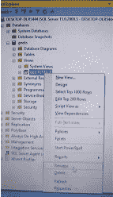

# 如何在 SQL Server 中重命名视图？

> 原文:[https://www . geesforgeks . org/如何重命名 SQL server 中的视图/](https://www.geeksforgeeks.org/how-to-rename-a-view-in-sql-server/)

视图是基于 SQL 语句结果集的虚拟表。它就像表的子集，基本上是为了优化数据库体验而创建的。

像真正的表一样，它也包含行和列。视图中的数据是从数据库中的一个或多个真实表中提取的数据。

我们可以像处理表一样对视图执行所有功能。

### **创建视图语法:**

```sql
CREATE VIEW view_name AS SELECT
column_1, column_2, ...
FROM table_name WHERE condition;
```

### **视图的重命名可以通过 SQL Server 中的对象资源管理器完成。**

**步骤 1:** 创建数据库

使用以下命令创建数据库。

**查询:**

```sql
CREATE TABLE geeks;
```

**步骤 2:** 使用数据库

**查询:**

```sql
USE geeks;
```

**步骤 3:** 表格定义

数据库中有以下 geeksforgeeks 表。

**查询:**

```sql
CREATE TABLE geeksforgeeks
(FIRSTNAME varchar(20), 
LASTNAME varchar(20),
GENDER varchar(10), AGE int);
```


**第 4 步:**插入数值

以下命令用于将值插入表中。

**查询:**

```sql
INSERT INTO geeksforgeeks VALUES
('ROMY','KUMARI','FEMALE', 22),
 ('PUSHKAR', 'JHA', 'MALE', 23),
('SOUMYA', 'SHRIYA', 'FEMALE', 22), 
('NIKHIL', 'KALRA', 'MALE', 23),
('ROHIT', 'KUMAR', 'MALE', 23), 
('ASTHA', 'GUPTA', 'FEMALE',22),
('SAMIKSHA', 'MISHRA', 'FEMALE', 22), 
('MANU', 'PILLAI', 'MALE', 24);
```


**第五步:**查看表格数据

**查询:**

```sql
SELECT * FROM geeksforgeeks;
```

**输出:**


**步骤 6:** 创建视图

**查询:**

```sql
CREATE VIEW FEMALE AS SELECT fIRSTNAME, LASTNAME,AGE
FROM geeksforgeeks WHERE GENDER='FEMALE';
```

这会有性别是女性的价值观。

**第 7 步:**查看视图内容

可以使用我们对表使用的相同查询来查看内容。

**查询:**

```sql
SELECT * FROM female;
```


**输出:**


**第 8 步:从对象浏览器**重命名视图

重命名视图的步骤:

*   从菜单栏中选择视图。
*   选择对象资源管理器选项。对象浏览器将出现在屏幕的左侧。
*   选择数据库文件夹并选择您的数据库(我们在本文中使用过的极客)。
*   在数据库中，选择查看选项。
*   右键单击视图名称并选择 RENAME 选项。
*   根据你的选择给新名字。

*   对象浏览器:


*   我们创建的视图:


*   通过右键单击重命名:



*   我们已将视图名称更改为“已更改名称”


**第 8 步:**使用新视图名称查看视图内容

**查询:**

```sql
SELECT * FROM Changed_name;
```


**输出:**

