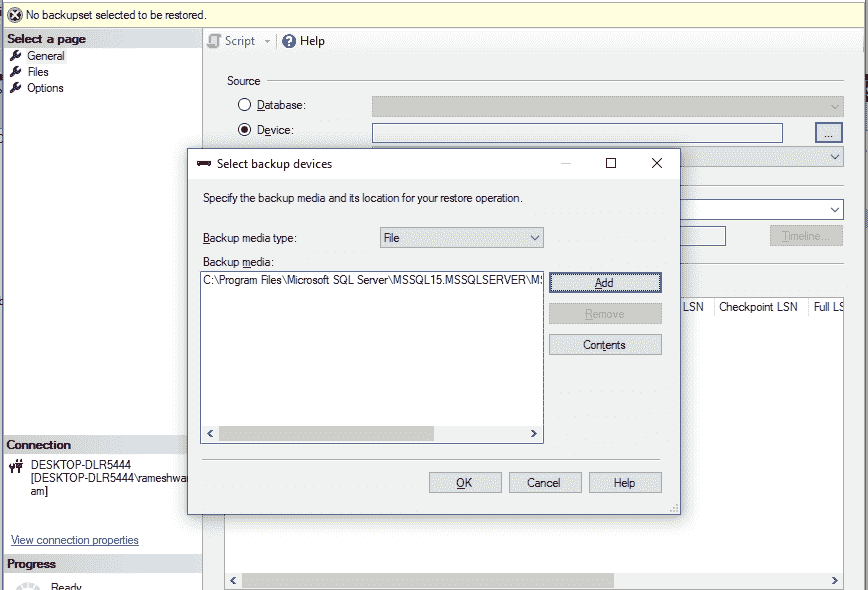

# 如何从备份中还原 SQL Server 数据库？

> 原文:[https://www . geeksforgeeks . org/如何从备份恢复 SQL-server-database/](https://www.geeksforgeeks.org/how-to-restore-sql-server-database-from-backup/)

数据库被定义为以有组织的方式存储在计算机上的[](https://www.geeksforgeeks.org/sql-concepts-and-queries/)数据库或数据的结构化形式，并且可以以各种方式访问。它也是模式、表、查询、视图等的集合。数据库帮助我们轻松地存储、访问和操作保存在计算机上的数据。 [数据库管理系统](https://www.geeksforgeeks.org/sql-tutorial/) 允许用户与数据库交互。在本文中，我们将了解如何从备份中恢复 SQL Server 数据库。

出于演示目的，我们将创建一个名为“极客”的数据库。

**步骤 1:** 创建数据库

使用下面的 SQL 语句创建名为极客的数据库；

**查询:**

```sql
CREATE DATABASE geeks;
```


您可以看到名为'极客'数据库被创建。

**步骤 2:** 使用数据库

**查询:**

```sql
USE geeks;
```

**步骤 3:** 表格定义

数据库中有以下演示表。

**查询:**

```sql
CREATE TABLE demo_table
(FIRSTNAME varchar(20),
LASTNAME varchar(20),
GENDER varchar(10), AGE int);
```

**第 4 步:**插入数值

以下命令用于将值插入表中。

**查询:**

```sql
INSERT INTO demo_table VALUES
('ROMY','KUMARI','FEMALE', 22),
('PUSHKAR', 'JHA', 'MALE', 23),
('SOUMYA', 'SHRIYA', 'FEMALE', 22),
('NIKHIL', 'KALRA', 'MALE', 23),
('ROHIT', 'KUMAR', 'MALE', 23),
```

**第五步:**查看表格数据

**查询:**

```sql
SELECT * FROM demo_table;
```

**输出:**


**数据库的恢复可以通过 SQL Server 中的对象资源管理器完成。**

还原数据库的步骤:

*   从菜单栏中选择视图。
*   选择对象资源管理器选项。对象浏览器将出现在屏幕的左侧。
*   右键单击数据库文件夹并选择“恢复数据库”选项。
*   该对话框将打开，选择设备选项并浏览备份媒体。
*   选择备份介质后，单击确定
*   数据库将成功还原。

现在，为了演示如何恢复数据库。删除极客数据库。

**步骤 6:** 删除数据库

**语法:**

```sql
DROP DATABASE database_name;
```

我们不能在数据库使用时将其删除。

**查询:**

```sql
DROP DATABASE geeks;
```

**输出:**


极客数据库被删除。在对象资源管理器中找不到极客数据库。

**第七步:恢复数据库**

*   右键单击数据库并选择“恢复数据库”选项


*   选择“设备”选项并添加备份媒体



*   单击确定按钮


*   将出现提示，显示消息“数据库恢复成功”。单击确定。


*   检查对象资源管理器。


**“极客”数据库恢复成功。**