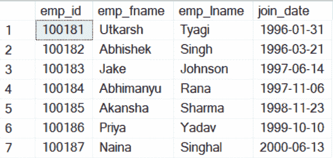
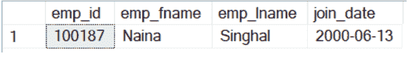
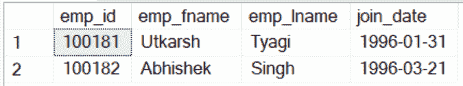
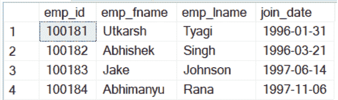

# 如何从 Oracle 数据库中检索基于日期的记录？

> 原文:[https://www . geesforgeks . org/如何从 oracle 数据库中检索基于日期的记录/](https://www.geeksforgeeks.org/how-to-retrieve-the-records-based-on-a-date-from-oracle-database/)

日期是一种 SQL 定义的数据类型，用于将日期存储在列中，不同的数据库管理系统以不同的格式存储日期。MySQL 使用 3 个字节来存储日期。它以类似“年-月-日”的格式存储日期。DATE 值的范围从 1000-01-01 到 9999-12-31。Oracle 数据库管理系统以“月-日-年”这样的格式存储日期。

这里‘MM’是月，‘DD’是日，‘YYYY’是年。Microsoft SQL Server 存储日期的格式与 MySQL 存储日期的格式相同。

**步骤 1:** 创建数据库

**查询:**

```sql
CREATE DATABASE geeksforgeeks;
```

**第 2 步:**我们来创建一个名为 employees 的表。

**查询:**

```sql
CREATE TABLE employee
(emp_id INT, emp_fname VARCHAR(45), 
emp_lname VARCHAR(45),join_date DATE, 
PRIMARY KEY(emp_id));
```

**步骤 3:** 现在我们将在员工表中插入值。

**查询:**

```sql
INSERT INTO employee VALUES 
(100181, 'Utkarsh', 'Tyagi', '1996-01-31'),
 (100182, 'Abhishek', 'Singh', '1996-03-21'), 
(100183, 'Jake', 'Johnson', '1997-06-14'), 
(100184, 'Abhimanyu', 'Rana', '1997-11-06'), 
(100185, 'Akansha', 'Sharma', '1998-11-23'), 
(100186, 'Priya', 'Yadav', '1999-10-10'),
(100187, 'Naina', 'Singhal', '2000-06-13');
```

**第四步:**现在我们来看看我们表格的内容。

**查询:**

```sql
SELECT * FROM employee;
```

**输出:**



**步骤 5:** 我们只想打印那些 join_date 为‘2000-06-13’的记录。

*   **使用“=”**[**运算符**](https://www.geeksforgeeks.org/sql-operators/) **基于日期检索记录。**

**查询:**

```sql
SELECT * FROM employee WHERE join_date = '2000-06-13';
```

**输出:**



我们只有一名员工的入职日期是“2000-06-13”。

*   **使用** [**LIKE 关键字**](https://www.geeksforgeeks.org/sql-like/) 基于日期检索记录

我们将使用与上述示例中相同的员工表。现在我们的任务是检索那些加入日期在 1996 年的记录，而不考虑日期和月份。

**查询:**

```sql
SELECT * FROM employee WHERE join_date LIKE '1996-%';
```



所以我们有两条记录的加入日期是 1996 年。

*   **使用** **关键字**根据日期检索记录

我们想检索那些 join_date 在 1996 年和 1997 年之间的记录。

**查询:**

```sql
SELECT * FROM employee WHERE join_date BETWEEN '1996-01-01' AND '1997-12-31';
```



所以在这段时间间隔内有四名员工加入了公司。