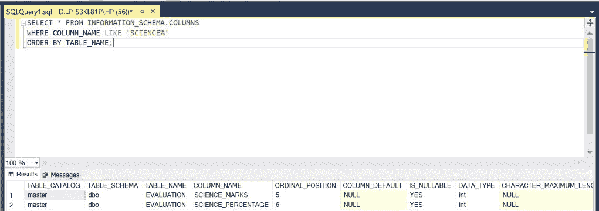

# 如何在 SQL 中搜索列名？

> 原文:[https://www . geesforgeks . org/如何在 sql 中搜索列名/](https://www.geeksforgeeks.org/how-to-search-for-column-names-in-sql/)

在 SQL 中，有时我们需要使用前缀搜索表中的列名。在本文中，我们将使用微软的 SQL Server 作为我们的数据库和选择关键字。

**步骤 1:** 创建数据库。为此，使用下面的命令创建一个名为 GeeksForGeeks 的数据库。

**查询:**

```sql
CREATE DATABASE GeeksForGeeks
```

**输出:**


**步骤 2:** 使用 GeeksForGeeks 数据库。为此，请使用以下命令。

**查询:**

```sql
USE GeeksForGeeks
```

**输出:**


**步骤 3:** 在数据库 GeeksForGeeks 中创建一个评估表。该表有 6 栏，即学生姓名、学生身份证、英语成绩、英语成绩、科学成绩、科学成绩，包括学生的姓名和身份证、他们在英语科目中的成绩和百分比以及他们在科学科目中的成绩和百分比。

**查询:**

```sql
CREATE TABLE EVALUATION(
STUDENT_NAME VARCHAR(10),
STUDENT_ID INT,
ENGLISH_MARKS INT,
ENGLISH_PERCENTAGE INT,
SCIENCE_MARKS INT,
SCIENCE_PERCENTAGE INT);
```

**输出:**


**步骤 4:** 描述评估表的结构。

**查询:**

```sql
EXEC SP_COLUMNS EVALUATION;
```

**输出:**


**第 5 步:**要查找具有公共前缀的表和列名，我们需要运行如下查询。以下查询通过将列名与提供的前缀进行比较来搜索数据库中的所有列。然后，生成的表和列按表名列出并排序。我们使用像****和**这样的关键词来实现这一点。以下查询搜索名称以“ **STUDENT** 开头的列。******

****语法:****

```sql
SELECT * FROM INFORMATION_SCHEMA.COLUMNS
WHERE COLUMN_NAME LIKE 'PREFIX%'
ORDER BY TABLE_NAME;
```

****查询:****

```sql
SELECT * FROM INFORMATION_SCHEMA.COLUMNS
WHERE COLUMN_NAME LIKE 'STUDENT%'
ORDER BY TABLE_NAME;
```

****注意**:所有返回的列名称中都有一个前缀“ **STUDENT** ”。**

****输出:****

****

****第 6 步:**以下查询搜索名称以“**英语**开头的列。**

****查询:****

```sql
SELECT * FROM INFORMATION_SCHEMA.COLUMNS
WHERE COLUMN_NAME LIKE 'ENGLISH%'
ORDER BY TABLE_NAME;
```

****注意**–所有返回的列名称中都有一个前缀“**英语**”。**

****输出:****

****

****第 7 步:**以下查询搜索名称以“ **SCIENCE** 开头的列。**

****查询:****

```sql
SELECT * FROM INFORMATION_SCHEMA.COLUMNS
WHERE COLUMN_NAME LIKE 'SCIENCE%'
ORDER BY TABLE_NAME;
```

****注意**–返回的所有列名称中都有一个前缀“**科学**”。**

****输出:****

****