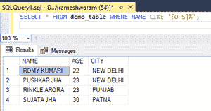
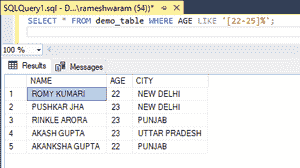

# 如何在 SQL 中选择一个字母范围？

> 原文:[https://www . geesforgeks . org/如何选择 sql 中的字母范围/](https://www.geeksforgeeks.org/how-to-select-a-range-of-letters-in-sql/)

在本文中，我们将看到如何使用 [LIKE 子句](https://www.geeksforgeeks.org/sql-like/)在 SQL 中选择一个字母范围。LIKE 子句用于 SQL 中的模式匹配，使用通配符运算符，如% ^等。它有方括号[]作为通配符运算符之一，用于指定模式匹配的字符范围。

让我们用一个例子来看看上面提到的这些函数。进行演示时，请遵循以下步骤:

**步骤 1:** 创建数据库

使用下面的 SQL 语句创建名为极客的数据库；

**查询:**

```sql
CREATE DATABASE geeks;
```

**步骤 2:** 使用数据库

使用下面的 SQL 语句将数据库上下文切换到极客:

**查询:**

```sql
USE geeks;
```

**步骤 3:** 表格创建

我们的极客数据库中有以下演示表。

**查询:**

```sql
CREATE TABLE demo_table(
NAME VARCHAR(20),
AGE INT,
CITY VARCHAR(20) );
```

**步骤 4:** 将数据插入表格

**查询:**

```sql
INSERT INTO demo_table VALUES
('ROMY KUMARI', 22, 'NEW DELHI'),
('PUSHKAR JHA',23, 'NEW DELHI'),
('RINKLE ARORA',23, 'PUNJAB'),
('AKASH GUPTA', 23, 'UTTAR PRADESH'),
('AKANKSHA GUPTA',22, 'PUNJAB'),
('SUJATA JHA', 30,'PATNA');
```

**第五步:**查看表格数据

**查询:**

```sql
SELECT * FROM demo_table;
```

**输出:**


**第 6 步:**使用 LIKE 子句选择字母范围

使用通配符运算符的语法

```sql
SELECT * from tablename WHERE column_name LIKE '%[range_value]%';
```

**'%'** 是指定 0 个或更多字符的通配符。

用于演示:

*   从表中选择名称以 0-S(0 到 S)范围内的值开头的行。

**查询:**

```sql
SELECT * FROM demo_table WHERE NAME LIKE '[O-S]%';
```

**输出:**



*   从表中选择年龄在 22-25 范围内的行。

**查询:**

```sql
SELECT * FROM demo_table WHERE AGE LIKE '[22-25]%';
```

**输出:**

