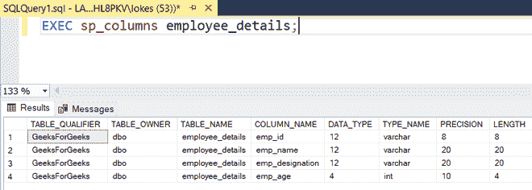

# 如何在 SQL 中从一个表中选择另一个表中不存在的所有记录？

> 原文:[https://www . geeksforgeeks . org/如何从一个表中选择所有记录-sql 中不存在的另一个表/](https://www.geeksforgeeks.org/how-to-select-all-records-from-one-table-that-do-not-exist-in-another-table-in-sql/)

我们可以通过对子查询(包括子查询中的另一个表)使用 NOT IN 或 NOT EXISTS 来获取一个表中不存在于另一个表中的记录。在本文中，让我们逐步了解如何从一个表中选择另一个表中不存在的所有记录。

### **创建数据库**

使用以下命令创建一个名为 GeeksforGeeks 的数据库:

```sql
CREATE DATABASE GeeksforGeeks
```


### **使用数据库**

要使用 GeeksforGeeks 数据库，请使用以下命令:

```sql
USE GeeksforGeeks
```


### **创建表格:**

使用以下 SQL 查询创建一个包含 4 列的表 ***【员工详细信息】*** :

```sql
CREATE TABLE employee_details(
   emp_id VARCHAR(8),
   emp_name VARCHAR(20),
   emp_designation VARCHAR(20),
   emp_age INT);
```

```sql
CREATE TABLE employee_resigned(
   emp_id VARCHAR(8),
   emp_name VARCHAR(20),
   emp_designation VARCHAR(20),
   emp_age INT);
```

 

### **验证表格:**

使用以下 SQL 查询查看数据库中表的描述:

```sql
EXEC sp_columns employee_details;
EXEC sp_columns employee_resigned;
```

 

### **将数据插入表格**

使用以下 SQL 查询将行插入员工详细信息表和员工辞职表:

```sql
INSERT INTO employee_details VALUES
  ('E40001','PRADEEP','H.R',36),
  ('E40002','ASHOK','MANAGER',28),
  ('E40003','PAVAN KUMAR','ASST MANAGER',28),
  ('E40004','SANTHOSH','STORE MANAGER',25),
  ('E40005','THAMAN','GENERAL MANAGER',26),
('E40006','HARSH',' ANALYST',25),
  ('E40007','SAMHITH','GENERAL MANAGER',26),
('E40008','SAMEER','SENIOR ANALYST',25),
  ('E40009','RISABH','BUSINESS ANALYST',26);
```

```sql
INSERT INTO employee_resigned VALUES('E40001','PRADEEP','H.R',36),
  ('E40004','SANTHOSH','STORE MANAGER',25),
  ('E40005','THAMAN','GENERAL MANAGER',26);
```


### **验证插入的数据:**

使用以下 SQL 查询在插入行后查看 employee_details 表:

```sql
SELECT* FROM employee_details;
SELECT* FROM employee_resigned;
```


### **查询:**

*   使用“不存在”查询未辞职人员的员工 id 和姓名。

```sql
SELECT emp_id,emp_name  
FROM employee_details
WHERE NOT EXISTS
(SELECT *  
   FROM  employee_resigned
   WHERE employee_details.emp_id = employee_resigned.emp_id);
```


*   使用“不在”查询未辞职员工的详细信息。

```sql
SELECT *
FROM employee_details
WHERE emp_id NOT IN
  (SELECT emp_id  
  FROM employee_resigned)
```

