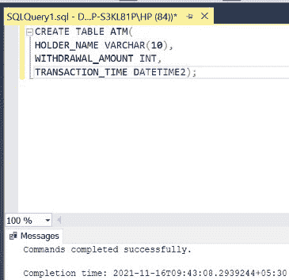
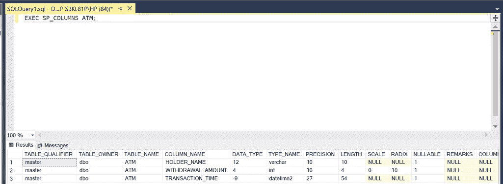
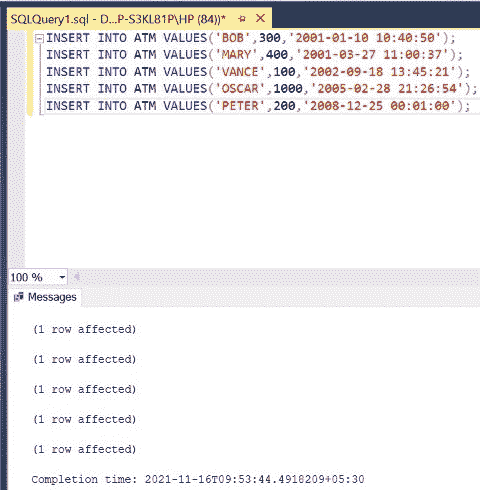
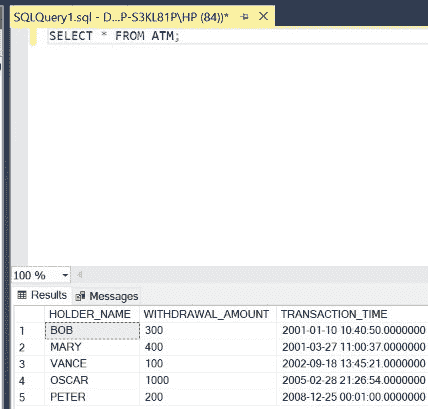
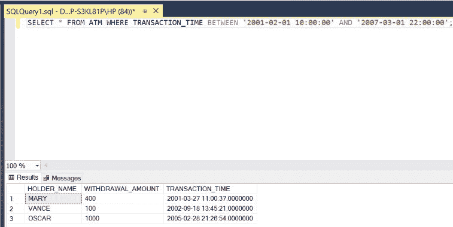
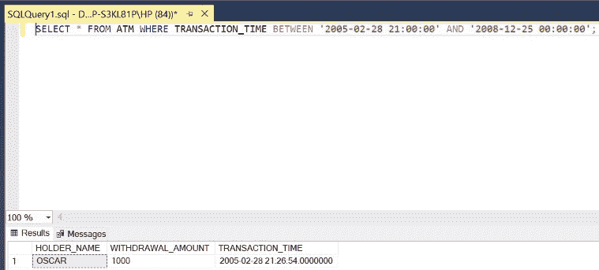
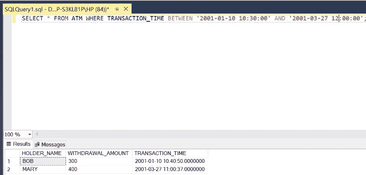

# 如何在 SQL Server 中选择两个日期和时间之间的数据？

> 原文:[https://www . geesforgeks . org/如何在 SQL server 中选择两个日期和时间之间的数据/](https://www.geeksforgeeks.org/how-to-select-data-between-two-dates-and-times-in-sql-server/)

在 SQL 中，一些事务需要根据它们的完成时间和日期来提取。这里，DATETIME2 数据类型在 SQL 中执行这样的操作。在本文中，我们将使用微软的 SQL Server 作为我们的数据库。

**注意:**这里，我们将使用查询中给出的两个日期和时间，并使用[**之间的关键字**](https://www.geeksforgeeks.org/sql-between-in-operator)**将它们分开。在此之前是 **WHERE** 关键字，用于满足由 BETWEEN 子句生成的条件。如上所述，我们表格中日期和时间的格式应为**yyyy:mm:****DD hh:mm:****ss**，这是 **DATETIME2** 所暗示的。时间为 **24 小时**格式。**

****语法:****

```sql
SELECT * FROM TABLE_NAME WHERE
DATE_TIME_COLUMN BETWEEN 
'STARTING_DATE_TIME' AND 'ENDING_DATE_TIME';
```

****步骤 1:** 创建数据库。为此，使用下面的命令创建一个名为 GeeksForGeeks 的数据库。**

****查询:****

```sql
CREATE DATABASE GeeksForGeeks
```

****输出:****

****

****步骤 2:** 使用 GeeksForGeeks 数据库。为此，请使用以下命令。**

****查询:****

```sql
USE GeeksForGeeks
```

****输出:****

****

****步骤 3:** 在数据库 GeeksForGeeks 内部创建一个表 ATM。该表有 3 列，即持有人姓名、提款金额和交易时间，包含账户持有人姓名、他/她提取的金额以及交易日期和时间。**

****查询:****

```sql
CREATE TABLE ATM(
HOLDER_NAME VARCHAR(10),
WITHDRAWAL_AMOUNT INT,
TRANSACTION_TIME DATETIME2);
```

****输出:****

****

****第 4 步:**描述表 ATM 的结构。**

****查询:****

```sql
EXEC SP_COLUMNS ATM;
```

****输出:****

****

****第五步:**在 ATM 表中插入 5 行。**

****查询:****

```sql
INSERT INTO ATM VALUES('BOB',300,'2001-01-10 10:40:50');
INSERT INTO ATM VALUES('MARY',400,'2001-03-27 11:00:37');
INSERT INTO ATM VALUES('VANCE',100,'2002-09-18 13:45:21');
INSERT INTO ATM VALUES('OSCAR',1000,'2005-02-28 21:26:54');
INSERT INTO ATM VALUES('PETER',200,'2008-12-25 00:01:00');
```

****输出:****

****

****第 6 步:**显示 ATM 表的所有行。**

****查询:****

```sql
SELECT * FROM ATM;
```

****输出:****

****

****步骤 7:** 检索 2001 年 2 月 1 日上午 10:00 至 2007 年 5 月 1 日下午 10:00 之间完成的交易的详细信息。**

****查询:****

```sql
SELECT * FROM ATM WHERE 
TRANSACTION_TIME BETWEEN
'2001-02-01 10:00:00' AND
 '2007-03-01 22:00:00';
```

****输出:****

****

****步骤 8:** 检索 2005 年 2 月 28 日晚上 09:00 到 2008 年 12 月 25 日上午 12:00 之间完成的交易的详细信息。**

****查询:****

```sql
SELECT * FROM ATM WHERE TRANSACTION_TIME
BETWEEN '2005-02-28 21:00:00' 
AND '2008-12-25 00:00:00';
```

****注意**–第五元组不显示，因为其交易时间为 **00:01:00** ，而我们的查询将时间限制为 **00:00:00。****

****输出:****

****

****步骤 9:** 检索 2001 年 1 月 10 日上午 10:30 到 2001 年 3 月 27 日下午 12:00 之间完成的交易的详细信息。**

****查询:****

```sql
SELECT * FROM ATM WHERE TRANSACTION_TIME
BETWEEN '2001-01-10 10:30:00' 
AND '2001-03-27 12:00:00';
```

****输出:****

****