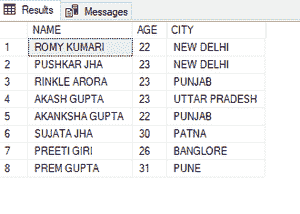
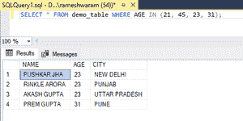
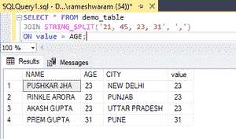

# 如何在 SQL Server 中选择一组与列表中所有项目匹配的行？

> 原文:[https://www . geesforgeks . org/如何选择与 SQL server 列表中所有项目相匹配的行组/](https://www.geeksforgeeks.org/how-to-select-group-of-rows-that-match-all-items-on-a-list-in-sql-server/)

在本文中，我们将看到如何在 SQL Server 中选择一组与列表中所有项目相匹配的行。

我们可以通过两种方法来执行上述功能。这些是:

*   通过使用输入运算符
*   通过使用字符串分割方法执行连接

[IN](https://www.geeksforgeeks.org/sql-between-in-operator/) 运算符:它允许您在 WHERE 子句中指定值列表。

**STRING_SPLIT()** :该函数可以使用逗号('，')等指定分隔符对字符表达式进行拆分。

**按照以下步骤进行演示:**

**步骤 1:** 创建数据库

可以使用 CREATE 命令创建数据库。

**查询:**

```sql
CREATE DATABASE geeks;
```

**第二步**:使用数据库

使用下面的 SQL 语句将数据库上下文切换到极客:

**查询:**

```sql
USE geeks;
```

**步骤 3:** 表格定义

我们的极客数据库中有以下演示表。

**查询:**

```sql
CREATE TABLE demo_table(
NAME VARCHAR(20),
AGE INT,
CITY VARCHAR(20) );
```

**步骤 4:** 将数据插入表格

**查询:**

```sql
INSERT INTO demo_table VALUES
('ROMY KUMARI', 22, 'NEW DELHI'),
('PUSHKAR JHA',23, 'NEW DELHI'),
('RINKLE ARORA',23, 'PUNJAB'),
('AKASH GUPTA', 23, 'UTTAR PRADESH'),
('AKANKSHA GUPTA',22, 'PUNJAB'),
('SUJATA JHA', 30,'PATNA')
('PREETI GIRI', 26,'BANGLORE'),
('PREM GUPTA',31,'PUNE');
```

**第五步:**查看表格数据

**查询:**

```sql
SELECT * FROM demo_table;
```

**输出:**



**第 6 步:**选择一组与列表中项目匹配的行。

为了演示的目的，让我们假设我们有一个包含以下项目的列表:(21，45，23，31)。我们将选择“年龄”列中的值与列表中的项目相匹配的一组行。

### **方法 1:使用 IN 运算符**

**语法:**

```sql
SELECT *FROM table_name WHERE column_name IN (list);
```

**查询:**

```sql
SELECT * FROM demo_table WHERE AGE IN (21, 45, 23, 31);
```

**输出:**



### **方法二:使用 STRING_SPLIT()函数执行 JOIN】**

**语法:**

```sql
SELECT * FROM table_name
JOIN STRING_SPLIT('list', 'separator')
ON value = column_name;
```

**查询:**

```sql
SELECT * FROM demo_table
JOIN STRING_SPLIT('21, 45, 23, 31', ',')
ON value = AGE;
```

**输出:**

