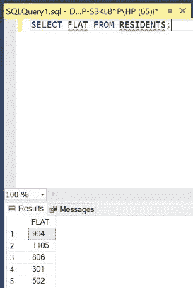

# 如何在 SQL 中选择单个列？

> 原文:[https://www . geesforgeks . org/如何选择 sql 中的单个列/](https://www.geeksforgeeks.org/how-to-select-individual-columns-in-sql/)

在 SQL 中，有时我们需要从表中选择单独的列。为此，我们使用一种特定的查询，如下面的演示所示。在本文中，我们将使用微软的 SQL Server 作为我们的数据库和选择关键字。 [选择](https://www.geeksforgeeks.org/sql-select-query/#:~:text=Select%20is%20the%20most%20commonly,fetch%20data%20from%20a%20database.&text=Learn%20SQL%20for%20interviews%20using,that%20the%20database%20server%20evaluates.) 是 SQL 中最常用的语句。SQL 中的 SELECT 语句用于从数据库中检索或获取数据。我们可以获取整个表，也可以根据特定的规则获取。返回的数据存储在结果表中。该结果表也称为结果集。

**步骤 1:** 创建数据库。为此，使用下面的命令创建一个名为 GeeksForGeeks 的数据库。

**查询:**

```
CREATE DATABASE GeeksForGeeks
```

**输出:**


**步骤 2:** 使用 GeeksForGeeks 数据库。为此，请使用以下命令。

**查询:**

```
USE GeeksForGeeks
```

**输出:**


**步骤 3:** 在数据库 GeeksForGeeks 中创建一个居民表。该表有 3 列，即 R_NAME、AGE 和 FLAT，包含姓名、年龄和社会各种居民的固定数字。

**查询:**

```
CREATE TABLE RESIDENTS(
R_NAME VARCHAR(20),
AGE INT,
FLAT INT);
```

**输出:**


**第 4 步:**描述表格 RESIDENTS 的结构。

**查询:**

```
EXEC SP_COLUMNS RESIDENTS;
```

**输出:**


**第 5 步:**在 RESIDENTS 表中插入 5 行。

**查询:**

```
INSERT INTO RESIDENTS VALUES('MICHAEL',45,904);
INSERT INTO RESIDENTS VALUES('GARY',90,1105);
INSERT INTO RESIDENTS VALUES('SCOTT',39,806);
INSERT INTO RESIDENTS VALUES('JIM',34,301);
INSERT INTO RESIDENTS VALUES('PAMELA',29,502);
```

**输出:**


**第 6 步:**显示居民表的所有行。

**查询:**

```
SELECT * FROM RESIDENTS;
```

**输出:**


**第 7 步:**要从表中选择一个单独的列，我们需要在关键字 **SELECT** 后面加上要选择的列名，然后是查询的其余部分。例如，在下图中，列 **R_NAME** 是从表**居民**中选择的单个列。

**语法:**

```
SELECT COLUMN_NAME FROM TABLE_NAME;
```

**查询:**

```
SELECT R_NAME FROM RESIDENTS;
```

**输出:**


**第八步:**

从表格**居民中选择个人栏**年龄**。**

**查询:**

```
SELECT AGE FROM RESIDENTS;
```

**输出:**


**第九步:**

从表格**居民**中选择单个列**平面**。

**查询:**

```
SELECT FLAT FROM RESIDENTS;
```

**输出:**

