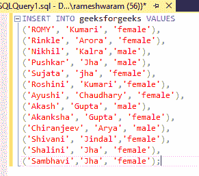

# 如何在 SQL 中选择单词末尾有一定值的单词？

> 原文:[https://www . geesforgeks . org/如何在 sql 中的单词末尾选择具有特定值的单词/](https://www.geeksforgeeks.org/how-to-select-words-with-certain-values-at-the-end-of-word-in-sql/)

为了在 SQL 中选择单词末尾有特定值的单词，我们可以使用模式匹配。模式匹配允许用户在数据中搜索特定的模式。这是使用 SQL 中的 LIKE 运算符完成的。查询使用通配符来匹配模式，通配符区分大小写。

一些通配符及其含义:

<figure class="table">t32

| **Symbol** | **Description** |
| % | Specify 0 or more characters. |
| _ | Specify a single character |
| [ ] | Specify any single character in brackets. |

</figure>

**示例:**

<figure class="table">a % a开始并以 a 结束的值

| **Symbol** | **Description** |
| 百分之一 | With any a |
| % a | With any a |
| With any a | A value containing any one character. |
| % _ a % | A value containing any one character. |

</figure>

**选择末尾有一定值的词:**

**步骤 1:** 创建数据库

可以使用 CREATE 命令创建数据库。

**查询:**

```
CREATE DATABASE geeks;
```

**步骤 2:** 使用数据库

使用下面的 SQL 语句将数据库上下文切换到极客:

**查询:**

```
USE geeks;
```

**步骤 3:** 表格定义

我们的极客数据库中有以下演示表。

**查询:**

```
CREATE TABLE geeksforgeeks(
FIRSTNAME VARCHAR(20), LASTNAME VARCHAR(20),
GENDER VARCHAR(20));
```


**步骤 4:** 插入数据

```
INSERT INTO geeksforgeeks VALUES
('ROMY', 'Kumari', 'female'), 
('Rinkle', 'Arora', 'female'),
('Nikhil', 'Kalra','male'),
 ('Pushkar', 'Jha', 'male'),
('Sujata', 'jha', 'female'),
 ('Roshini', 'Kumari','female'),
('Ayushi', 'Chaudhary', 'female'),
 ('Akash', 'Gupta', 'male'),
('Akanksha', 'Gupta', 'female'), 
('Chiranjeev', 'Arya', 'male'),
('Shivani', 'Jindal','female'),
 ('Shalini', 'Jha', 'female'),
('Sambhavi','Jha', 'female');
```



**步骤 5:** 对于视图，表格数据

**查询:**

```
SELECT * FROM geeksforgeeks;
```

**输出:**


**第六步:**匹配结束字符

*   通过在姓氏末尾加上“a”来查询姓氏

**查询:**

```
SELECT LASTNAME FROM geeksforgeeks WHERE LASTNAME LIKE '%a';
```

**输出:**

 

*   查询以获取末尾有“ra”的姓氏。

**查询:**

```
SELECT LASTNAME FROM geeksforgeeks Where LASTNAME LIKE '%ra';
```

**输出:**

 

*   得到末尾有“A”的姓氏。

**查询:**

```
SELECT LASTNAME FROM geeksforgeeks Where LASTNAME LIKE 'A';
```

**输出:**

 

姓氏末尾没有“A”值。这表明为模式匹配输入的值区分大小写。