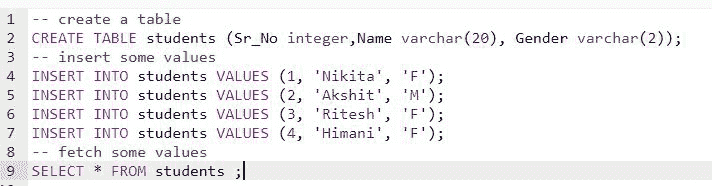
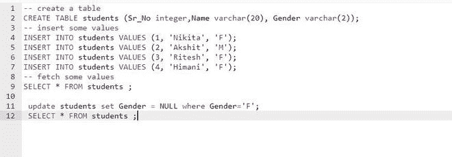
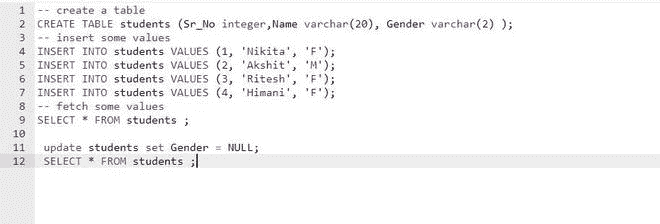
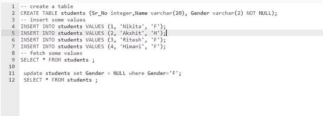
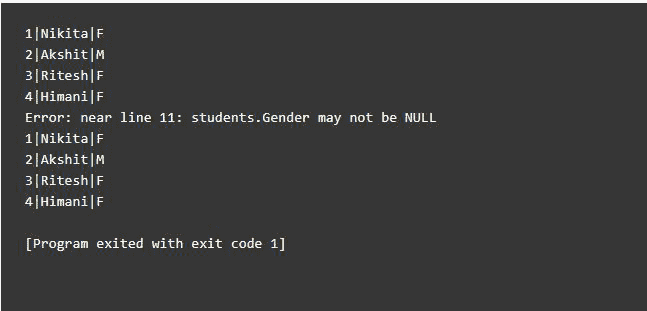

# 如何在 SQL 中将列值设置为空？

> 原文:[https://www . geesforgeks . org/如何在 sql 中将列值设置为 null/](https://www.geeksforgeeks.org/how-to-set-a-column-value-to-null-in-sql/)

在本文中，我们将研究如何在 SQL 中将列值设置为空。

首先，让我们使用 CREATE TABLE 命令创建一个表:

```sql
-- create a table
CREATE TABLE students (Sr_No integer,Name varchar(20), Gender varchar(2));
-- insert some values
INSERT INTO students VALUES (1, 'Nikita', 'F');
INSERT INTO students VALUES (2, 'Akshit', 'M');
INSERT INTO students VALUES (3, 'Ritesh', 'F');
INSERT INTO students VALUES (4, 'Himani', 'F');
-- fetch some values
SELECT * FROM students ;
```



这张桌子看起来像这样:


要**更新列值，**使用以下命令:

```sql
 UPDATE TABLE [TABLE_NAME]
```

要将列值设置为空，请使用语法:

```sql
 update [TABLE_NAME] set [COLUMN_NAME] = NULL where [CRITERIA] 
```

**示例:**对于上表

```sql
update students set Gender = NULL where Gender='F';
SELECT * FROM students ;
```



**输出:**


**列值也可以设置为空，不需要指定‘where’条件。**

**示例:**

```sql
update students set Gender = NULL;
SELECT * FROM students ;
```



**输出:**


如果您设置了一个特定列值不能为空的约束，并且稍后试图将其设置为空，那么它将生成一个错误。

**示例:**

```sql
-- create a table
CREATE TABLE students (Sr_No integer,Name varchar(20), Gender varchar(2) NOT NULL);
-- insert some values
INSERT INTO students VALUES (1, 'Nikita', 'F');
INSERT INTO students VALUES (2, 'Akshit', 'M');
INSERT INTO students VALUES (3, 'Ritesh', 'F');
INSERT INTO students VALUES (4, 'Himani', 'F');
-- fetch some values
SELECT * FROM students ;
```



**输出:**



**错误:**性别不能为空。