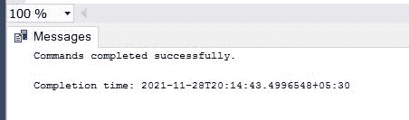

# 如何在微软 SQL Server 中设置兼容性？

> 原文:[https://www . geesforgeks . org/如何设置-microsoft-sql-server 中的兼容性/](https://www.geeksforgeeks.org/how-to-setup-compatibility-in-microsoft-sql-server/)

SQL Server 兼容性级别是数据库设置之一。它有助于保持数据库与 SQL server 版本兼容。默认情况下，数据库的兼容级别低于 SQL server 版本。它会影响服务器中的许多对象。

**例如:**如果我们在特定版本的 SQL server 上从头开始创建数据库，并将数据库保持在同一版本，那么我们完全不必担心兼容性级别。但是，如果我们将应用程序从较低版本迁移到较高版本的 SQL server，那么我们必须确保兼容性级别匹配。否则，数据库的旧兼容级别可能不支持一些较新的功能。因此，为了维护它，我们需要与 SQL server 相匹配的兼容级别。

让我们用一个例子来理解这个概念。首先，我们将创建一个数据库，并设置它与不同 SQL server 版本的兼容级别。现在我们将尝试借助 UI 进行设置(不使用 SQL 查询)，之后我们将借助查询进行设置。

### **方法一:使用 GUI**

**步骤 1:** 创建数据库

在这一步中，我们将创建一个数据库，并将其命名为 geeksforgeeks。我们需要使用 CREATE 运算符。

**查询:**

```
CREATE DATABASE geeksforgeeks;
```


**步骤 2:** 属性和选项选项卡

为了查看数据库的兼容级别，请在 Microsoft SQL Server Management Studio 中右键单击该数据库，选择“属性”，然后单击“选项”选项卡。转到**根数据库>右键单击>属性>选项。**下面是附上的截图供参考。


现在，您必须单击选项选项卡来查看特定数据库的兼容级别。下面是同样的截图。


**步骤 3:** 更改兼容级别

在这一步中，我们将更改数据库的兼容级别，为此，您可以使用下拉属性并选择不同的兼容级别，然后点击确定按钮。这将更新数据库的兼容级别。见下图。


**第 4 步:**输出

保存所有更改后，当您再次遵循上述步骤并检查数据库的兼容级别时，它将被更新。在这里，我们已经将兼容级别更新为 140，下面是同样的截图。


### **方法二:使用 SQL 查询**

在这个方法中，我们将使用一个 SQL 查询来更新数据库的兼容级别。

**步骤 1:** 检查数据库的兼容级别

首先，我们需要执行一个查询来查看数据库的兼容级别。为此，我们使用以下查询。

**查询:**

```
select name, compatibility_level
 from sys.databases;
```


**输出:**

这将给出系统中存在的数据库的兼容级别。生成以下输出。


**步骤 2:** 更改数据库的兼容级别

我们还可以看到，在方法 1 中，我们已经将兼容性级别更新为 140。现在，我们将兼容性级别更改为 120。为此，我们将使用以下查询。

**查询:**

```
ALTER DATABASE [geeksforgeeks] 
SET COMPATIBILITY_LEVEL = 120;
```


**输出:**



**步骤 3:** 检查更新的兼容性

在这一步中，我们将使用以下查询来检查更新后的兼容性级别。

```
SELECT compatibility_level FROM 
sys.databases WHERE name = 'geeksforgeeks';
```


**输出:**

在执行查询时，我们将获得以下输出，并将数据库 geeksforgeeks 的兼容级别更新为 120。

