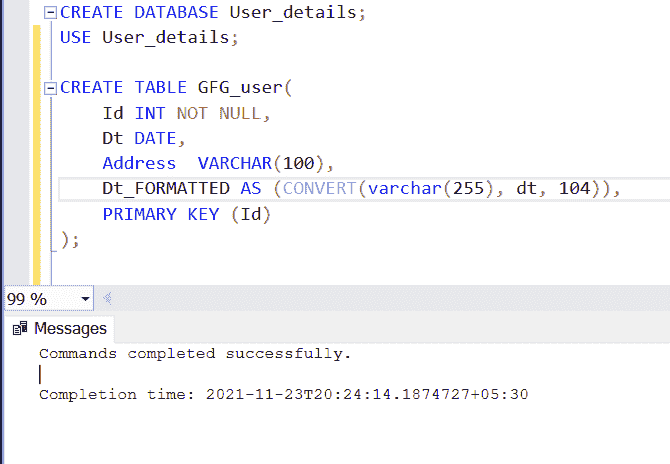
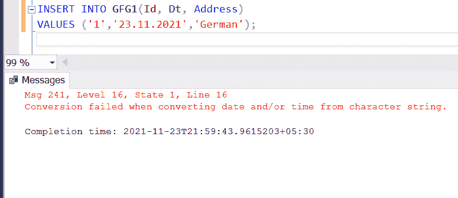
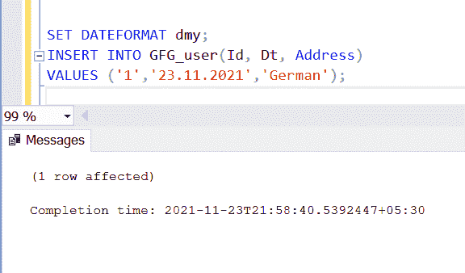
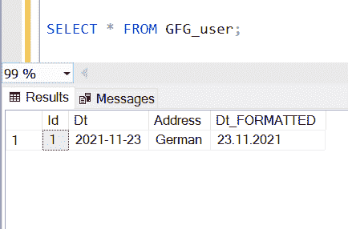

# 如何在创建表格时指定日期格式，并用 SQL 填写？

> 原文:[https://www . geeksforgeeks . org/如何指定日期格式-关于创建一个表并填充它-sql/](https://www.geeksforgeeks.org/how-to-specify-a-date-format-on-creating-a-table-and-fill-it-in-sql/)

每当我们使用数据库时，我们发现几乎每个表都包含一个日期列。毕竟，在分析数据时，数据的日期起着重要的作用。以特定或可理解的格式存储日期非常重要。在本文中，我们将学习如何在 SQL Server 上指定日期格式。

让我们创建演示数据库和表格。

**步骤 1:** 创建数据库

使用以下命令创建数据库。

**查询:**

```sql
CREATE DATABASE User_details; 
```

**步骤 2:** 使用数据库

**查询:**

```sql
USE User_details; 
```

**步骤 3:** 表格定义

数据库中有以下 GFG 用户表。

**查询:**

```sql
CREATE TABLE GFG_user(Id INT NOT NULL,Dt DATE, 
Address  VARCHAR(100),Dt_FORMATTED AS 
(convert(varchar(255), dt, 104)),   
PRIMARY KEY (Id) );
```

**输出:**



在这里，我们已经创建了一个名为 Dt _ FORMATTED 的列，我们将在其中保存我们的格式化日期。

现在，我们看到 **CONVERT()** 功能。CONVERT()函数只是将任何类型的值转换为指定的数据类型。

**语法:**

```sql
CONVERT ( data_type ( length ) ,
expression , style )    
```

通过使用这个函数，我们将字符串转换为日期。在风格论证的地方，我们提到了**‘104’**。它是指定日期格式的数字代码。

查看此表，查看不同格式使用的不同代码:

<figure class="table">T61T66】ANSIT61 T146】131(<sup>2</sup>)T154】DD/mm/yyyyyyy hh:mi:ss:mmm

| 

#### with century

#### (YY)

 | 

#### The century

#### (yyyy)

 | 

#### standard

 | 

#### input/output

 |
| – | Or 0.100 ( <sup>1,1</sup> |
| one | One hundred and one | United States of America | 1 = mm/DD/YY

T57】101 = mm/DD/yyyy |
| Two | One hundred and two | German | 4 = DD . mm . YY104 = DD . mm . yyy |
| Eleven | One hundred and eleven | Japan | T111】11 = YY/mm/DD111 = YY/mm/DD | Europe default+ms | DD mon yyyy hh:mi:ss:mmm(24 小时) |
| – | 回历（ <sup>5</sup> ） |

</figure>

这里，我们只提到了 10 种最常用的格式。

**第 4 步:**插入数值

以下命令用于将值插入表中。

**查询:**

```sql
SET DATEFORMAT dmy; INSERT INTO GFG_user
(Id, Dt, Address) VALUES ('1','23.11.2021',
'German');   
```



在这个查询中，我们使用**日期格式**设置。

**语法:**

```sql
SET DATEFORMAT format    
```

当我们插入字符串时，服务器会尝试在将字符串插入到表中之前将其转换为日期。因为它无法判断我们是将月份放在日期之前还是日期放在月份之前。例如，假设您试图插入 06.07.2000。服务器无法检测日期是 7 月 6 日还是 6 月 7 日。虽然它使用正在运行的用户帐户的本地化设置来计算，但不提及 DATEFORMAT 可能会给你一个错误，因为大多数情况下，运行该操作的帐户被设置为美国格式，即–**月日年(mdy)** 。

导致错误的原因是我们想将其保存为 **dmy** ，而不是 **mdy** 。然而，使用 DATEFORMAT 将帮助您摆脱它。

**输出:**



我们已经完成了我们的表，现在让我们检查我们是否得到了我们想要的输出。

**第五步:**查看表格数据

**查询:**

```sql
SELECT * FROM GFG_user; 
```

**输出:**



我们已经成功地在 Dt _ FORMATTED 列中获得了我们的德语格式的日期。