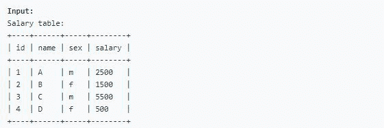
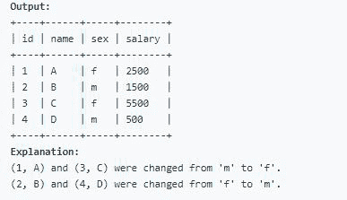

# 如何在 MySQL 中交换一个值？

> 原文:[https://www . geesforgeks . org/how-swap-a-values-in-MySQL/](https://www.geeksforgeeks.org/how-to-swap-a-values-in-mysql/)

SQL 中的 UPDATE 语句用于更新数据库中现有表的数据。根据我们的要求，我们可以使用更新语句来更新单列和多列。假设 w e 需要编写一个 SQL 查询，用一个 [update 语句](https://www.geeksforgeeks.org/sql-update-statement/)交换所有的‘a’和‘m’值(即把所有的‘f’值改为‘m ’,反之亦然)，并且没有中间临时表，那么步骤如下:

**步骤 1:** 创建数据库

使用下面的 SQL 语句创建一个名为 geeks 的数据库:

**查询:**

```sql
create database geeksforgeeks;
```

**步骤 2:** 使用数据库

使用下面的 SQL 语句将数据库上下文切换到极客:

**查询:**

```sql
use geeksforgeeks;
```

**步骤 3:** 表格定义

我们的 geeksforgeeks 数据库中有以下工资表。

**查询:**

```sql
create table Salary(id int  , name varchar(20) , sex varchar(1) ,
 salary int);
```

“薪资”表包含员工的信息。

**步骤 4:** 在表格中插入值

**查询:**

```sql
insert into Salary values(1 , "A" , "m" , 2500);
insert into Salary values(2 , "B" , "f" , 1500);
insert into Salary values(3 , "C" , "m" , 5500);
insert into Salary values(4 , "D" , "f" ,  500);
```



**步骤 5:** 假设我们想要更新表中的一个特定值，那么查询将如下

**MySQL 查询:**

```sql
update Salary set sex = if(sex='m' , 'f','m');
```

在上面的查询中，我们使用 [**IF()** 函数](https://www.geeksforgeeks.org/mysql-if-function/)来交换 f 和 m，如果性为 m 则返回 f，否则返回 m。

**输出:**

