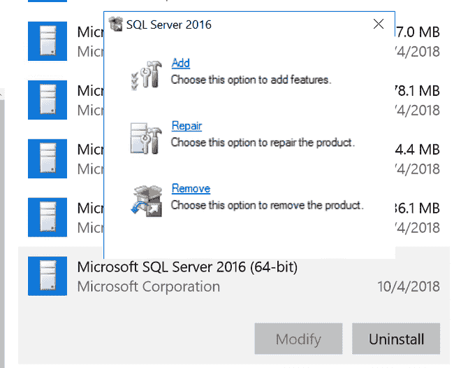
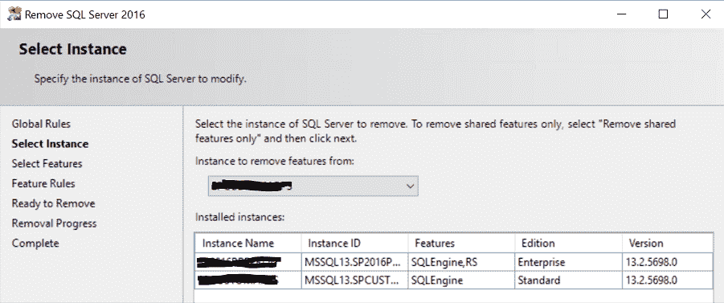
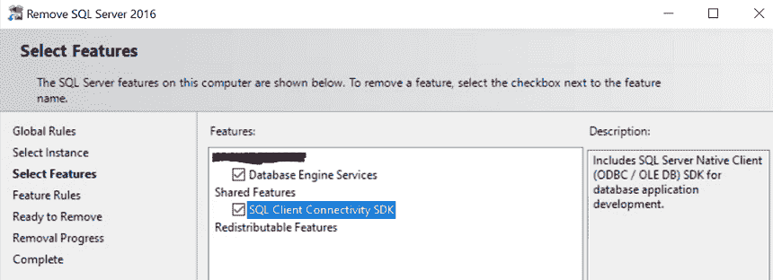
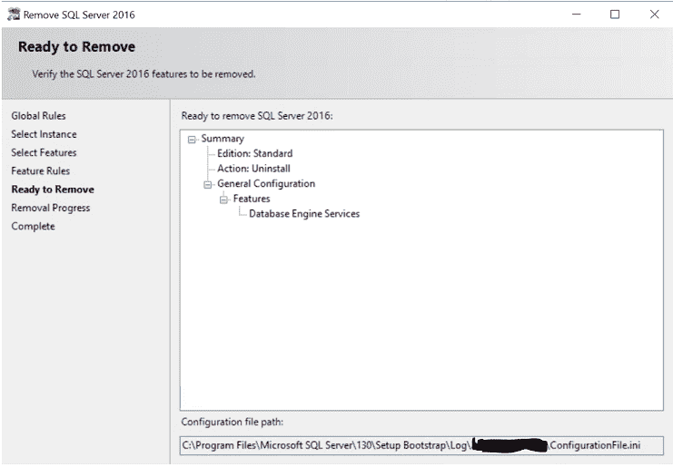

# 如何卸载一个 SQL Server 实例？

> 原文:[https://www . geesforgeks . org/如何卸载 SQL server 实例/](https://www.geeksforgeeks.org/how-to-uninstall-an-instance-of-sql-server/)

[SQL Server](https://www.geeksforgeeks.org/introduction-of-ms-sql-server/) 是微软开发并上市的关系数据库管理系统。在本文中，我们将研究如何卸载 SQL Server 安装程序的实例:

### **先决条件:**

1.  要卸载 SQL Server，您需要具有本地管理员权限。
2.  备份你的数据。您可以创建所有数据库(包括系统数据库)的完整备份，或者手动复制。mdf 和。ldf 文件移动到一个单独的位置。
3.  停止所有 SQL Server 服务。

### **卸载:**

*   要开始从 Windows Server 2008、Windows Server 2012 和 Windows 2012 R2 中删除程序，请导航至**控制面板**，然后选择**程序和功能。**
*   右键单击微软 SQL Server(版本)(位)，选择**卸载**。

**或**

*   要从 Windows 10、Windows Server 2016、Windows Server 2019 开始删除过程，请从“开始”菜单导航到“设置”，然后选择“应用程序”。
*   在搜索框中搜索 SQL，选择 Microsoft SQL Server(版本)(位)。作为一个示例，微软 SQL Server 2016 (64 位)如下所示:

*   选择**卸载**。
*   在“SQL Server”弹出对话框中选择“删除”，启动“Microsoft SQL Server”向导。

*   使用下拉列表选择实例，标记 SQL Server 实例名称，或选择仅删除 SQL Server 共享功能和管理工具。若要继续，请选择“下一步”。
*   在“选择功能”页面上，选择需要从 SQL Server 实例中删除的功能。

*   在“删除”页面上，预览将要卸载的功能和组件列表。单击删除开始卸载。

*   刷新 Windows 10、Windows Server 2016、Windows Server 2019 中的“应用程序和功能”窗口，或 Windows Server 2008、Windows Server 2012 和 Windows 2012 R2 中的“程序和功能”窗口，验证是否已成功删除 SQL Server 实例。