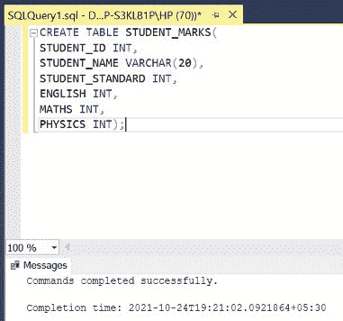
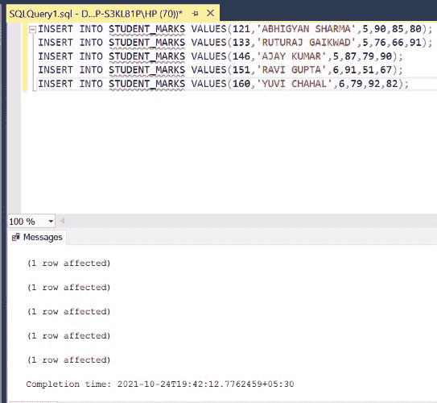
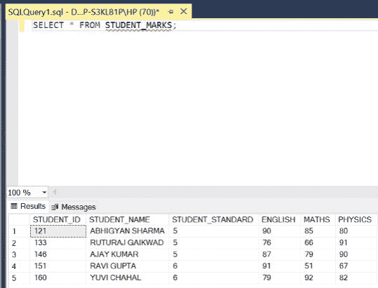
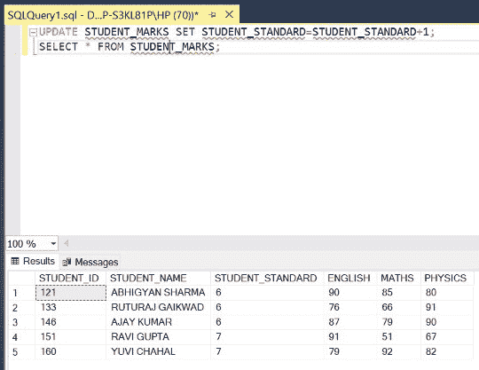
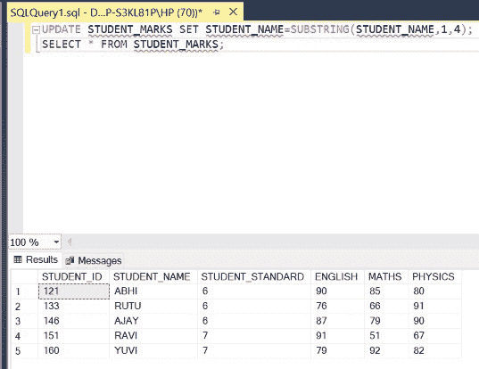
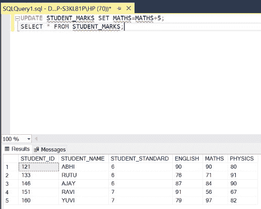

# 如何更新 SQL 中的所有行？

> 原文:[https://www . geesforgeks . org/如何更新 sql 中的所有行/](https://www.geeksforgeeks.org/how-to-update-all-rows-in-sql/)

在 SQL 中，有时会出现[更新](https://www.geeksforgeeks.org/sql-update-statement/)表中所有行的情况。我们将使用 UPDATE 命令在 SQL 中实现这一点。在本文中，我们将使用微软的 SQL Server 作为我们的数据库。

**语法:**

不带 WITH 条件从句

```
UPDATE table_name SET column1 = value1, column2 = value2;
```

With WITH 条件从句

```
UPDATE table_name SET column1 = value1, column2 = value2, ... WHERE condition;
```

**步骤 1:** 创建数据库。为此，使用下面的命令创建一个名为 GeeksForGeeks 的数据库。

**查询:**

```
CREATE DATABASE GeeksForGeeks
```

**输出:**


**步骤 2:** 使用 GeeksForGeeks 数据库。为此，请使用以下命令。

**查询:**

```
USE GeeksForGeeks
```

**输出:**


**步骤 3:** 在数据库 GeeksForGeeks 中创建一个表 STUDENT_MARKS。该表有 4 列，即学生身份、学生姓名、学生标准、英语、数学和物理，包含学生身份、学生姓名、标准和各科成绩。

**查询:**

```
CREATE TABLE STUDENT_MARKS(
STUDENT_ID INT,
STUDENT_NAME VARCHAR(20),
STUDENT_STANDARD INT,
ENGLISH INT,
MATHS INT,
PHYSICS INT);
```

**输出:**



**第 4 步:**在 MARKS 表中插入 5 行。

**查询:**

```
INSERT INTO STUDENT_MARKS VALUES(121,'ABHIGYAN SHARMA',5,90,85,80);
INSERT INTO STUDENT_MARKS VALUES(133,'RUTURAJ GAIKWAD',5,76,66,91);
INSERT INTO STUDENT_MARKS VALUES(146,'AJAY KUMAR',5,87,79,90);
INSERT INTO STUDENT_MARKS VALUES(151,'RAVI GUPTA',6,91,51,67);
INSERT INTO STUDENT_MARKS VALUES(160,'YUVI CHAHAL',6,79,92,82);
```

**输出:**



**第 5 步:**显示 MARKS 表的所有行，包括 0(零)值。

**查询:**

```
SELECT * FROM STUDENT_MARKS;
```

**输出:**



**第七步:**假设新学年已经开始。所以我们需要将所有行的 STUDENT_STANDARD 增加(更新)1。我们不会在这里使用 WHERE 子句，因为我们必须更新所有的行。然后显示表格。

**查询:**

```
UPDATE STUDENT_MARKS SET STUDENT_STANDARD=STUDENT_STANDARD+1;
SELECT * FROM STUDENT_MARKS;
```

**输出:**



**第八步:**学校管理的一些新变化规定只显示学生姓名的前 4 个字母。因此，我们需要将名称更新为仅包含前 4 个字母的子字符串。我们不会在这里使用 WHERE 子句，因为我们必须更新所有的行。然后显示表格。

**查询:**

```
UPDATE STUDENT_MARKS SET STUDENT_NAME=SUBSTRING(STUDENT_NAME,1,4);
SELECT * FROM STUDENT_MARKS;
```

**输出:**



**第九步:**假设数学老师想把所有学生的分数都提高 5 分。所以我们需要更新数学列，所以我们将值增加 5。我们不会在这里使用 WHERE 子句，因为我们必须更新所有的行。然后显示表格。

**查询:**

```
UPDATE STUDENT_MARKS SET MATHS=MATHS+5;
SELECT * FROM STUDENT_MARKS;
```

**输出:**



因此，以上述方式，我们可以使用 update 命令更新表中的所有行。我们不会同时使用 WHERE 子句，因为所有的行都需要更新。