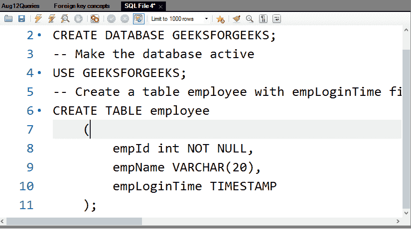
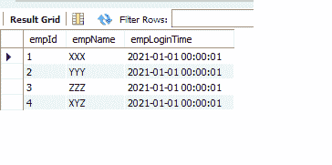
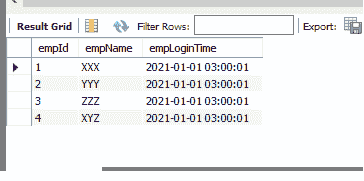
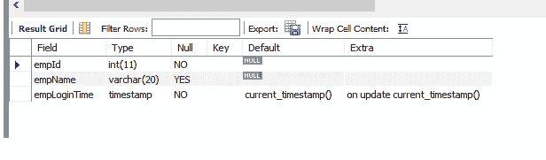
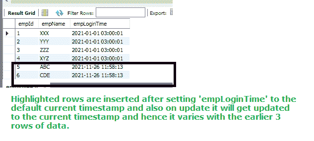
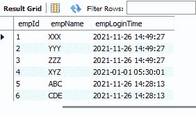

# 如何在 MySQL 中更新当前时间戳？

> 原文:[https://www . geesforgeks . org/how-update-current-timestamp-in-MySQL/](https://www.geeksforgeeks.org/how-to-update-current-timestamp-in-mysql/)

MySQL 是一个易于使用的 RDBMS。许多组织更喜欢使用它，因为它易于维护，更容易准备模式、存储过程、触发器和数据库维护。在本文中，让我们看看如何在 MySQL 中更新到当前时间戳。

**步骤 1:** 数据库创建

首先我们创建数据库。这里的 GEEKSFORGEEKS 是数据库的名字。

**查询:**

```
CREATE DATABASE GEEKSFORGEEKS;
```

**步骤 2:** 激活数据库

**查询:**

```
USE GEEKSFORGEEKS;
```

**第 3 步:**创建一个员工表，将 empLoginTime 字段作为时间戳。

**查询:**

```
CREATE TABLE employee
   (
       empId int NOT NULL,
       empName VARCHAR(20),
       empLoginTime TIMESTAMP
   );
```

**输出:**



**第四步:**我们可以设置时区如下

**查询:**

```
SET TIME_ZONE = '+00:00';
```

如果我们想改变时区那也是可以做到的。

**步骤 5:** 现在，让我们插入记录

**查询:**

```
INSERT INTO employee
    (
        empId, empName, empLoginTime
    )
VALUES
    (1, 'XXX', '2021-01-01 00:00:01'),
    (2, 'YYY', '2021-01-01 00:00:01'),
    (3, 'ZZZ', '2021-01-01 00:00:01'),
    (4, 'XYZ', '2021-01-01 00:00:01');
```

**第 6 步:**显示记录

**查询:**

```
SELECT * FROM employee;
```

**输出:**



这里，“empLoginTime”列指示所述时区模式中的值。

**步骤 7:** 可以查看不同时区的数据。在此期间，我们可以随意设置时区

**查询:**

```
SET time_zone ='+03:00';
SELECT * FROM employee;
```

**输出:**



在 MySQL 中，有一个工具可以保存列的默认当前时间戳值。即每当员工登录系统时，empLoginTime 应该自动获取时间戳值。这相当于将列更新为当前时间戳值。

**查询:**

```
ALTER TABLE employee MODIFY 
COLUMN empLoginTime 
TIMESTAMP DEFAULT CURRENT_TIMESTAMP
ON UPDATE CURRENT_TIMESTAMP;    
```

现在让我们检查一下桌子的结构

**查询:**

```
DESC employee;
```



### **拥有 current_timestamp 更新的优势:**

对于 DEFAULT CURRENT_TIMESTAMP 和 ON UPDATE CURRENT_TIMESTAMP，“empLoginTime”列的默认值都是当前时间戳，并且会自动更新为当前时间戳。

现在让我们将记录插入表中。因为我们有默认的 current_timestamp，并且在更新时也是 current_timestamp，所以我们不需要给出“empLoginTime”的值。下面是这样做的查询。

**查询:**

```
**Since empLoginTime has the current 
timestamp value, we no need to add the value
 explicitly to that column**
INSERT INTO employee (empId, empName) VALUES
(5, 'ABC'),(6,'CDE');
```

显示记录

**查询:**

```
SELECT * FROM employee;
```



最好有“登录”和“注销”列，以及类似类型的列，以默认当前时间戳值。如果没有设置，我们可以很容易地更新列值。

在 MySQL 工作台中，我们必须执行以下操作:

更新数据的步骤

*   导航至编辑–>首选项。
*   然后单击“SQL 编辑器”选项卡，并取消选中“安全更新”复选框。
*   然后单击查询–>重新连接到服务器。

现在执行您的 SQL 查询

**查询:**

```
UPDATE employee set empLoginTime = CURRENT_TIMESTAMP
WHERE empId < 4;
```

显示记录

**查询:**

```
SELECT * FROM employee;
```



通常，我们应该在表中有“创建时间”和“修改时间”来获得更新的值。这将有助于审计目的。默认约束有助于设置当前时间戳值。在创建表的过程中，可以设置默认值，或者通过使用 ALTER 命令，我们可以设置默认约束。另一种方法是使用“更新”命令，如上面的例子所示。