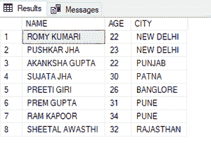
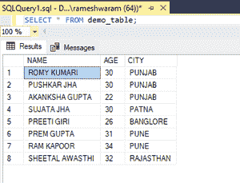

# 如何在 SQL 中单个 Update 语句中更新多列？

> 原文:[https://www . geesforgeks . org/如何更新-多列单更新-sql 语句/](https://www.geeksforgeeks.org/how-to-update-multiple-columns-in-single-update-statement-in-sql/)

在本文中，我们将看到，如何在一条 SQL 语句中更新多个列。我们可以通过在 update 语句中的 SET 命令后指定多个列来更新多个列。UPDATE 语句后面总是跟着 SET 命令，它指定需要更新的列。

**多列更新**

**语法:**

```sql
UPDATE table_name
SET column_name1= value1, column_name2= value2
WHERE condition;
```

现在，按照以下步骤进行演示:

**步骤 1:** 创建数据库

我们可以使用以下命令创建一个名为 geeks 的数据库。

**查询:**

```sql
CREATE DATABASE geeks;
```

**步骤 2:** 使用数据库

使用下面的 SQL 语句将数据库上下文切换到极客:

**查询:**

```sql
USE geeks;
```

**步骤 3:** 表格定义

我们的极客数据库中有以下演示表。

**查询:**

```sql
CREATE TABLE demo_table(
NAME VARCHAR(20),
AGE INT,
CITY VARCHAR(20) );
```

**步骤 4:** 将数据插入表格

**查询:**

```sql
INSERT INTO demo_table VALUES
('ROMY KUMARI', 22, 'NEW DELHI'),
('PUSHKAR JHA',23, 'NEW DELHI'),
('AKANKSHA GUPTA',22, 'PUNJAB'),
('SUJATA JHA', 30,'PATNA'),
('PREETI GIRI', 26,'BANGLORE'),
('PREM GUPTA',31,'PUNE'),
('RAM KAPOOR', 34,'PUNE'),
('SHEETAL AWASTHI',32, 'RAJASTHAN');
```

**第五步:**查看表格数据

**查询:**

```sql
SELECT * FROM demo_table;
```

**输出:**



**步骤 6:** 更新多列

出于演示的目的，让我们将年龄值更新为 **30** ，将城市值更新为**旁遮普**，其中城市值为“新德里”。

**查询:**

```sql
UPDATE demo_table
SET AGE=30, CITY='PUNJAB'
WHERE CITY='NEW DELHI';
```

**输出:**

**查看表格演示内容 _ 表格**



我们可以看到该表现在已经更新为所需的值。