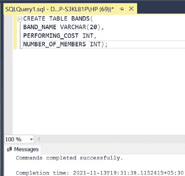
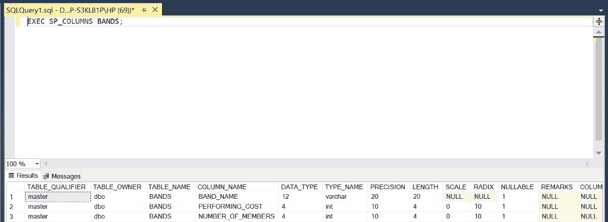
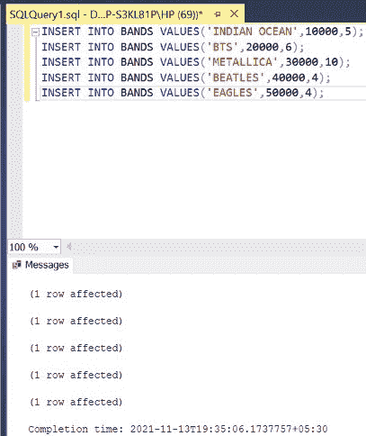
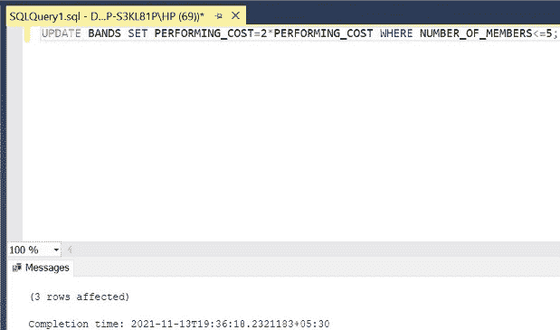
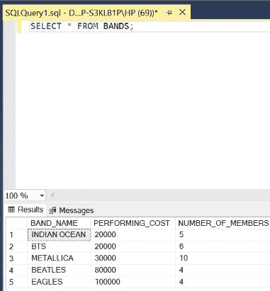
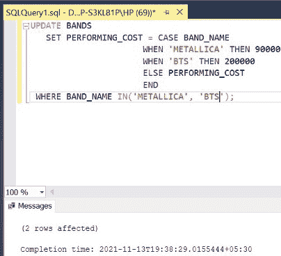
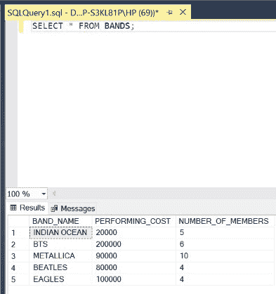

# 如何在 SQL Server 中使用一次查询更新多条记录？

> 原文:[https://www . geesforgeks . org/如何使用 SQL server 中的一次查询更新多条记录/](https://www.geeksforgeeks.org/how-to-update-multiple-records-using-one-query-in-sql-server/)

在 SQL 中，有时我们需要在一个查询中更新多个记录。我们将使用 [UPDATE 关键字](https://www.geeksforgeeks.org/sql-update-statement/)来实现这一点。为此，我们使用了两种示例，即第一种仅基于一个条件，第二种基于多个条件。在本文中，我们将使用微软的 SQL Server 作为我们的数据库和选择关键字。

**步骤 1:** 创建数据库。为此，使用下面的命令创建一个名为 GeeksForGeeks 的数据库。

**查询:**

```
CREATE DATABASE GeeksForGeeks
```

**输出:**


**步骤 2:** 使用 GeeksForGeeks 数据库。为此，请使用以下命令。

**查询:**

```
USE GeeksForGeeks
```

**输出:**


**步骤 3:** 在数据库 GeeksForGeeks 中创建一个 BANDS 表。该表有 3 列，即乐队名称、表演成本和成员数量，包含乐队的名称、表演费用和成员数量。

**查询:**

```
CREATE TABLE BANDS(
BAND_NAME VARCHAR(20),
PERFORMING_COST INT,
NUMBER_OF_MEMBERS INT);
```

**输出:**



**第 4 步:**描述表 BANDS 的结构。

**查询:**

```
EXEC SP_COLUMNS BANDS;
```

**输出:**



**第 5 步:**在 BANDS 表中插入 5 行。

**查询:**

```
INSERT INTO BANDS VALUES('INDIAN OCEAN',10000,5);
INSERT INTO BANDS VALUES('BTS',20000,6);
INSERT INTO BANDS VALUES('METALLICA',30000,10);
INSERT INTO BANDS VALUES('BEATLES',40000,4);
INSERT INTO BANDS VALUES('EAGLES',50000,4);
```

**输出:**



**第 6 步:**显示 BANDS 表的所有行。

**查询:**

```
SELECT * FROM BANDS;
```

**输出:**


**步骤 7:** 更新表 **BANDS** 中仅满足一个条件的所有记录。这里的条件是**栏的值应该小于 5。如果条件得到满足，那么列**的值将加倍。使用关键字**更新**和**其中**来实现。****

**语法:**

```
UPDATE TABLE_NAME SET COLUMN_NAME
= VALUE WHERE CONDITION;
```

**查询:**

```
UPDATE BANDS SET PERFORMING_COST = 
2*PERFORMING_COST WHERE NUMBER_OF_MEMBERS<=5;
```

**输出:**



**第 8 步:**显示更新后的 FIRM 表的所有行。

**查询:**

```
SELECT * FROM BANDS;
```

**注:****表演 _ 成本**对于拥有**成员数量** < =5 的乐队来说已经翻倍了。

**输出:**



**步骤 9:** 更新满足两个(多个)条件的表**波段**的所有记录。这里的条件是如果**乐队名称**是“金属”，那么它的**表演 _ 费用**设置为 90000，如果**乐队名称**是“基站”，那么它的**表演 _ 费用**设置为 200000。使用关键字**更新**和**当**来实现这一点。该查询的行为类似于 if-else if-else 块。

**语法:**

```
UPDATE TABLE_NAME
SET COLUMN_VALUE 
= CASE COLUMN_NAME
WHEN 'COLUMN_NAME1' THEN COLUMN_VALUE1
WHEN 'COLUMN_NAME2' THEN COLUMN_VALUE2
ELSE COLUMN_VALUE
END
WHERE BAND_NAME IN('COLUMN_NAME1', 'COLUMN_NAME2');
```

**查询:**

```
UPDATE BANDS
SET PERFORMING_COST 
= CASE BAND_NAME
WHEN 'METALLICA' THEN 90000
WHEN 'BTS' THEN 200000
ELSE PERFORMING_COST
END
WHERE BAND_NAME IN('METALLICA', 'BTS');
```

**输出:**



**第 10 步:**显示更新后的 FIRM 表的所有行。

**查询:**

```
SELECT * FROM BANDS;
```

**注:【METALLICA 和 BTS 的**performance _ COST**已分别更新为 90000 和 200000。**

**输出:**

