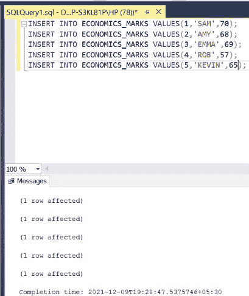
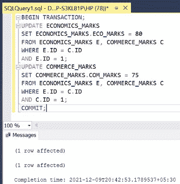

# 如何在 SQL Server 中一条语句更新两个表？

> 原文:[https://www . geesforgeks . org/如何更新-SQL server 二合一语句中的两个表/](https://www.geeksforgeeks.org/how-to-update-two-tables-in-one-statement-in-sql-server/)

在 SQL 中，要求单个查询/语句同时执行两个任务。例如，在一个查询/语句中一起更新两个不同的表。这包括使用**开始交易**条款和**提交**条款。单独的**更新**子句写在前一个子句之间，以同时执行两个更新。下面的文章也描述了同样的情况。在本文中，我们将使用微软的 SQL Server 作为我们的数据库。

**步骤 1:** 创建数据库。为此，使用下面的命令创建一个名为 GeeksForGeeks 的数据库。

**查询:**

```sql
CREATE DATABASE GeeksForGeeks
```

**输出:**


**步骤 2:** 使用 GeeksForGeeks 数据库。为此，请使用以下命令。

**查询:**

```sql
USE GeeksForGeeks
```

**输出:**


**步骤 3:** 在数据库 GeeksForGeeks 中创建一个表 ECONOMICS_MARKS。该表有 3 栏，即身份证、学名和经济成绩，包含学生的卷号和姓名以及学生在经济学科目上的成绩。

**查询:**

```sql
CREATE TABLE ECONOMICS_MARKS(
ID INT,
S_NAME VARCHAR(10),
ECO_MARKS INT);
```

**输出:**


**第 4 步:**描述一下 ECONOMICS_MARKS 表的结构。

**查询:**

```sql
EXEC SP_COLUMNS ECONOMICS_MARKS;
```

**输出:**


**步骤 5:** 在数据库 GeeksForGeeks 中创建一个表 COMMERCE_MARKS。该表有 3 栏，即身份证、学名和商科成绩，包括学生的学号和姓名以及商科学生的成绩。

**查询:**

```sql
CREATE TABLE COMMERCE_MARKS(
ID INT,
S_NAME VARCHAR(10),
COM_MARKS INT);
```

**输出:**


**第 6 步:**描述 COMMERCE_MARKS 表的结构。

**查询:**

```sql
EXEC SP_COLUMNS COMMERCE_MARKS;
```

**输出:**


**第 7 步:**在 ECONOMICS_MARKS 表中插入 5 行。

**查询:**

```sql
INSERT INTO ECONOMICS_MARKS VALUES(1,'SAM',70);
INSERT INTO ECONOMICS_MARKS VALUES(2,'AMY',68);
INSERT INTO ECONOMICS_MARKS VALUES(3,'EMMA',69);
INSERT INTO ECONOMICS_MARKS VALUES(4,'ROB',57);
INSERT INTO ECONOMICS_MARKS VALUES(5,'KEVIN',65);
```

**输出:**



**第 8 步:**显示 ECONOMICS_MARKS 表的所有行。

**查询:**

```sql
SELECT * FROM ECONOMICS_MARKS;
```

**输出:**


**第 9 步:**在 COMMERCE_MARKS 表中插入 5 行。

**查询:**

```sql
INSERT INTO COMMERCE_MARKS VALUES(1,'SAM',80);
INSERT INTO COMMERCE_MARKS VALUES(2,'AMY',88);
INSERT INTO COMMERCE_MARKS VALUES(3,'EMMA',90);
INSERT INTO COMMERCE_MARKS VALUES(4,'ROB',75);
INSERT INTO COMMERCE_MARKS VALUES(5,'KEVIN',56);
```

**输出:**


**第 10 步:**显示 COMMERCE_MARKS 表的所有行。

**查询:**

```sql
SELECT * FROM COMMERCE_MARKS;
```

**输出:**


**第 11 步:**使用单个查询分别更新具有 **id=1** 至 **80** 和 **75** 的学生的**经济学**和**商业标记**。这包括 2 个步骤。首先执行 **ECONOMICS_MARKS** 表和 **COMMERCE_MARKS** 表的 **JOIN** 。然后使用分别为 **E** 和 **C** 的表格的**别名**，比较学生的 **ID** (确保从两个表格中选择相同的**ID**)**和**最后比较学生的 **ID** 到 **1** (给定值)。当这两个条件都满足时，**将相应的标记更新为 **80** 和 **75** 。整个过程必须包含在 **BEGIN TRANSACTION** 和 **COMMIT** 之间，作为单个**原子**操作来处理。该查询涉及更新属于相同学号**的记录。****

**语法:**

```sql
BEGIN TRANSACTION;
UPDATE TABLE_1
SET TABLE_1.TABLE_1_COLUMN = VALUE_1
FROM TABLE_1 T1, TABLE_2 T2
WHERE T1.ID = T2.ID
AND T1.ID = ID_VALUE_1;
UPDATE TABLE_2
SET TABLE_2.TABLE_2_COLUMN = VALUE_2
FROM TABLE_1 T1, TABLE_2 T2
WHERE T1.ID = T2.ID
AND T2.ID = ID_VALUE_2;
COMMIT;
```

**查询:**

```sql
BEGIN TRANSACTION;
UPDATE ECONOMICS_MARKS
SET ECONOMICS_MARKS.ECO_MARKS = 80
FROM ECONOMICS_MARKS E, COMMERCE_MARKS C
WHERE E.ID = C.ID
AND E.ID = 1;
UPDATE COMMERCE_MARKS
SET COMMERCE_MARKS.COM_MARKS = 75
FROM ECONOMICS_MARKS E, COMMERCE_MARKS C
WHERE E.ID = C.ID
AND C.ID = 1;
COMMIT;
```

**输出:**



**步骤 12:** 显示更新后的 ECONOMICS_MARKS 表的所有行。

**查询:**

```sql
SELECT * FROM ECONOMICS_MARKS;
```

**注意**–用于 **ID 1** 的列 **ECO_MARKS** 的值被更新为 **80** 。

**输出:**


**步骤 13:** 显示更新后的 COMMERCE_MARKS 表的所有行。

**查询:**

```sql
SELECT * FROM COMMERCE_MARKS;
```

**注:**将 **ID 1** 的 **COM_MARKS** 栏的值更新为 **75** 。

**输出:**


**第 14 步:**使用单个查询将具有 **id=2** 的学生的**经济标记**更新为 **86** 以及具有 **id=3** 的学生的商业标记更新为 **99** 。该查询涉及更新属于不同学号**的记录。**

**查询:**

```sql
BEGIN TRANSACTION;
UPDATE ECONOMICS_MARKS
SET ECONOMICS_MARKS.ECO_MARKS = 86
FROM ECONOMICS_MARKS E, COMMERCE_MARKS C
WHERE E.ID = C.ID
AND E.ID = 2;
UPDATE COMMERCE_MARKS
SET COMMERCE_MARKS.COM_MARKS = 99
FROM ECONOMICS_MARKS E, COMMERCE_MARKS C
WHERE E.ID = C.ID
AND C.ID = 3;
COMMIT;
```

**输出:**


**第 15 步:**显示更新后的 ECONOMICS_MARKS 表的所有行。

**查询:**

```sql
SELECT * FROM ECONOMICS_MARKS;
```

**注意**–用于 **ID 2** 的列 **ECO_MARKS** 的值被更新为 **86** 。

**输出:**


**步骤 16:** 显示更新后的 COMMERCE_MARKS 表的所有行。

**查询:**

```sql
SELECT * FROM COMMERCE_MARKS;
```

**注意**–用于 **ID 3** 的列 **COM_MARKS** 的值被更新为 **99** 。

**输出:**

