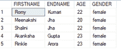
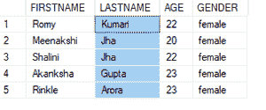
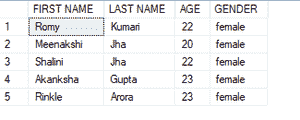

# 如何在 SELECT 语句中使用列别名？

> 原文:[https://www . geesforgeks . org/如何在 select 语句中使用列别名/](https://www.geeksforgeeks.org/how-to-use-column-alias-in-select-statement/)

**别名**用于给列或表赋予一个临时名称(仅在查询期间)，以便使列名或表名更易读。它不会永久更改列的名称。

别名可以使用“as”关键字执行，也可以不使用任何关键字。但是建议使用“AS”关键字，以避免初始列名和列别名之间的混淆。

如果别名包含空格或任何特殊字符，请用单引号(')或双引号(" ")将别名括起来。

在 SQL 中，字符串也用单引号(')括起来。为避免混淆，建议别名使用双引号。

**表别名语法:**

```
SELECT * FROM table_name AS alias_name;
```

**列别名的语法:**

```
SELECT column_name AS alias_name FROM table_name;
```

为了演示的目的，我们将在名为“极客”的数据库中创建 demo_table。

**步骤 1:创建数据库**

使用下面的 SQL 语句创建一个名为 geeks 的数据库。

**查询:**

```
CREATE DATABASE geeks;
```

**步骤 2:使用数据库**

使用下面的 SQL 语句将数据库上下文切换到极客。

**查询:**

```
USE geeks;
```

**第三步:表格定义**

我们的极客数据库中有以下演示表。

**查询:**

```
CREATE TABLE demo_table
(FIRSTNAME VARCHAR(20),
ENDNAME VARCHAR(20),
AGE INT,GENDER VARCHAR(20));
```

**第四步:将数据插入表格**

```
INSERT INTO demo_table VALUES
('Romy', 'Kumari', 22, 'female'),
('Meenakshi', 'Jha', 20, 'female'),
('Shalini', 'Jha', 22, 'female'),
('Akanksha', 'Gupta', 23, 'female'),
('Rinkle', 'Arora', 23, 'female');
```

**第五步:见表格内容**

使用以下命令查看 demo_table 的内容:

**查询:**

```
SELECT * FROM demo_table;
```



**第六步:对 ENDNAME 列执行列别名。**

我们将使用姓氏作为 endgame 列的别名

**查询:**

```
SELECT FIRSTNAME, ENDNAME AS LASTNAME, AGE, GENDER FROM demo_table;
```

**输出:**



**使用(姓氏)和(名字)作为别名**

如果别名中有特殊字符或空格，我们会将别名括在双括号中:

**查询:**

```
SELECT FIRSTNAME AS "FIRST NAME", ENDNAME AS "LAST NAME", AGE, GENDER FROM demo_table;
```

**输出:**

