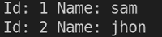

# 如何和 MySQL 一起使用 Go？

> 原文:[https://www.geeksforgeeks.org/how-to-use-go-with-mysql/](https://www.geeksforgeeks.org/how-to-use-go-with-mysql/)

MySQL 是一个基于结构化查询语言(SQL)的开源关系数据库管理系统。它是一个关系数据库，将数据组织到一个或多个表中，这些表中的数据相互关联。

**数据库驱动程序:**数据库驱动程序实现数据库连接的协议。驱动程序就像一个适配器，连接到特定数据库的通用接口。

**初始设置:**

启动 MySQL 服务器，使用以下命令安装 go MySQL 驱动程序。

```
go get -u github.com/go-sql-driver/mysql
```

**创建数据库对象:**

用 sql.Open 创建一个数据库对象。没有与 MySQL 建立连接，而是只创建一个数据库对象，供以后使用。

```
db, err := sql.Open("mysql", "<user>:<password>@tcp(127.0.0.1:3306)/<database-name>")
```

如果在默认端口上没有使用 MySQL，请替换 3306。

## 去

```
package main

import (
    "database/sql"
    "fmt"
    _ "github.com/go-sql-driver/mysql"
)

func main() {

    // create a database object which can be used
    // to connect with database.
    db, err := sql.Open("mysql", "root:passwd@tcp(0.0.0.0:3306)/user")

    // handle error, if any.
    if err != nil {
        panic(err)
    }

    // Now its  time to connect with oru database,
    // database object has a method Ping.
    // Ping returns error, if unable connect to database.
    err = db.Ping()

    // handle error
    if err != nil {
        panic(err)
    }

    fmt.Print("Pong\n")

    // database object has  a method Close,
    // which is used to free the resource.
    // Free the resource when the function
    // is returned.
    defer db.Close()
}
```

**输出:**


图 1.1

**执行数据库查询:**可以用 Exec()和 Query()进行数据库查询。

**1。**使用 SQL 查询和 Exec()创建数据库表。

## 去

```
package main

import (
    "database/sql"
    "fmt"

    _ "github.com/go-sql-driver/mysql"
)

func main() {

    // create a database object which can be used
    // to connect with database.
    db, err := sql.Open("mysql", "root:passwd@tcp(0.0.0.0:3306)/user")

    // handle error, if any.
    if err != nil {
        panic(err)
    }

    //  database object has a method called Exec,
    // it executes a database query, but it does
    // not return any row as result.
    // Here we create a database table with a SQL query.
    _, err = db.Exec("CREATE TABLE user(id INT NOT NULL, name VARCHAR(20),
                     PRIMARY KEY (ID));")

    // handle error
    if err != nil {
        panic(err)
    }

    fmt.Print("Successfully Created\n")

    // database object has  a method Close,
    // which is used to free the resource.
    // Free the resource when the function
    // is returned.
    defer db.Close()
}
```

**输出:**


**2。**用查询()中的 SQL 查询在数据库表中插入一行。

## 去

```
package main

import (
    "database/sql"
    "fmt"

    _ "github.com/go-sql-driver/mysql"
)

func main() {

    // create a database object which can be used
    // to connect with database.
    db, err := sql.Open("mysql", "root:passwd@tcp(0.0.0.0:3306)/user")

    // handle error, if any.
    if err != nil {
        panic(err)
    }

    // database object has a method called Query,
    // It can execute a SQL query and return rows
    // as result. Here we insert a row into  the  table,
    // no row returned as result for this operation.
    _, err = db.Query("INSERT INTO user VALUES(1,'sam')")

    // handle error
    if err != nil {
        panic(err)
    }

    fmt.Print("Successfully  Inserted\n")

    // database object has  a method Close,
    // which is used to free the resource.
    // Free the resource when the function
    // is returned.
    defer db.Close()
}
```

**输出:**


**3。**使用 query()中的 SQL 查询返回用户表中的所有行。

## 去

```
package main

import (
    "database/sql"
    "fmt"

    _ "github.com/go-sql-driver/mysql"
)

func main() {

    // create a database object which can be
    // used to connect with database.
    db, err := sql.Open("mysql", "root:passwd@tcp(0.0.0.0:3306)/user")

    // handle error, if any.
    if err != nil {
        panic(err)
    }

    // Here a SQL query is used to return all
    // the data from the table user.
    result, err := db.Query("SELECT * FROM user")

    // handle error
    if err != nil {
        panic(err)
    }

    // the result object has a method called Next,
    // which is used to iterate through all returned rows.
    for result.Next() {

        var id int
        var name string

        // The result object provided Scan  method
        // to read row data, Scan returns error,
        // if any. Here we read id and name returned.
        err = result.Scan(&id, &name)

        // handle error
        if err != nil {
            panic(err)
        }

        fmt.Printf("Id: %d Name: %s\n", id, name)
    }

    // database object has  a method Close,
    // which is used to free the resource.
    // Free the resource when the function
    // is returned.
    defer db.Close()
}
```

**输出:**

