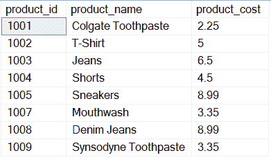
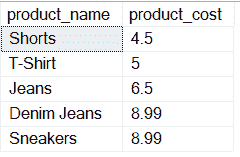
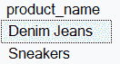
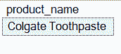
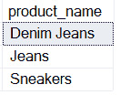
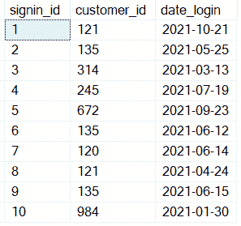
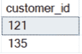

# 如何在 SQL 中使用 HAVING With 聚合函数？

> 原文:[https://www . geeksforgeeks . org/如何使用 sql 中的聚合函数/](https://www.geeksforgeeks.org/how-to-use-having-with-aggregate-functions-in-sql/)

SQL 提供了许多执行任务的内置函数。有 4 种类型的函数:日期函数、字符函数、数值函数和聚合函数。

这里我们将研究聚合函数以及如何使用 **HAVING** 关键字来使用它们。

聚合函数是数据库内置函数，作用于表的多行并产生单个输出。我们在 SQL 中经常使用的聚合函数基本上有 5 个。聚合函数是确定性的。常见的聚合函数如下:

*   [**【COUNT()**](https://www.geeksforgeeks.org/sql-count-avg-and-sum/)**:**计算表中的总行数，它返回单个值。
*   [**【AVG()**](https://www.geeksforgeeks.org/sql-count-avg-and-sum/)**:**计算应用于该列的值的平均值。
*   [**【MIN()】**](https://www.geeksforgeeks.org/sql-count-avg-and-sum/)**:**返回其应用到的列中的最小值。
*   [**【MAX()**](https://www.geeksforgeeks.org/sql-count-avg-and-sum/)**:返回应用到的列中的最大值。**
*   [**【SUM()】**](https://www.geeksforgeeks.org/sql-count-avg-and-sum/)**:**返回其应用到的列的所有值的总和。

何时使用 **HAVING** 关键字？

我们用来在给定条件下筛选数据的 WHERE 关键字可以很好地与算术运算符、比较运算符等 SQL 运算符配合使用，但是当涉及到聚合函数时，我们使用 HAVING 关键字来对给定条件下的数据进行排序。GROUP BY 子句也与 HAVING 关键字一起使用。

**语法:**

```sql
SELECT column_name(s) 
FROM table_name 
WHERE condition 
GROUP BY expression 
HAVING condition 
ORDER BY expression 
LIMIT value;
```

### **将 SUM()与 Having 子句一起使用:**

**步骤 1:** 创建数据库

**查询:**

```sql
CREATE DATABASE database_name;
```

**步骤 2:** 创建一个名为产品的表。

**查询:**

```sql
CREATE TABLE PRODUCTS(product_id int primary key, product_name varchar(45), product_cost float);
```

**步骤 3:** 在表格中插入数值

**查询:**

```sql
INSERT INTO PRODUCTS VALUES 
(1001, 'Colgate Toothpaste', 2.25), (1002 'T-Shirt', 5), 
(1003, 'Jeans', 6.5), (1004, 'Shorts', 4.5), 
(1005, 'Sneakers', 8.99), (1007, 'Mouthwash', 3.35), 
(1008, 'Denim Jeans', 8.99), (1009, 'Synsodyne Toothpaste', 3.35);
```

**第四步:**现在我们来看看产品表的内容。

**查询:**

```sql
SELECT * FROM products;
```

**输出:**



**第五步:**现在我们的任务是打印所有那些产品成本之和大于 3.50 的产品。

**查询:**

```sql
SELECT product_name, product_cost  
FROM products  
GROUP BY product_name, product_cost  
HAVING SUM(product_cost) > 3.5  
ORDER BY product_cost;
```

**输出:**



产品表

这里只显示那些成本大于 3.5 的产品

### **使用带 Having 子句的 MAX()和 MIN()**

我们使用的产品表与上一个示例中使用的相同。

我们的任务是找到最高价格大于 7 的产品名称和最低价格小于 3 的产品名称。

**查询:**

```sql
SELECT * FROM products;
```


**查询 1(查找最高价格大于 7 的产品)**

```sql
SELECT product_name 
FROM products 
GROUP BY product_name 
HAVING MAX(product_cost) > 7;
```

**输出**



**查询 2(查找最低价格低于 3 的产品)**

```sql
SELECT product_name 
FROM products 
GROUP BY product_name 
HAVING MIN(product_cost) < 3;
```

**输出:**



### **使用带有 Having 子句的 AVG()**

我们将使用产品表来演示这一部分。

**查询:**

```sql
SELECT * FROM products;
```


现在，我们要选择那些价格大于产品表平均价格的产品。

**查询:**

```sql
SELECT product_name
FROM products
GROUP BY product_name
HAVING AVG(product_cost) > (SELECT AVG(product_cost) FROM products);
```

**输出:**



这里只显示那些平均价格高于产品表平均价格的产品。

### **将 Count()与 Having 子句一起使用**

**第一步:**我们将创建一个数据库。

**查询:**

```sql
CREATE DATABASE database_name;
```

**第二步:**创建表登录。

**查询:**

```sql
CREATE TABLE login(signin_id int PRIMARY KEY ,customer_id int, date_login date);
```

**步骤 3:** 在表格中插入数值。

**查询:**

```sql
INSERT INTO login values
(1, 121, '2021-10-21'), (2, 135, '2021-05-25'),  
(3, 314, '2021-03-13'), (4, 245, '2021-07-19'),  
(5, 672, '2021-09-23'), (6, 135, '2021-06-12'),  
(7,120,'2021-06-14'), (8, 121, '2021-04-24'),  
(9,135, '2021-06-15'), (10, 984, '2021-01-30');
```

**第四步:**显示表格内容。

**查询:**

```sql
SELECT * FROM login;
```

**输出:**



现在我们要显示那些至少出现过两次的客户 id。

**查询:**

```sql
SELECT customer_id  
FROM login
 GROUP BY customer_id 
HAVING COUNT(customer_id) >=2 ;
```

**输出:**



这里 customer_id 121 和 135 至少出现了两次。