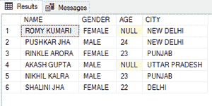
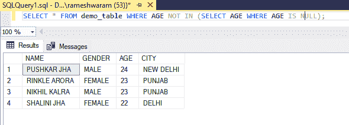
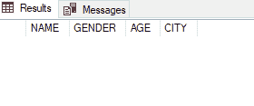
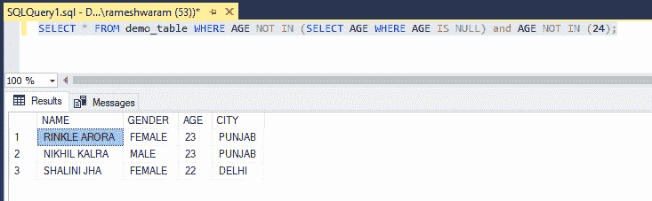

# 如何在 SQL 中使用 NOT IN 子句内部的空值？

> 原文:[https://www . geesforgeks . org/如何使用-null 值-in-not-in-子句-in-sql/](https://www.geeksforgeeks.org/how-to-use-null-values-inside-not-in-clause-in-sql/)

在本文中，我们将看到如何在 SQL 的 NOT IN 子句中使用空值。空在 [SQL 中有特殊的地位。](https://www.geeksforgeeks.org/sql-null-functions/)表示没有值，所以不能用来比较。如果使用它进行比较，它将始终返回空值。

为了在 NOT IN 子句中使用[空值](https://www.geeksforgeeks.org/sql-null-values/)，我们可以创建一个单独的子查询来包含[空值](https://www.geeksforgeeks.org/sql-null-values/)。

为空值单独创建一个 where 子句，如:

**查询:**

```
WHERE value IS NULL;
```

**步骤 1:** 创建数据库

使用下面的 SQL 语句创建名为极客的数据库；

**查询:**

```
CREATE DATABASE geeks;
```

**步骤 2:** 使用数据库

使用下面的 SQL 语句将数据库上下文切换到极客:

**查询:**

```
USE geeks;
```

**步骤 3:** 表格创建

我们的极客数据库中有以下演示表。

**查询:**

```
CREATE TABLE demo_table(
NAME VARCHAR(20),
GENDER VARCHAR(20),
AGE INT,
CITY VARCHAR(20) );
```

**步骤 4:** 将数据插入表格

**查询:**

```
INSERT INTO demo_table VALUES
('ROMY KUMARI', 'FEMALE', NULL, 'NEW DELHI'),
('PUSHKAR JHA', 'MALE',24, 'NEW DELHI'),
('RINKLE ARORA', 'FEMALE',23, 'PUNJAB'),
('AKASH GUPTA', 'MALE', NULL, 'UTTAR PRADESH'),
('NIKHIL KALRA', 'MALE', 23, 'PUNJAB'),
('SHALINI JHA','FEMALE', 22, 'DELHI');
```

**第五步:**查看表格数据

**查询:**

```
SELECT * FROM demo_table;
```

**输出:**



**步骤 6:** 在非空中使用空值

为了演示，我们将从年龄不是[空值的表中返回值。](https://www.geeksforgeeks.org/sql-select-null/)

**查询:**

```
SELECT * FROM demo_table WHERE AGE NOT IN (SELECT AGE WHERE AGE IS NULL);
```

**输出:**



如果要在非输入子句中添加值，请使用与运算符定义单独的非输入子句。如果在同一个 NOT IN 子句中添加该值，它将返回 NULL。

**查询:**

```
SELECT * FROM demo_table WHERE AGE NOT IN ((SELECT AGE WHERE AGE IS NULL),24);
```

**输出:**



返回空表。

**用空值添加 NOT IN 子句中其他值的正确方法:**

**查询:**

```
SELECT * FROM demo_table WHERE AGE NOT IN (SELECT AGE WHERE AGE IS NULL) and AGE NOT IN (24);
```

**输出:**

