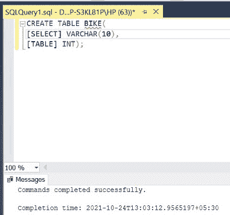
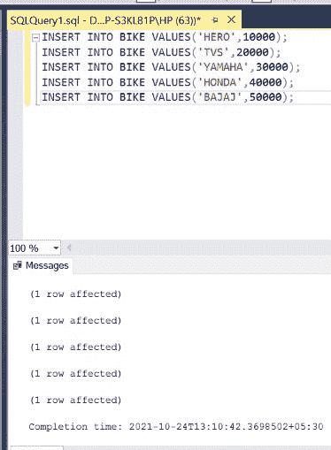
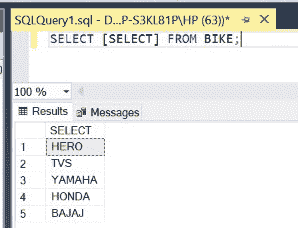
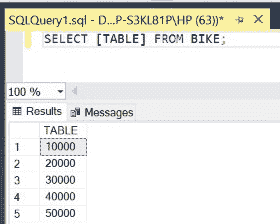
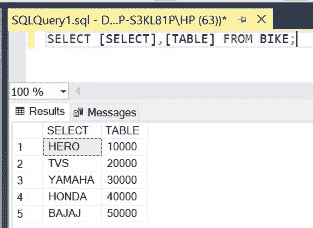

# 如何在 SQL 中使用保留字作为列名？

> 原文:[https://www . geesforgeks . org/如何使用保留字作为 sql 中的列名/](https://www.geeksforgeeks.org/how-to-use-reserved-words-as-column-names-in-sql/)

在 SQL 中，某些单词是保留的。这些被称为关键字或保留字。这些单词不能用作标识符，即在 SQL 中不能用作列名。但是，这条规则也有例外。在本文中，我们将讨论如何在 SQL 中使用保留字作为列名。在本文中，我们将使用微软的 SQL Server 作为我们的数据库。

**步骤 1:** 创建数据库。为此，使用下面的命令创建一个名为 GeeksForGeeks 的数据库

**查询:**

```sql
CREATE DATABASE GeeksForGeeks
```

**输出:**


**步骤 2:** 使用 GeeksForGeeks 数据库。为此，请使用以下命令

**查询:**

```sql
USE GeeksForGeeks
```

**输出:**


**步骤 3:** 在数据库 GeeksForGeeks 中创建一个表。我们将桌子命名为 BIKE。它将包含 2 个名为 SELECT 和 TABLE 的列。这两个都是 SQL 中的关键词。这里的技巧是在方括号“[]”内键入列名，这样编译器就不会将它们作为保留字来读取。

**查询:**

```sql
CREATE TABLE BIKE(
[SELECT] VARCHAR(10),
[TABLE] INT);
```

**输出:**



**注意:**这里**选择**栏存储自行车名称，**表**栏存储自行车费用。

**第 4 步:**向 BIKE 表添加数据。

**查询:**

```sql
INSERT INTO BIKE VALUES('HERO',10000);
INSERT INTO BIKE VALUES('TVS',20000);
INSERT INTO BIKE VALUES('YAMAHA',30000);
INSERT INTO BIKE VALUES('HONDA',40000);
INSERT INTO BIKE VALUES('BAJAJ',50000);
```

**输出:**



**第 4 步:**显示自行车表中的选择列。

**查询:**

```sql
SELECT [SELECT] FROM BIKE;
```

**输出:**



**步骤 5:** 显示自行车表格中的表格列。

**查询:**

```sql
SELECT [TABLE] FROM BIKE;
```

**输出:**



**第 5 步:**我们甚至可以使用逗号分隔符显示这两列。

**查询:**

```sql
SELECT [SELECT],[TABLE] FROM BIKE;
```

**输出:**



因此，以类似的方式，我们可以使用 SQL 中的任何保留名称作为列名。