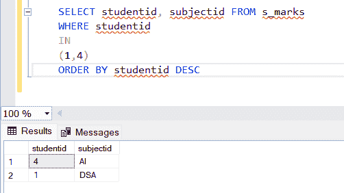

# 如何在 SQL 中使用按特定 id 排序选择？

> 原文:[https://www . geesforgeks . org/如何使用-按特定 id 按顺序选择-sql/](https://www.geeksforgeeks.org/how-to-use-select-in-order-by-specific-ids-in-sql/)

SQL 中使用语句的顺序，通过在后缀中提到结果集为 [DESC](https://www.geeksforgeeks.org/sql-describe-statement/) (用于降序)和 ASC(用于升序)，以升序或降序对结果集进行排序。在本文中，我们将在一个只有一些指定列值的数据库上进行排序。

让我们首先创建一个数据库。

**步骤 1:** 创建数据库

**查询:**

```sql
CREATE DATABASE GFG
```

**步骤 2:** 使用数据库

**查询:**

```sql
USE GFG
```

**步骤 3:** 创建表格

**查询:**

```sql
CREATE TABLE s_marks 
(
studentid int PRIMARY KEY, 
subjectid VARCHAR(10), 
professorid int
)
```

**步骤 4:** 在表格中插入一些数据

**查询:**

```sql
INSERT INTO [dbo].[s_marks]
           ([studentid]
           ,[subjectid]
           ,[professorid])
     VALUES(1, 'DSA', 6)
GO 

INSERT INTO [dbo].[s_marks]
           ([studentid]
           ,[subjectid]
           ,[professorid])
     VALUES(2, 'Compiler', 7)
GO

INSERT INTO [dbo].[s_marks]
           ([studentid]
           ,[subjectid]
           ,[professorid])
     VALUES(3, 'ML', 8)
GO 

INSERT INTO [dbo].[s_marks]
           ([studentid]
           ,[subjectid]
           ,[professorid])
     VALUES(4, 'AI', 9)
GO 
```

**第五步:**使用一些 id 通过根据学生证和[订单获取表格数据。](https://www.geeksforgeeks.org/sql-order-by/)

**查询:**

```sql
SELECT studentid, subjectid FROM s_marks 
    WHERE studentid 
    IN
    (1,4)
    ORDER BY studentid DESC
```

**输出:**



因此，我们可以看到，数据成功地与订单以及各自的 id 一起打印出来。