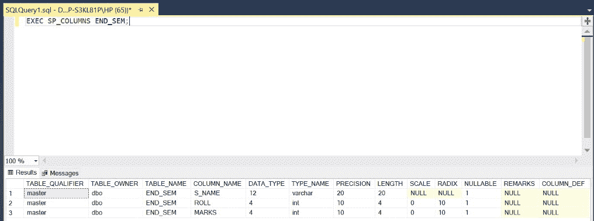
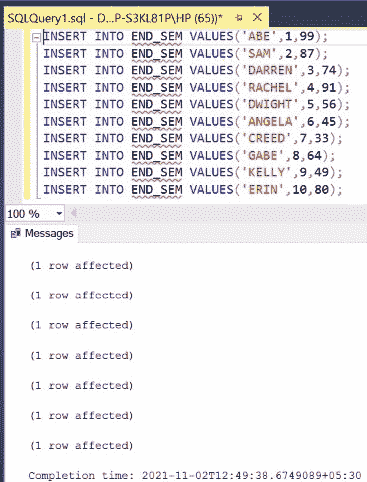
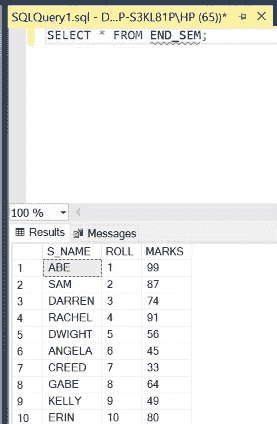
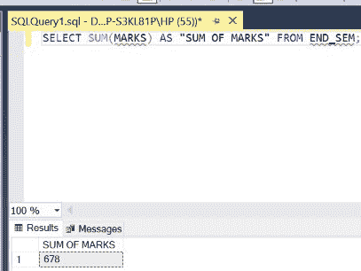
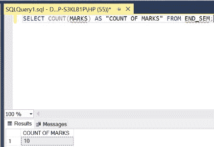
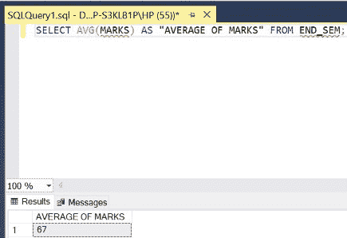
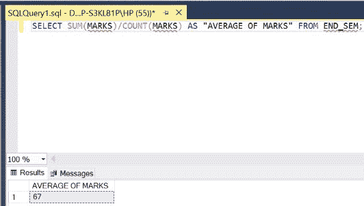
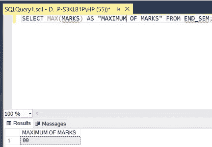
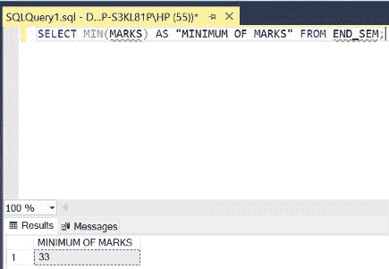

# 如何在 SQL 中使用带有聚合函数的 SELECT？

> 原文:[https://www . geesforgeks . org/如何使用 sql 中的聚合函数选择/](https://www.geeksforgeeks.org/how-to-use-select-with-aggregate-functions-in-sql/)

在 SQL 中，主要提供了五个[聚合函数](https://www.geeksforgeeks.org/aggregate-functions-in-sql/)。这些有助于我们以期望的方式处理表数据。所有这些都说明如下。在本文中，我们将使用微软的 SQL Server 作为我们的数据库。

**步骤 1:** 创建数据库。为此，使用下面的命令创建一个名为 GeeksForGeeks 的数据库。

**查询:**

```
CREATE DATABASE GeeksForGeeks
```

**输出:**


**步骤 2:** 使用 GeeksForGeeks 数据库。为此，请使用以下命令。

**查询:**

```
USE GeeksForGeeks
```

**输出:**


**步骤 3:** 在数据库 GeeksForGeeks 中创建一个表 END_SEM。该表有 3 列，即 S_NAME、ROLL 和 MARKS，包含姓名、卷号和不同学生的分数。

**查询:**

```
CREATE TABLE END_SEM(
S_NAME VARCHAR(20),
ROLL INT,
MARKS INT);
```

**输出:**


**第四步:**描述表 END_sEM 的结构。

**查询:**

```
EXEC SP_COLUMNS END_SEM;
```

**输出:**



**第 5 步:**在 END_SEM 表中插入 5 行。

**查询:**

```
INSERT INTO END_SEM VALUES('ABE',1,99);
INSERT INTO END_SEM VALUES('SAM',2,87);
INSERT INTO END_SEM VALUES('DARREN',3,74);
INSERT INTO END_SEM VALUES('RACHEL',4,91);
INSERT INTO END_SEM VALUES('DWIGHT',5,56);
INSERT INTO END_SEM VALUES('ANGELA',6,45);
INSERT INTO END_SEM VALUES('CREED',7,33);
INSERT INTO END_SEM VALUES('GABE',8,64);
INSERT INTO END_SEM VALUES('KELLY',9,49);
INSERT INTO END_SEM VALUES('ERIN',10,80);
```

**输出:**



**第 6 步:**显示 END_SEM 表的所有行。

**查询:**

```
SELECT * FROM END_SEM;
```

**输出:**



SQL 中有五个[聚合函数](https://www.geeksforgeeks.org/aggregate-functions-in-sql/)。以上新创建的 **END_SEM** 表格展示了它们的用法:

*   **SUM 函数:**返回 **SUM** 后括号中指定的列的所有条目的和(相加)。

**查询:**

```
SELECT SUM(MARKS) AS "SUM OF MARKS" FROM END_SEM;
```

**输出:**



*   **计数功能:**返回**计数**后括号中指定的列中非空条目的计数(个数)。如果所有的列都需要这个，那么我们需要在**计数**之后的括号中加上一个*号。

**查询:**

```
SELECT COUNT(MARKS) AS "COUNT OF
MARKS" FROM END_SEM;
```

**输出:**



*   **AVG 函数:**返回 **AVG** 后括号内指定列所有条目的平均值(均值)。平均值=总和/计数

**查询 1:**

```
SELECT AVG(MARKS) AS "AVERAGE OF MARKS" FROM END_SEM;
```

**输出:**



**查询 2:**

```
SELECT SUM(MARKS)/COUNT(MARKS) AS "AVERAGE OF MARKS" FROM END_SEM;
```

**输出:**



*   **MAX 函数:**返回 **MAX** 后括号中指定的列中所有条目的最大值条目。

**查询:**

```
SELECT MAX(MARKS) AS "MAXIMUM OF MARKS" FROM END_SEM;
```

**输出:**



*   **MIN 函数:**返回 **MIN** 后括号中指定的列中所有条目的最小值条目。

**查询:**

```
SELECT MIN(MARKS) AS "MINIMUM OF MARKS" FROM END_SEM;
```

**输出:**

