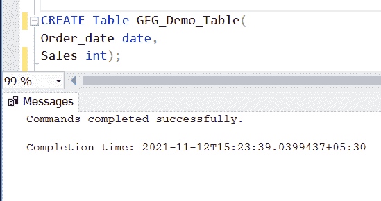
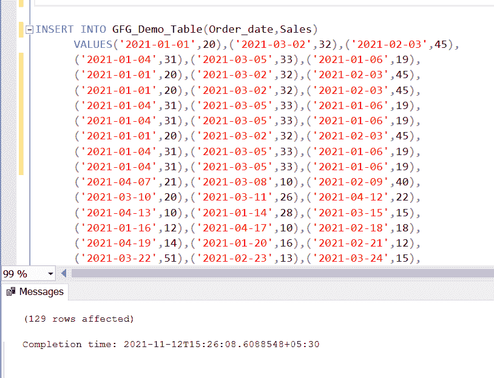

# 如何在不锁定表的情况下使用 SELECT？

> 原文:[https://www . geesforgeks . org/如何使用-选择-不锁定-a-table/](https://www.geeksforgeeks.org/how-to-use-select-without-locking-a-table/)

使用 **SELECT** 语句和正在进行的 [**INSERT**](https://www.geeksforgeeks.org/sql-insert-statement/) 或 [**UPDATE**](https://www.geeksforgeeks.org/sql-update-statement/) 语句，对行或可能对整个表进行排他锁，直到提交或回滚该操作的事务。假设您正在处理一个包含数千行的非常大的表，而数据库表的设计效率并不高。请记住，在现实生活中，您不是唯一一个使用数据库的人，该数据库可能同时在许多用户的设备上被访问。因此，如果您正在使用 [SELECT 语句](https://www.geeksforgeeks.org/sql-select-query/)读取表，而其他人正在尝试执行 INSERT 语句，那么可能会发生锁，两个事务会相互阻塞。

因此 **SQL Server 中的解决方案是** **【诺洛克】**表提示允许您指示查询优化器读取给定的表，而无需获得排他锁或共享锁。

**步骤 1:** 使用数据库创建数据库

**查询:**

```
CREATE DATABASE GFG_Demo;
USE GFG_Demo;     
```

**输出:**


**步骤 2:** 表格定义

我们的 GFG 演示数据库中有以下演示表。

**查询:**

```
CREATE Table GFG_Demo_Table
( Order_date date, Sales int);   
```

**输出:**



**步骤 3:** 向表中添加数据

使用下面的语句向 GFG 演示表添加数据。

**查询:**

```
INSERT INTO GFG_Demo_Table(Order_date,Sales)   
VALUES('2021-01-01',20),('2021-03-02',32),('2021-02-03',45),
('2021-01-04',31),('2021-03-05',33),('2021-01-06',19), 
('2021-01-01',20),('2021-03-02',32),
('2021-02-03',45),('2021-01-01',20),('2021-03-02',32),
('2021-02-03',45),  ('2021-01-04',31),('2021-03-05',33),
('2021-01-06',19),  ('2021-01-04',31),('2021-03-05',33),
('2021-01-06',19),  ('2021-01-01',20),('2021-03-02',32),
('2021-02-03',45),  ('2021-01-04',31),('2021-03-05',33),
('2021-01-06',19),  ('2021-01-04',31),('2021-03-05',33),
('2021-01-06',19),  ('2021-04-07',21),('2021-03-08',10),
('2021-02-09',40),  ('2021-03-10',20),('2021-03-11',26),
('2021-04-12',22),  ('2021-04-13',10),('2021-01-14',28),
('2021-03-15',15),  ('2021-01-16',12),('2021-04-17',10),
('2021-02-18',18),  ('2021-04-19',14),('2021-01-20',16),
('2021-02-21',12),  ('2021-03-22',51),('2021-02-23',13),
('2021-03-24',15),  ('2021-02-25',30),('2021-03-26',14),
('2021-04-27',16),  ('2021-02-25',30),('2021-03-26',14),
('2021-04-27',16),  ('2021-02-25',30),('2021-03-26',14),
('2021-04-27',16),  ('2021-02-25',30),('2021-03-26',14),
('2021-04-27',16),  ('2021-03-22',51),('2021-02-23',13),
('2021-03-24',15),  ('2021-03-22',51),('2021-02-23',13),
('2021-03-24',15),  ('2021-02-25',30),('2021-03-26',14),
('2021-04-27',16),  ('2021-03-22',51),('2021-02-23',13),
('2021-03-24',15),  ('2021-02-25',30),('2021-03-26',14),
('2021-04-27',16),  ('2021-03-22',51),('2021-02-23',13),
('2021-03-24',15),  ('2021-03-22',51),('2021-02-23',13),
('2021-03-24',15),  ('2021-03-22',51),('2021-02-23',13),
('2021-03-24',15),  ('2021-02-25',30),('2021-03-26',14),
('2021-04-27',16),  ('2021-02-25',30),('2021-03-26',14),
('2021-04-27',16),  ('2021-02-25',30),('2021-03-26',14),
('2021-04-27',16),  ('2021-02-25',30),('2021-03-26',14),
('2021-04-27',16),  ('2021-02-25',30),('2021-03-26',14),
('2021-04-27',16),  ('2021-02-25',30),('2021-03-26',14),
('2021-04-27',16),  ('2021-04-19',14),('2021-01-20',16),
('2021-02-21',12),  ('2021-04-19',14),('2021-01-20',16),
('2021-02-21',12),  ('2021-04-19',14),('2021-01-20',16),
('2021-02-21',12),  ('2021-04-19',14),('2021-01-20',16),
('2021-02-21',12),  ('2021-04-19',14),('2021-01-20',16),
('2021-02-21',12),  ('2021-04-19',14),('2021-01-20',16),
('2021-02-21',12),  ('2021-04-19',14),('2021-01-20',16),
('2021-02-21',12),  ('2021-04-19',14),('2021-01-20',16),
('2021-02-21',12),  ('2021-04-19',14),('2021-01-20',16),
('2021-02-21',12),  ('2021-02-28',15),('2021-01-29',20),
('2021-01-30',18);   
```

**输出:**



**步骤 4:** 使用 NOLOCK

现在我们的表已经准备好了，让我们做一个测试，看看 NOLOCK 有多有用。

**查询:**

```
BEGIN TRAN UPDATE GFG_Demo_Table 
SET Sales= 25 WHERE Sales=20;   
```

**步骤 5:****BEGIN TRAN**语句将启动事务，该事务将在 SQL 会话号 **52** 下的 GFG_Demo_Table 表中运行以下 UPDATE 语句(在我们的系统中可能不同)，而无需通过提交或回滚来完成事务。

**查询:**

```
SELECT * FROM GFG_Demo_Table;   
```

**步骤 6:** 当您执行该查询时，您可能会注意到 SELECT 语句花费的时间比平时稍长。这种差异在较大的桌子上更明显。试试这个，有几千行。这是因为事务仍未提交或回滚。这就是为什么它会阻止其他试图从表中读取数据的查询。您可以使用以下命令进行检查。

**查询:**

```
sp_who2 52   
```

**注意:**对于这个特定的表，由于表没有那么大，SELECT 语句不会被阻塞很长时间，但是在一个有数千个数据的表的情况下，您可以通过运行上面的命令看到阻塞 SELECT 语句的查询的会话号。

**第 7 步:**要运行阻塞查询，必须**杀死**或**提交**或**回滚**事务。然而，这不是最可取的解决方案。这就是**带(NOLOCK)** 进入画面的地方。

**查询:**

```
SELECT * FROM GFG_Demo_Table WITH (NOLOCK);   
```

现在，运行上面的查询，然后使用前面的命令检查 SELECT 语句的状态。

**输出:**


**第 8 步:****BlkBy**栏为空，表示现在解除锁定。也可以使用 **WITH (READUNCOMMITTED)** ，它的作用和 WITH (NOLOCK)一样。它还可以读取未提交的数据，而无需等待 UPDATE 语句释放锁。

**输出:**


**注意:**只能在 **SELECT** 语句中使用这些表提示，不能在其他语句中使用。

### 方法 2:

您可以使用**SET TRANSACTION ISOLATION LEVEL**语句将连接级别的事务隔离级别更改为 READ UNCOMMITTED，而不是使用那些允许在查询级别进行脏读的表提示。

**查询:**

```
SET TRANSACTION ISOLATION LEVEL READ 
UNCOMMITTED; 
SELECT * FROM GFG_Demo_Table;  
```

**输出:**


该查询还将直接检索相同的数据，而不使用任何表提示，也不等待 UPDATE 语句释放它对表执行的锁定。

### 使用 NOLOCK 的缺点

*   一开始使用 NOLOCK 似乎是个好主意，因为我们可以更快地获取请求的数据，而无需等待其他操作提交。但是，脏读是一个巨大的问题，我们在这之后得到的结果，可能并不准确。因此，在[在线事务处理(OLTP)](https://www.geeksforgeeks.org/on-line-transaction-processing-oltp-system-in-dbms/) 环境中，自动添加 NOLOCK 提示通常不是一个好的做法。
*   添加 NOLOCK 提示或更改隔离级别确实会改变对单个查询或会话中所有命令的锁定处理方式。彻底测试这些更改，以检查它们是否满足您的需求。