# 如何使用 SQL 查询重命名约束？

> 原文:[https://www . geesforgeks . org/如何使用-SQL-查询-重命名-a-constraint/](https://www.geeksforgeeks.org/how-to-use-sql-query-to-rename-a-constraint/)

在 SQL 中，我们有时需要重命名表的约束。下面演示了执行相同操作的整个过程。在本文中，我们将使用微软的 SQL Server 作为我们的数据库。

**步骤 1:** 创建数据库。为此，使用下面的命令创建一个名为 GeeksForGeeks 的数据库。

**查询:**

```sql
CREATE DATABASE GeeksForGeeks
```

**输出:**

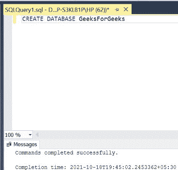

**步骤 2:** 使用 GeeksForGeeks 数据库。为此，请使用以下命令。

**查询:**

```sql
USE GeeksForGeeks
```

**输出:**

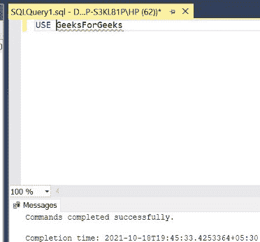

**步骤 3:** 在数据库 GeeksForGeeks 中创建一个 INFO 表。该表有 3 列，即 S_NAME、roll 和 branch，包含在工程学院学习的各种学生的姓名、ROLL 编号和 BRANCH。

**查询:**

```sql
CREATE TABLE INFO(
S_NAME VARCHAR(20),
ROLL INT,
BRANCH VARCHAR(5));
```

**输出:**

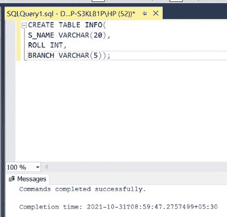

**步骤 4:** 在**信息**表中添加一个名为 **BRANCH_CHECK** 的自定义**检查约束**。该约束检查数据库中输入的学生分支是否在工程学院教授的 5 个分支中，即计算机科学与工程、电子与通信工程、土木工程、机械工程和电气工程。

**查询:**

```sql
ALTER TABLE INFO ADD CONSTRAINT BRANCH_CHECK 
CHECK (BRANCH IN('CSE','ECE','CE','ME','ELE'));
```

**输出:**

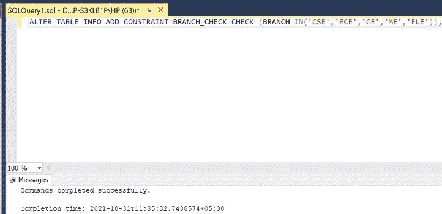

**第五步:**描述 INFO 表的结构。

**查询:**

```sql
EXEC SP_COLUMNS INFO;
```

**输出:**

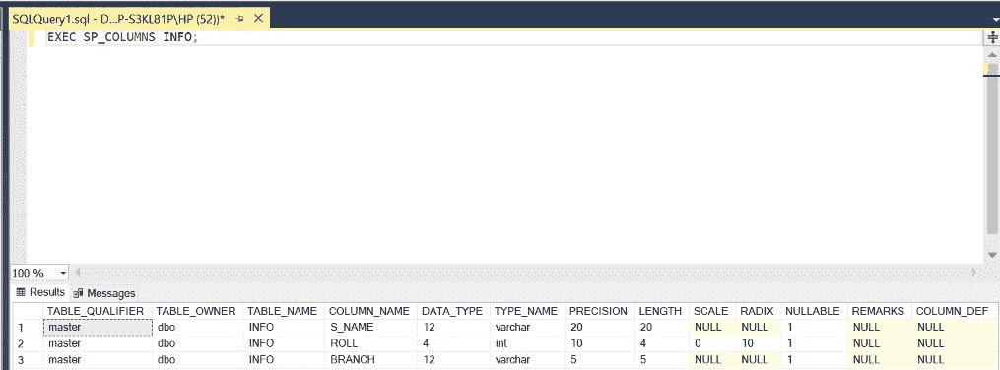

**步骤 6:** 在信息表中插入 5 行，使分支在**分支 _ 检查**约束中定义的 5 个分支内。因此在添加这些行时不会引发错误。

**查询:**

```sql
INSERT INTO INFO VALUES('MATT',1001,'CSE');
INSERT INTO INFO VALUES('SAM',1002,'ECE');
INSERT INTO INFO VALUES('NICK',1003,'CE');
INSERT INTO INFO VALUES('JOHN',1004,'ELE');
INSERT INTO INFO VALUES('BRUCE',1005,'ME');
```

**输出:**

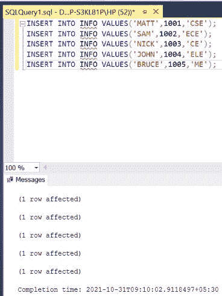

**第 7 步:**在信息表中插入行，使分支在**分支 _ 检查**约束中定义的 5 个分支中是**而不是**。这将引发一个错误，因为它违反了约束。

**查询:**

```sql
INSERT INTO INFO VALUES('MORRIS',1006,'MECH');
```

**输出:**

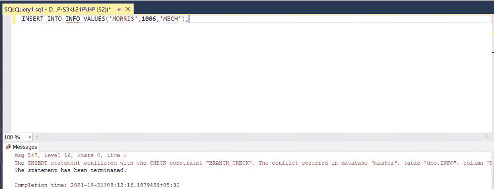

**第 8 步:**显示 INFO 表的所有行。

**查询:**

```sql
SELECT * FROM INFO;
```

**输出:**

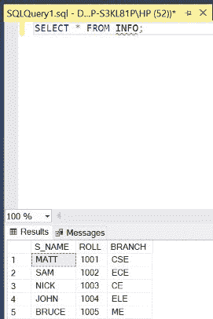

**步骤 9:** 显示为 INFO 表定义的所有约束。

**查询:**

```sql
SELECT CONSTRAINT_NAME, CONSTRAINT_TYPE 
FROM INFORMATION_SCHEMA.TABLE_CONSTRAINTS 
WHERE TABLE_NAME='INFO';
```

**输出:**

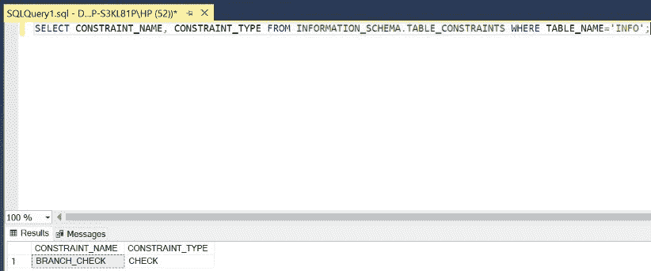

**第 10 步:**将自定义检查约束从**分支检查**重命名为**检查分支**。

**查询:**

```sql
SP_RENAME 'BRANCH_CHECK','CHECK_BRANCH';
```

**输出:**

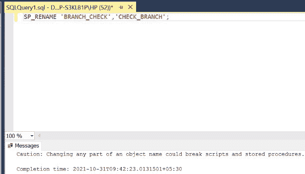

**步骤 11:** 显示为 INFO 表定义的所有约束。新名称即 **CHECK_BRANCH** 现在必须可见，而不是旧名称即 **BRANCH_CHECK** 。

**查询:**

```sql
SELECT CONSTRAINT_NAME, CONSTRAINT_TYPE
FROM INFORMATION_SCHEMA.TABLE_CONSTRAINTS
WHERE TABLE_NAME='INFO';
```

**输出:**

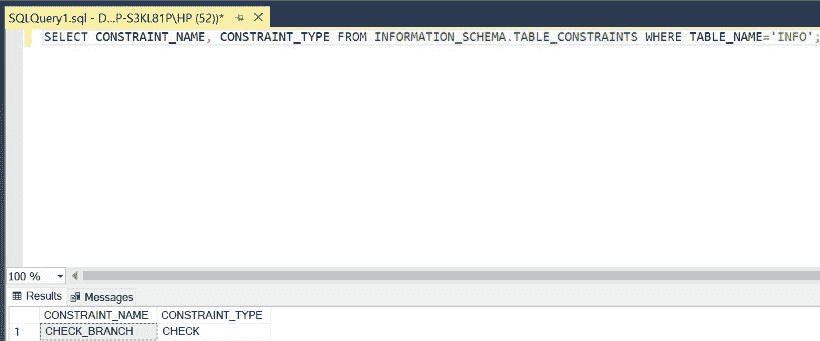

因此，以上述方式，可以重命名表中存在的任何约束。