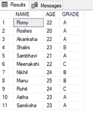
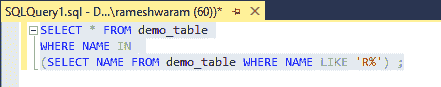
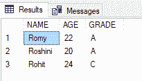
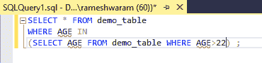
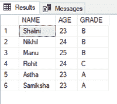

# 如何在 SQL 中使用带子查询的 IN 运算符？

> 原文:[https://www . geesforgeks . org/如何使用带有 sql 子查询的运算符/](https://www.geeksforgeeks.org/how-to-use-the-in-operator-with-a-subquery-in-sql/)

在本文中，我们将看到在 SQL 中将 In 运算符与子查询结合使用。[输入运算符](https://www.geeksforgeeks.org/sql-between-in-operator/)用于将列值与值列表进行比较。值列表是在 SQL 中的 IN 查询之后定义的。

如果我们不知道要比较的确切值列表，我们可以使用查询生成值列表。

**语法:**

**无子查询:**

```sql
SELECT column_name(s)
FROM table_name
WHERE column_name IN (value1, value2, ...);
```

**带子查询**

```sql
SELECT column_name(s)
FROM table_name
WHERE column_name IN (SELECT statement);
```

现在，按照以下步骤进行演示:

**步骤 1:** 创建数据库

我们可以使用以下命令创建一个名为 geeks 的数据库。

**查询:**

```sql
CREATE DATABASE geeks;
```

**步骤 2:** 使用数据库

使用下面的 SQL 语句将数据库上下文切换到极客:

```sql
USE geeks;
```

**步骤 3:** 表格定义

我们的极客数据库中有以下演示表。demo_table 包含学生的数据以及他们的年龄和成绩。

**查询:**

```sql
CREATE TABLE demo_table(
NAME VARCHAR(20),
AGE int,
GRADE VARCHAR(5));
```

**步骤 4:** 将数据插入表格

**查询:**

```sql
INSERT INTO demo_table
VALUES ('Romy',22, 'A'),
('Roshini', 20, 'A'),
('Akanksha', 22, 'A'),
('Shalini',23,'B'),
('Sambhavi',21,'A'),
('Meenakshi',22,'C'),
('Nikhil',24,'B'),
('Manu',25,'B'),
('Rohit',24,'C'),
('Astha',23,'A'),
('Samiksha',23,'A');
```

**第五步:**查看内容

执行以下查询查看表格的内容

```sql
SELECT * FROM demo_table;
```

**输出:**



**步骤 6:** 子查询中 In 运算符的使用

获取名字以 r 开头的学生的数据。

**查询:**

```sql
SELECT * FROM demo_table
WHERE NAME IN  
(SELECT NAME FROM demo_table WHERE NAME LIKE 'R%') ;
```



**输出:**



获取 22 岁以上学生的数据。

**查询:**

```sql
SELECT * FROM demo_table
WHERE AGE IN  
(SELECT AGE FROM demo_table WHERE AGE>22) ;
```



**输出:**

