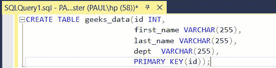
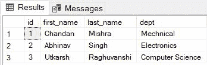
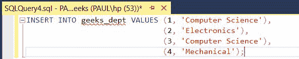
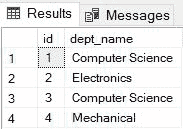
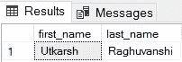

# 如何在子查询中使用 IN 运算符？

> 原文:[https://www . geesforgeks . org/如何使用子查询运算符/](https://www.geeksforgeeks.org/how-to-use-the-in-operator-with-a-subquery/)

[SQL](https://www.geeksforgeeks.org/sql-tutorial/) 中的输入运算符允许在 [WHERE](https://www.geeksforgeeks.org/sql-where-clause/) 子句中指定多个值，它可以帮助您轻松测试表达式是否匹配值列表中的任何值。IN 运算符的使用减少了在 SELECT、INSERT、UPDATE 和 DELETE 等语句中对多个 or 条件的需求。

### **子查询:**

一个或多个 [SELECT](https://www.geeksforgeeks.org/sql-select-query/) 语句与另一个 SELECT 语句的 where 子句嵌套在一起的 SQL 查询称为[子查询](https://www.geeksforgeeks.org/sql-subquery/)。这类查询的第一个语句称为**外部查询**，其中内部查询称为**内部查询**。在执行这样的查询时，将首先评估内部查询，外部查询接收内部查询的值。

现在，我们将为我们的数据库创建一个模式，并将其命名为极客。之后，我们将在其中创建一个名为 geeks_data 的表，并在子查询中使用 IN 运算符。

**步骤 1:** 创建数据库

为了创建数据库，我们需要使用 [CREATE](https://www.geeksforgeeks.org/sql-create/) 运算符。

**查询:**

```
CREATE DATABASE geeksforgeeks;
```

**输出:**


图:创建数据库

**步骤 2:** 在数据库中创建一个表

在这一步中，我们将在极客数据库的极客中创建两个表**极客 _ 数据**和**极客 _ 部门**。

*   创建极客数据表:

**查询:**

```
CREATE TABLE geeks_data(id INT, 
                        first_name VARCHAR(255),
                        last_name VARCHAR(255),
                        dept  VARCHAR(255),
                        PRIMARY KEY(id));
```



图:创建极客数据表

*   创建极客 _ 部门表:

**查询:**

```
CREATE TABLE geeks_dept(id INT, 
                        dept_name VARCHAR(255),
                        PRIMARY KEY(id));
```


图:创建一个表格极客 _ 部门

**步骤 3:** 将数据插入表格

为了在数据库中插入数据，我们需要使用 insert 操作符。首先，我们将把它插入 geeks_data 表。

**查询:**

```
INSERT INTO geeks_data VALUES 
(1, 'Chandan', 'Mishra', 'Mechanical'),
(2, 'Abhinav', 'Singh', 'Electronics'),
(3, 'Utkarsh', 'Raghuvanshi', 'Computer Science');
```


图:在极客数据表中插入值

**输出:**



图:极客数据

现在我们将插入表 geeks_dept 的数据。

```
INSERT INTO geeks_dept VALUES (1, 'Computer Science'),
                              (2, 'Electronics'),
                              (3, 'Computer Science'),
                              (4, 'Mechanical');
```



图:将数据插入极客部门

**输出:**



图:极客 _ 部门

**步骤 4:** 在子查询中执行输入运算符

在这一步中我们将尝试从 geeks_data 表中找出 geeks 的数据，那些来自计算机科学系的人借助 geeks_dept 表使用子查询。

**查询:**

```
SELECT first_name, last_name FROM geeks_data WHERE dept IN 
                    (SELECT dept_name FROM geeks_dept WHERE id = 1);
```


我们将得到来自计算机科学系的极客的名和姓。

**输出:**



图:子查询中输入运算符的结果