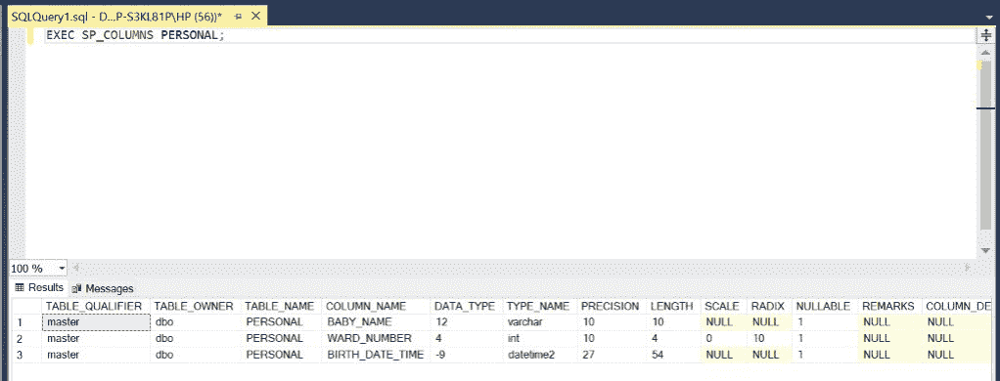

# 如何编写特定日期范围和日期时间的 SQL 查询？

> 原文:[https://www . geesforgeks . org/如何编写特定日期范围和日期时间的 sql 查询/](https://www.geeksforgeeks.org/how-to-write-a-sql-query-for-a-specific-date-range-and-date-time/)

在 SQL 中，有些问题要求我们根据日期和时间来检索行。对于这种情况，我们使用存在于 SQL 中的 DATETIME2 数据类型。在本文中，我们将使用微软的 SQL Server 作为我们的数据库。

**注意**–这里，我们将使用 WHERE 和 BETWEEN 子句以及查询来将我们的行限制在给定的时间内。在 MS SQL Server 中保存日期和时间的模式是 yyyy:mm: dd hh:mm: ss。时间以 24 小时制表示。日期和时间使用数据类型 DATETIME2 共同存储在一个列中。

**语法:**

```sql
SELECT * FROM TABLE_NAME WHERE DATE_TIME_COLUMN
BETWEEN 'STARTING_DATE_TIME' AND 'ENDING_DATE_TIME';
```

**步骤 1:** 创建数据库。为此，使用下面的命令创建一个名为 GeeksForGeeks 的数据库。

**查询:**

```sql
CREATE DATABASE GeeksForGeeks
```

**输出:**


**步骤 2:** 使用 GeeksForGeeks 数据库。为此，请使用以下命令。

**查询:**

```sql
USE GeeksForGeeks
```

**输出:**


**步骤 3:** 在数据库 GeeksForGeeks 中创建一个 PERSONAL 表。该表有 3 列，即婴儿名、病房号和出生日期时间，包含各种婴儿的姓名、病房号以及出生日期和时间。

**查询:**

```sql
CREATE TABLE PERSONAL(
BABY_NAME VARCHAR(10),
WARD_NUMBER INT,
BIRTH_DATE_TIME DATETIME2);
```

**输出:**


**第 4 步:**描述 PERSONAL 表的结构。

**查询:**

```sql
EXEC SP_COLUMNS PERSONAL;
```

**输出:**



**第 5 步:**在 MARKS 表中插入 5 行。

**查询:**

```sql
INSERT INTO PERSONAL VALUES('TARA',3,'2001-01-10 10:40:50');
INSERT INTO PERSONAL VALUES('ANGEL',4,'2001-03-27 11:00:37');
INSERT INTO PERSONAL VALUES('AYUSH',1,'2002-09-18 13:45:21');
INSERT INTO PERSONAL VALUES('VEER',10,'2005-02-28 21:26:54');
INSERT INTO PERSONAL VALUES('ISHAN',2,'2008-12-25 00:01:00');
```

**输出:**


**第 6 步:**显示 MARKS 表的所有行，包括 0(零)值。

**查询:**

```sql
SELECT * FROM PERSONAL;
```

**输出:**


**步骤 7:** 检索 2000 年 1 月 1 日上午 12:00 至 2002 年 9 月 18 日下午 12:00 之间出生的婴儿的详细信息。

**查询:**

```sql
SELECT * FROM PERSONAL WHERE BIRTH_DATE_TIME BETWEEN
'2000-01-01 00:00:00' AND '2002-09-18 12:00:00';
```

**输出:**


**第八步:**检索 2001 年 5 月 1 日上午 11:00 至 2005 年 5 月 1 日晚上 10:00 之间出生的婴儿的详细信息。

**查询:**

```sql
SELECT * FROM PERSONAL WHERE BIRTH_DATE_TIME BETWEEN
 '2001-03-01 11:00:00' AND '2005-03-01 22:00:00';
```

**输出:**


**第九步:**检索 2005 年圣诞节当天或之后出生的婴儿的详细信息。

**查询:**

```sql
SELECT * FROM PERSONAL WHERE BIRTH_DATE_TIME > 
'2005-12-25 00:00:00';
```

**输出:**

