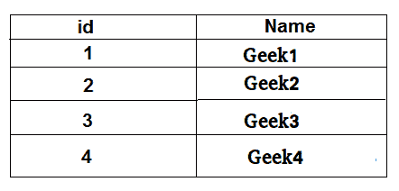

# MySQL 中的 IFNULL

> 原文:[https://www.geeksforgeeks.org/ifnull-in-mysql/](https://www.geeksforgeeks.org/ifnull-in-mysql/)

给定一个表，在这个表中，它打印该表的条目。如果表为空，则给出空值。

示例:

> 问题:给定一个员工表，打印给定表中 id 等于 2 的姓名。
> 
> 输出:极客 2
> 
> 问题:给定相同的员工表，打印给定表中 id 等于 5 的名称。
> 输出:空

方法:在这种情况下，我们在这里使用 IFNULL。如果表为空或其他情况，则打印空值。

查询:-

```sql
SELECT 
IFNULL(
  (SELECT NAME 
  from employee
  where id = 2),
  'NULL') as NAME;

```

```sql
Output:-
Geek2

```

查询:-

```sql
SELECT 
IFNULL(
  (SELECT NAME 
  from employee
  where id = 5),
  'NULL') as NAME;

```

```sql
Output:-
NULL

```