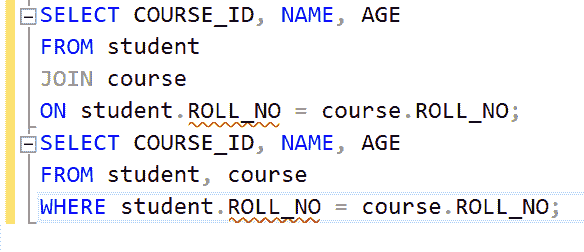

# SQL 中的隐式连接与显式连接

> 原文:[https://www . geesforgeks . org/implicit-join-vs-explicit-join-in-SQL/](https://www.geeksforgeeks.org/implicit-join-vs-explicit-join-in-sql/)

JOIN 子句用于根据两个或多个表之间的关系组合它们的行。执行 JOIN 操作有两种不同的语法形式:

*   显式连接
*   隐式连接

**步骤 1:** 创建数据库

使用下面的 SQL 语句创建一个名为 geeks 的数据库:

```sql
CREATE DATABASE geeks;
```

**步骤 2:** 使用数据库

使用下面的 SQL 语句将数据库上下文切换到极客:

```sql
USE geeks;
```

**步骤 3:** 创建表格

使用下面的 SQL 语句创建一个名为 student 的表:

```sql
CREATE TABLE student(
  ROLL_NO INT PRIMARY KEY,
  NAME VARCHAR(25),
  AGE INT);
```

使用下面的 SQL 语句创建一个名为“课程:

```sql
CREATE TABLE course(
  COURSE_ID INT,
  ROLL_NO INT);
```

**步骤 4:** 向表中添加数据

使用以下 SQL 语句将数据添加到学生表中:

```sql
INSERT INTO student 
VALUES 
(1, 'Anjali', 20), 
(2, 'Rachna', 18), 
(3, 'Shubham', 21), 
(4, 'Harsh', 25), 
(5, 'Shivam', 18), 
(6, 'Harshit', 20);
```

使用以下 SQL 语句将数据添加到课程表中:

```sql
INSERT INTO course 
VALUES 
(1, 1),
(2, 2),
(2, 3),
(5, 4),
(3, 5);
```

**第五步:**学生表

使用下面的 SQL 语句查看学生表的内容:

```sql
SELECT * FROM student;
```


课程表:

使用下面的 SQL 语句查看课程表的内容:

```sql
SELECT * FROM course;
```


**步骤 6:** 显式连接

这种表示法使用 on 关键字指定连接的谓词，使用 Join 关键字指定要连接的表。连接可以是任何类型，即内部连接、左连接、右连接或完全连接。更容易理解，更不容易出错。

**语法:**

```sql
SELECT column_names
FROM table1
JOIN table2
ON table1.column_name = table2.column_name
```

下面的查询将使用显式联接符号显示注册不同课程的学生的课程 id、姓名和年龄。

**查询:**

```sql
SELECT COURSE_ID, NAME, AGE 
FROM student
JOIN course
ON student.ROLL_NO = course.ROLL_NO;
```



**输出:**


**步骤 7:** 隐式连接

这种表示法简单地列出了用于连接的表(在 SELECT 语句的 FROM 子句中)，使用逗号分隔它们，WHERE 子句应用于连接谓词。它执行交叉连接。很难理解，更容易出错。

**语法:**

```sql
SELECT column_names
FROM table1, table2
WHERE table1.column_name = table2.column_name
```

下面的查询将使用隐式连接表示法显示注册不同课程的学生的课程 id、姓名和年龄。

**查询:**

```sql
SELECT COURSE_ID, NAME, AGE 
FROM student, course
WHERE student.ROLL_NO = course.ROLL_NO;
```

**输出:**

