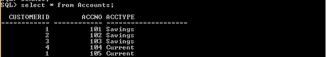

# IN vs EXISTS in SQL

> 原文:[https://www.geeksforgeeks.org/in-vs-exists-in-sql/](https://www.geeksforgeeks.org/in-vs-exists-in-sql/)

SQL 代表结构化查询语言。它用于在数据库中存储数据、修改或操作数据库中的数据以及从数据库中检索数据。我们可以说，SQL 在关系数据库管理系统(RDBMS)中管理数据。

用于与数据库通信以执行任务、功能和数据查询的指令称为 SQL 语句。SQL 不区分大小写。一般 SQL 关键字都是大写的。

### **SQL 中的输入运算符:**

为了将表达式与值列表进行匹配，SQL 提供了输入运算符。所以我们不需要在 SELECT、UPDATE 等中使用多个 OR 条件。

我们可以直接列出值，也可以向 IN 运算符提供查询结果。

```sql
Syntax : SELECT columnName(s) FROM tableName WHERE columnNamex IN (value1, value2, ...);
```

这里 *ColumnNameX* 与列表中的每个值(值 1，值 2，…)匹配。如果匹配发生，则输入评估为真，如果不匹配发生，则输入评估为假。

假设我们有一个名为*“客户”*的表，如下所示:


客户表

现在我们想查看 id 可以是 1 或 2 或 5 或 6 或 7 的客户的详细信息，我们可以使用 IN 运算符&给出一组值来检查。


### **存在于 SQL 中的运算符:**

如果参数子查询非空，则 exists 构造返回值 true，否则返回 false。为了检查是否通过这个子查询返回了一行，使用它。如果通过执行子查询返回了一行或多行，则返回 True 否则，如果没有返回任何行，则返回 False。

```sql
Syntax :
SELECT columnName(s) FROM tableName1 WHERE EXISTS
(subquery);

subquery is of the form : SELECT columnName FROM tableName2 WHERE condition
```

这里首先执行子查询。

子查询是 SELECT 语句。将满足 EXISTS 条件&如果子查询在其结果集中至少返回一条记录，它将返回 TRUE，否则，将不满足 EXISTS 条件，它将返回 FALSE。

**注意:**子查询返回外部查询表中的每一行。

现在，假设我们有另一个表:*“Accounts”*如下:



账户表

现在要查看所有客户的任何种类的帐户存在，我们可以使用 exists 关键字作为:


我们在此检查:将客户表中的每个 *CUSTOMERID* 与帐户表中的 CUSTOMERID 进行匹配。

如果是客户。CUSTOMERID = ACCOUNTS。CUSTOMERID 在子查询中评估为真，返回一行&因此子查询评估为真&我们的外部查询(从客户中选择*)针对该特定客户执行。

**注意:**要做同样的事情，即看到所有客户的任何一种账户都存在，我们可以利用 **IN** 关键字也:


**IN&EXISTS Operator 的关键区别有:**

<figure class="table">

|  | **输入操作符** | T13】存在操作员 |
| 1。 | IN can be used as a substitute for multiple or operators. | To determine whether to return any values, we use EXISTS. |
| 2。 | When the result of If subquery is small, the operation speed of IN is faster than that of EXISTS operator. | If the subquery results are large, then EXISTS works faster than the IN operator. |
| 3。 | Under the IN condition, the SQL engIne compares all values in the in clause. | Once evaluated as true under the EXISTS condition, the SQL engine will stop the process of further matching. |
| 4。 | Check only for a single column, and you can use the input operator. | To check multiple columns, you can use the EXISTS operator. |
| 5。 | Input operators cannot compare any values with null values. | The EXISTS clause can compare everything with NULLs. |
| 6。 | A set of direct numerical values can be given for comparison. | Cannot compare values directly, subquery is required. |

</figure>