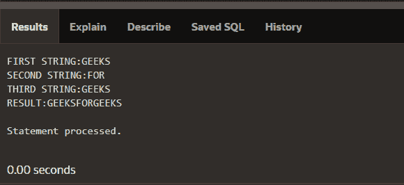
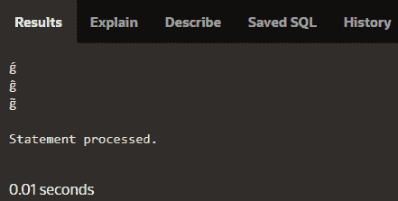

# PLSQL 中内置的连接函数

> 原文:[https://www . geeksforgeeks . org/inbound-concat-function-in-plsql/](https://www.geeksforgeeks.org/inbuilt-concat-function-in-plsql/)

**先决条件:** [PLSQL 基础知识](https://www.geeksforgeeks.org/plsql-introduction/)

**简介:**
PLSQL 代表“SQL 的过程语言扩展”，用于转换、更新和查询数据库中的数据。它被分成包含声明和语句的块。并且它与 oracle 数据库集成(从版本 7 开始)。PLSQL 背后的主要思想是它增加了一些 SQL 中没有的编程约束。

**1。Concat 函数:**
concation 的意思是将各种各样的字符串连接起来，形成一个新的字符串，或者我们也可以说是将序列中的某个东西链接在一起，或者链接成一个链。所以在 PLSQL 中，我们可以使用 concat()函数将各种字符串连接成一个字符串。所以 concat()函数接受两个输入作为参数，然后返回附加的字符串。我们还可以使用它来连接两个以上的字符串，我们可以在下面的示例中看到它的实现。
Oracle 12c、Oracle 11g、Oracle 10g、Oracle 9i、Oracle 8i 支持此功能。

**示例–**

```sql
INPUT: STR1='PL' , STR2='SQL'
OUTPUT:PL SQL

INPUT: STR1='KASHYAP' , STR2='SINGH'
OUTPUT:KASHYAP SINGH

INPUT: STR1='GEEKS' , STR2='FOR' , STR3='GEEKS'
OUTPUT:GEEKS FOR GEEKS
```

**语法–**

```sql
concat(source1,source2);
```

**所用参数**–
此处**来源 1** 为第一串**来源 2** 为第二串。
上述函数将返回追加的字符串。

**示例 1–**

```sql
DECLARE
str1 varchar2(25);
str2 varchar2(25);
res varchar2(25);

BEGIN
str1:='KASHYAP';
str2:='SINGH';
res:=concat(str1,str2);

dbms_output.put_line('FIRST STRING:'||str1);
dbms_output.put_line('SECOND STRING:'||str2);
dbms_output.put_line('RESULT:'||res);
END;
```

**输出–**


**示例 2–**

```sql
DECLARE
str1 varchar2(25);
str2 varchar2(25);
str3 varchar2(25);
res varchar2(25);

BEGIN
str1:='GEEKS';
str2:='FOR';
str3:='GEEKS';
res:=concat(str1,concat(str2,str3);

dbms_output.put_line('FIRST STRING:'||str1);
dbms_output.put_line('SECOND STRING:'||str2);
dbms_output.put_line('THIRD STRING:'||str3);
dbms_output.put_line('RESULT:'||res);
END;
```

**输出 2–**



**2。撰写功能:**

*   在 PLSQL 中，字符串实际上是具有可选大小规格的字符序列，字符可以是字母、空格、数字、特殊字符或所有字符的组合。Compose 函数基本上返回一个 Unicode 字符串。
*   Unicode 是处理各种字符的标准。每个符号都有一个代码点(一个数字)，这些代码点可以使用多种编码进行编码(转换为字节序列)。
*   UTF-8 就是这样一种编码。低代码点用单个字节编码，高代码点用字节序列编码。

在组合函数中可以与其他字符组合的 unistring 值有:

*   unistr（'\0302'） – circumflex （ ^ ）
*   unistr(“\ 0300”)-严重重音( ` )
*   unistr(“\ 0308”)-UML()
*   unistr(' \ 0301 ')–锐音符( )
*   unistr(\ 0303 ')波浪符号(~)

**示例–**

```sql
INPUT-COMPOSE('o' || unistr('\0308') )
OUTPUT-ö

INPUT-COMPOSE('a' || unistr('\0302') )
OUTPUT-â
```

**语法–**

```sql
COMPOSE(STRING)
```

**参数使用–**
**字符串–**需要生成 Unicode 字符串的输入字符串。
上述函数将返回 Unicode 字符串。

**示例 1–**

```sql
DECLARE 
   Var1 char:='g';
   Var2 char:='f';
   Var3 char:='s';

BEGIN 
   dbms_output.put_line(COMPOSE(Var1 || unistr('\0308' ))); 
   dbms_output.put_line(COMPOSE(Var2 || unistr('\0301' )));
   dbms_output.put_line(COMPOSE(Var3 || unistr('\0303' ))); 
END;  
```

**输出–**


**示例 2–**

```sql
DECLARE 
   Var1 char:='g';   
BEGIN 
   dbms_output.put_line(COMPOSE(Var1 || unistr('\0301' ))); 
   dbms_output.put_line(COMPOSE(Var1 || unistr('\0302' )));
   dbms_output.put_line(COMPOSE(Var1 || unistr('\0303' ))); 
END;  
```

**输出–**

