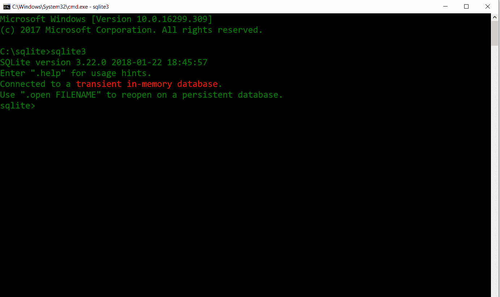
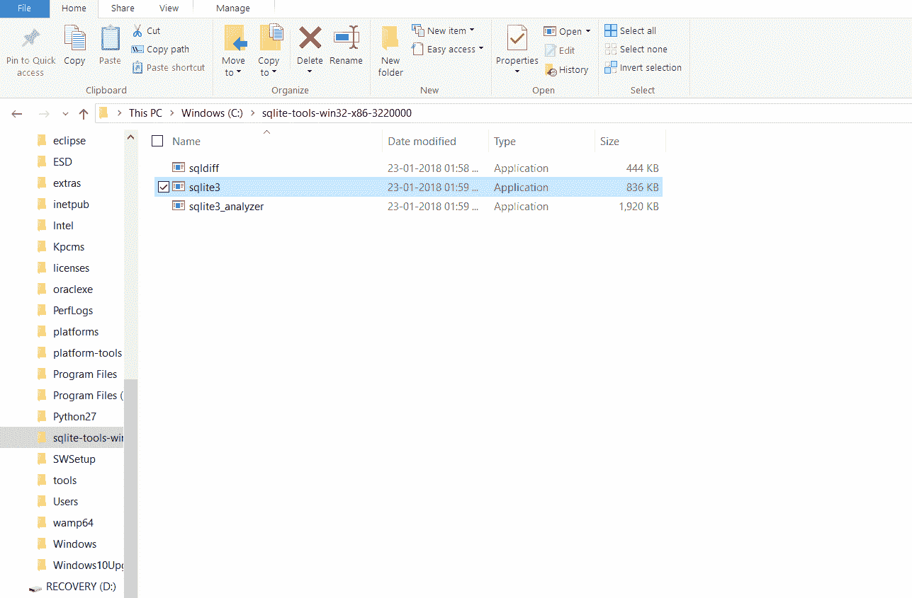
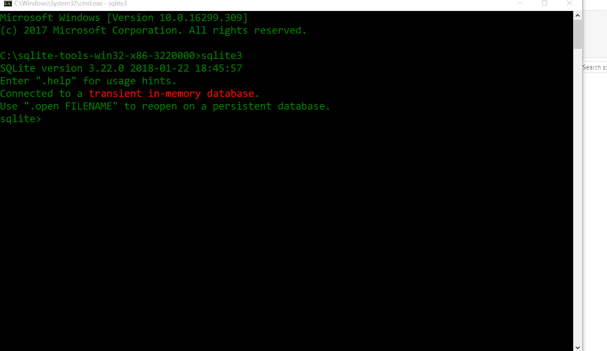
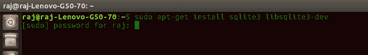
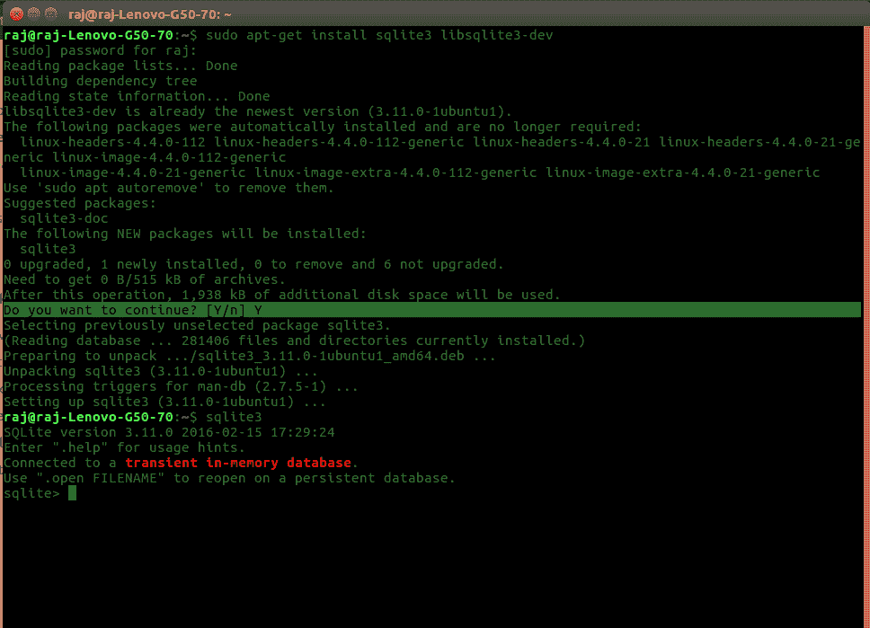
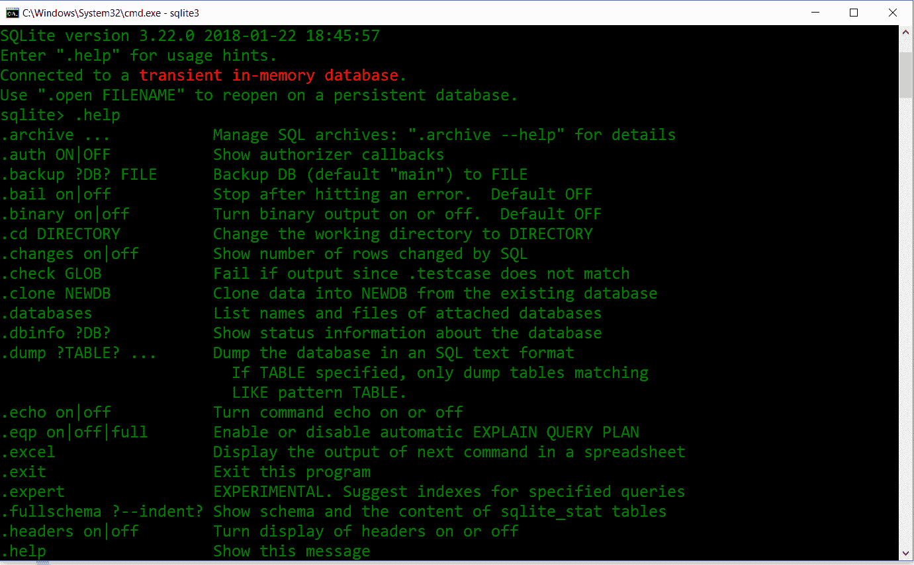
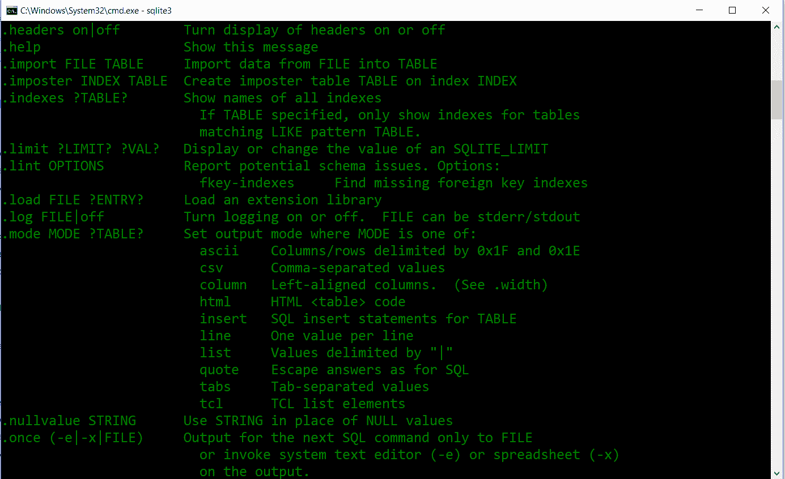
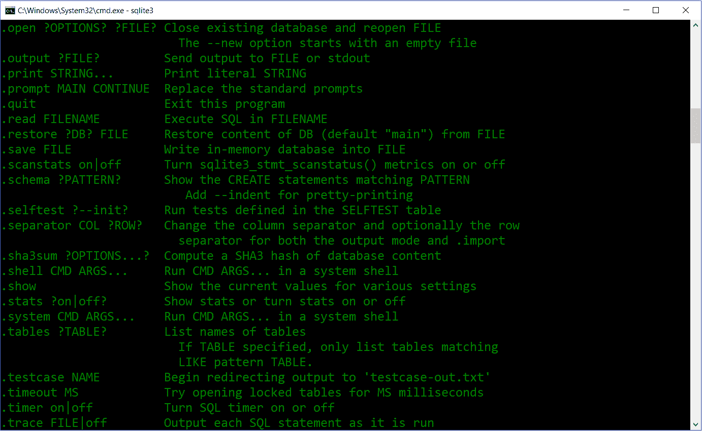
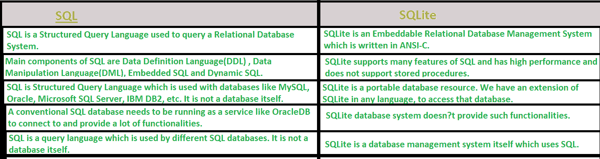

# SQLite 简介

> 原文:[https://www.geeksforgeeks.org/introduction-to-sqlite/](https://www.geeksforgeeks.org/introduction-to-sqlite/)

**SQLite** 是一个自包含、高可靠性、嵌入式、全功能、公共域的 SQL 数据库引擎。它是世界上使用最多的数据库引擎。它是一个进程内库，其代码是公开的。它可以免费用于任何目的，商业或私人。它基本上是一个嵌入式的 SQL 数据库引擎。普通的磁盘文件可以很容易地被 SQLite 读写，因为它没有像 SQL 那样的独立服务器。SQLite 数据库文件格式是跨平台的，因此任何人都可以轻松地在 32 位和 64 位系统之间复制数据库。由于所有这些特性，它作为应用程序文件格式是一种流行的选择。

**历史:**
它是由 d .理查德·希普设计的，目的是运行一个程序不需要管理。2000 年 8 月。由于它与其他如 MySql 和 Oracle 相比非常轻量级，因此被称为 SQLite。自 2000 年以来，SQLite 发布了不同的版本。

**安装在窗户上:**
1。访问 [SQLite](https://www.sqlite.org/download.html) 官网下载 zip 文件。
2。下载那个压缩文件。
3。通过展开 zip 文件，在 C 或 D(任何你想要的地方)创建一个文件夹来存储 SQLite。
4。打开命令提示符，设置上一步中给出的 SQLite 文件夹的路径。然后写下“sqlite3”并按回车键。


也可以直接打开*。exe* 文件从文件夹中你已经存储了 SQLite 整件事。

点击后选中*。exe* 文件它会打开 SQLite 应用程序


**安装在 Linux 上:**

打开终端，键入此命令并输入密码

```sql
sudo apt-get install sqlite3 libsqlite3-dev
```



它会自动安装，一旦它询问**是否要继续(是/否)**键入 Y 并按回车键。安装成功后，我们可以通过命令 **sqlite3** 进行检查。


**SQLite 的特点**

1.  事务遵循 ACID 属性，即原子性、一致性、隔离性和持久性，即使在系统崩溃和电源故障之后。
2.  配置过程非常简单，不需要设置或管理。
3.  SQL 的所有特性都在其中实现，还有一些附加特性，如部分索引、表达式索引、JSON 和通用表表达式。
4.  有时它比直接文件系统输入/输出更快
5.  它支持万亿字节大小的数据库和千兆字节大小的字符串和 blobs。
6.  几乎所有的 OS 都支持 SQLite，像安卓、BSD、iOS、Linux、Mac、Solaris、VxWorks、Windows (Win32、WinCE 等)。很容易移植到其他系统。
7.  完整的数据库可以存储在单个跨平台磁盘文件中。

**SQLite 的应用**

1.  由于其小代码打印和高效的内存使用，它是手机、掌上电脑、MP3 播放器、机顶盒和其他电子设备中数据库引擎的流行选择。
2.  它被用作 open 将 XML、JSON、CSV 或一些专有格式写入应用程序使用的磁盘文件的替代方法。
3.  由于它没有复杂的配置，并且很容易将文件存储在普通的磁盘文件中，因此它可以用作中小型网站的数据库。
4.  它速度更快，可以通过各种各样的第三方工具访问，因此它在不同的软件平台上都有很大的应用。

**SQLite 命令**
在 SQLite 中，有几个不以分号(；).以下是所有命令及其描述:







**一些 DDL 和 DML 命令**
与之前的 MySQL、Oracle 等技术相比是一样的。

*   **创建表格:**
    `CREATE TABLE STUDENT(
    ID INT PRIMARY KEY NOT NULL,
    NAME TEXT NOT NULL,
    AGE INT NOT NULL,
    ADDRESS CHAR(50),
    FEES REAL
    );`
*   **插入命令:**
    `INSERT INTO STUDENT (ID, NAME, AGE, ADDRESS, FEES)
    VALUES (1, 'Sunil', 28, 'Mumbai', 20000.00);`
*   **降表:**
    `Drop Table Student;`

**SQLite 的缺点**

*   它仅用于低到中等流量请求的情况。
*   数据库大小受到限制，即在大多数情况下为 2GB。



**参考文献:**T2】https://www.sqlite.org/index.html
https://www.javatpoint.com