# 使用内部连接连接多个表

> 原文:[https://www . geeksforgeeks . org/join-multi-tables-use-inner-join/](https://www.geeksforgeeks.org/join-multiple-tables-using-inner-join/)

要从单个表中检索数据，我们使用 [**【选择】**](https://www.geeksforgeeks.org/sql-select-query/) 和 [**【投影】**](https://www.geeksforgeeks.org/difference-between-selection-and-projection-in-dbms/) 操作，但要从多个表中检索数据，我们在[**【SQL】**](https://www.geeksforgeeks.org/sql-tutorial/)中使用[**【JOINS】**](https://www.geeksforgeeks.org/sql-join-set-1-inner-left-right-and-full-joins/)。**SQL** 中有不同类型的**连接**。本文只讨论 **MSSQL** 中的内部连接操作。

内部连接是基于一个**要求条件**从多个表中检索数据的方法，必要条件是数据库的两个表之间必须有公共列或匹配列，并且列的数据类型必须相同。

让我们一步步看看如何在 **MSSQL** 中使用**内部连接**连接两个表和三个表。

### **创建数据库:**

使用如下 SQL 查询创建数据库极客。

```
 CREATE DATABASE GeeksForGeeks;
```

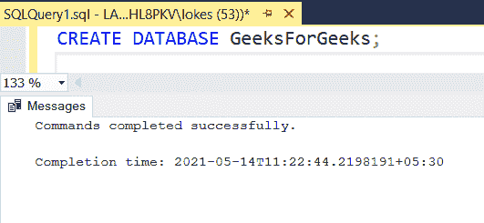

### **使用数据库:**

使用数据库学生使用如下 SQL 查询。

```
USE GeeksForGeeks;
```

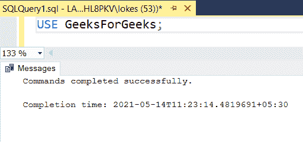

使用 SQL 查询创建学生、课程和讲师三个表，如下所示:

```
CREATE TABLE student
( stu_id varchar(10),
 stu_name varchar(20),
 course_id varchar(10),
 branch varchar(20),
 lecturer_id varchar(10)
);
```

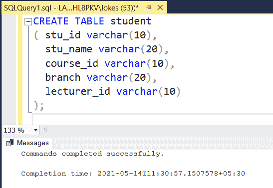

```
CREATE TABLE course
(
  course_id varchar(10),
  course_name varchar(20)
);
```

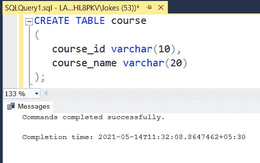

```
CREATE TABLE lecturer
(
  lecturer_id varchar(10),
  lecturer_name varchar(20)
);
```

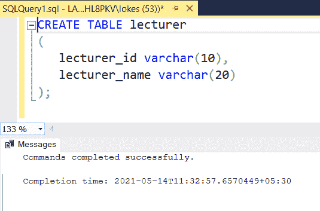

### **验证数据库:**

要查看数据库 GeeksForGeeks 中三个表的描述，请使用如下 SQL 查询。

```
EXEC sp_columns student;
EXEC sp_columns course;
EXEC sp_columns lecturer;
```

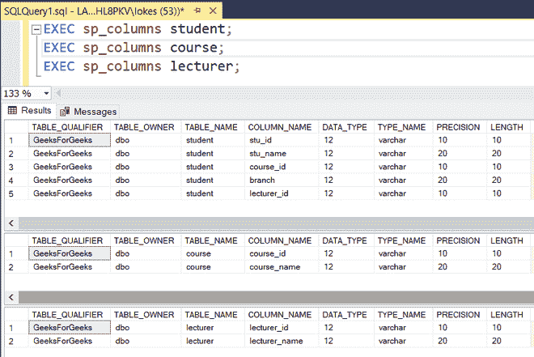

### **在三个表中插入数据:**

使用以下 SQL 查询将行插入学生表，如下所示:

```
INSERT INTO student VALUES
('1901401','DEVA','CS1003','C.S', 'P4002'),
('1901402','HARSH','CS1001','C.S', 'P4001'),
('1901403','ABHISHEK','CS1001','C.S', 'P4001'),
('1901404','GARVIT','CS1002','C.S', 'P4003'),
('1901405','SAMPATH','CS1003','C.S', 'P4002'),
('1901406','SATWIK','CS1002','C.S', 'P4003'),
('1901407','GUPTA','CS1001','C.S', 'P4001'),
('1901408','DAS','CS1003','C.S', 'P4002');
```

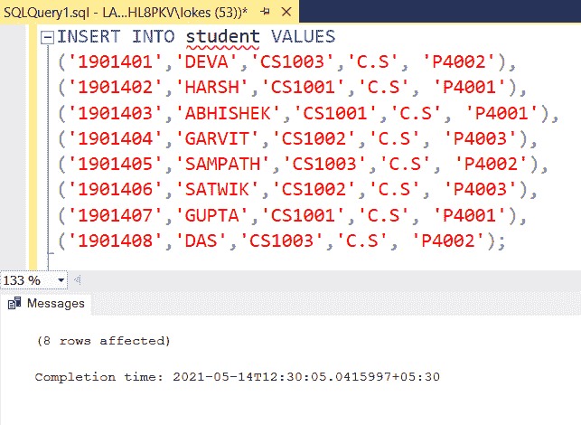

使用以下 SQL 查询将行插入课程表，如下所示:

```
INSERT INTO course VALUES
('CS1001', 'DBMS'),
('CS1002', 'O.S'),
('CS1003', 'C.N'),
('CS1004', 'M.L'),
('CS1005', 'A.I');
```

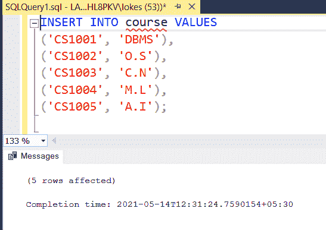

使用以下 SQL 查询将行插入讲师表，如下所示:

```
INSERT INTO lecturer VALUES
('P4001', 'RAMESH'),
('P4002', 'RAVINDER'),
('P4003', 'RAHUL SHARMA'),
('P4004', 'PRADEEP KUMAR'),
('P4005', 'SRINIVASA RAO');
```

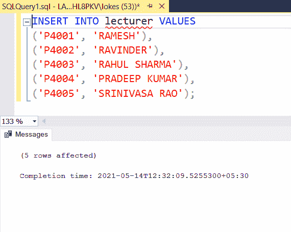

### **验证插入的数据:**

使用如下 SQL 查询在插入行后查看三个表。

```
SELECT* FROM student;
SELECT* FROM course;
SELECT* FROM lecturer;
```

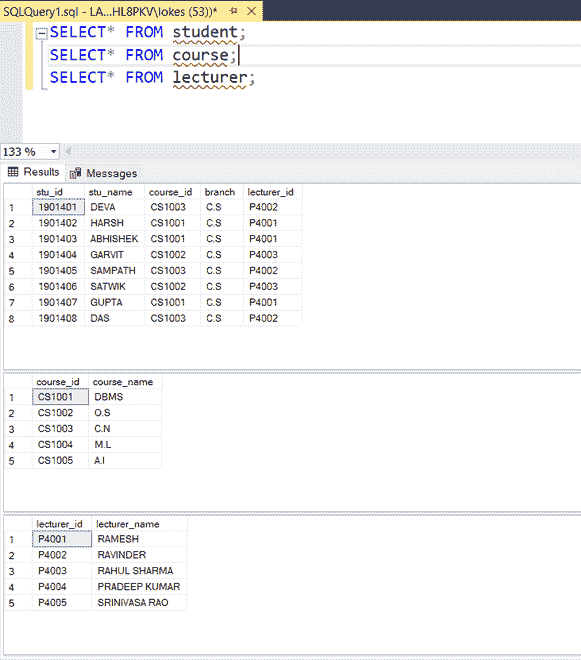

### **应用内部连接:**

多重连接的语法:

```
SELECT column_name1,column_name2,..
FROM table_name1
INNER JOIN 
table_name2
ON condition_1
INNER JOIN 
table_name3
ON condition_2
INNER JOIN 
table_name4
ON condition_3
.
.
.
```

**注意:**当只选择特定的列时，使用*表名*。*列名*当两个表中有相同的列名时，否则会出现**不明确的**错误。

### 查询:

两张桌子上的内部连接学生和课程:

```
SELECT *
FROM student  
INNER JOIN 
course  
ON  
student.course_id = course.course_id;
```

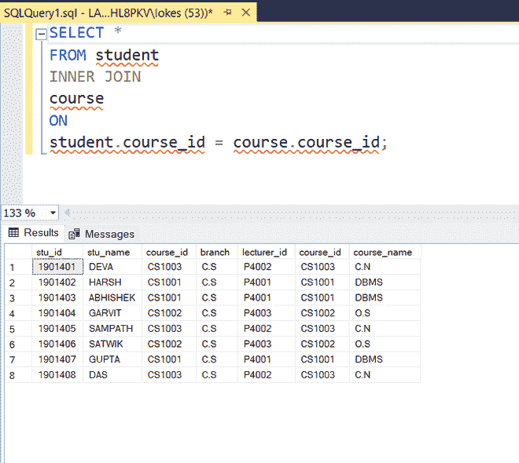

2 个表的所有列都满足相等条件

三张桌子上的内部连接学生、课程和讲师:

```
SELECT *
FROM student  
INNER JOIN  
course  
ON  
student.course_id = course.course_id
INNER JOIN  
lecturer  
ON  
student.lecturer_id = lecturer.lecturer_id;
```

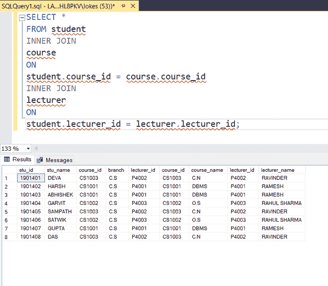

3 个表的所有列都满足相等条件

三个表的内部连接学生，课程，讲师，但是通过选择特定表的特定列。

```
SELECT stu_id, stu_name,course.course_id,course.course_name,
lecturer.lecturer_name
FROM student  
INNER JOIN  
course  
ON 
student.course_id = course.course_id
INNER JOIN  
lecturer  
ON  
student.lecturer_id = lecturer.lecturer_id;
```

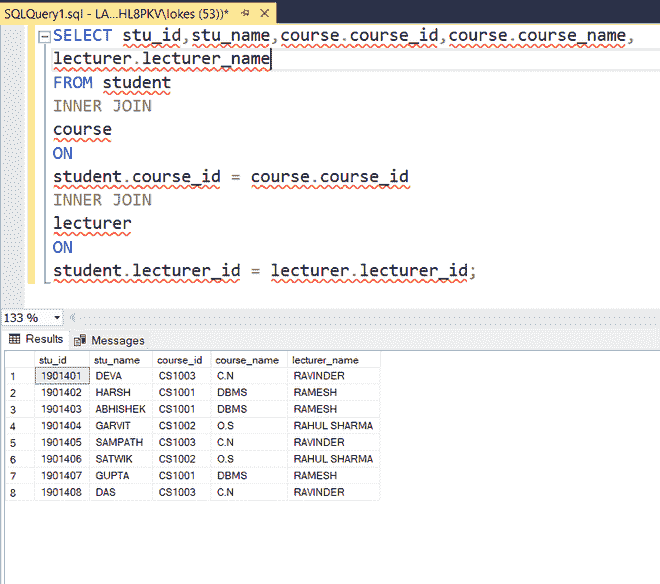