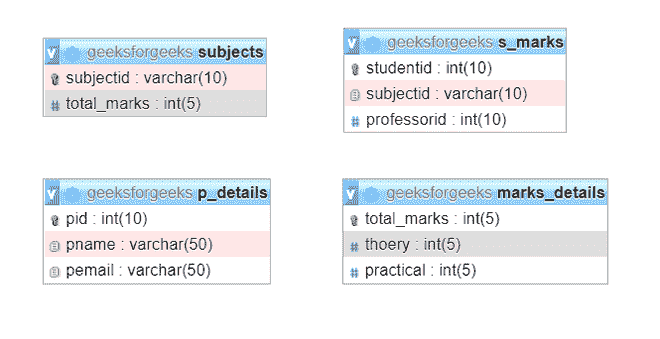

# 在 SQL 中连接 4 个表

> 原文:[https://www.geeksforgeeks.org/joining-4-tables-in-sql/](https://www.geeksforgeeks.org/joining-4-tables-in-sql/)

本文的目的是制作一个简单的程序，使用 SQL 中的 Join 和 Where 子句连接两个表。下面是使用 MySQL 的实现。本主题的前提是 [MySQL](https://www.geeksforgeeks.org/mysql-database-current_user-functions/) 和在你的电脑上安装 [Apache](https://www.apachefriends.org/index.html) 服务器。

**简介:**
在 [SQL](https://www.geeksforgeeks.org/sql-tutorial/) 中，查询是带有插入、读取、删除、更新等指令的请求。数据库中的记录。这些数据可以用于各种目的，如训练模型、寻找数据中的模式等。在这里，我们将讨论在 SQL 中连接 4 个表的方法，并将为每个表实现使用 SQL 查询，以便更好地理解。

**方法:**
这里，我们将讨论在 SQL 中实现连接 4 个表的方法和步骤。因此，让我们从创建一个数据库开始。

**步骤-1:创建数据库–**
这里首先，我们将使用 SQL 查询创建数据库，如下所示。

```sql
CREATE DATABASE geeksforgeeks;
```

**步骤-2:** **使用数据库–**
现在，我们将使用数据库使用 SQL 查询如下。

```sql
USE geeksforgeeks;
```

**步骤-3:创建表 1–**
使用如下 SQL 查询创建表 1，名称为 s_marks。

```sql
CREATE TABLE s_marks 
(
studentid int(10) PRIMARY KEY, 
subjectid VARCHAR(10), 
professorid int(10)
);
```

**第 4 步:创建表 2–**
使用如下 SQL 查询为教授详细信息创建表 2 作为 p_details。

```sql
CREATE TABLE p_details 
(
pid int(10) PRIMARY KEY, 
pname VARCHAR(50), 
pemail VARCHAR(50)
);
```

**步骤-5:创建表 3–**
使用如下 SQL 查询为作为主题的主题创建一个表。

```sql
CREATE TABLE subjects  
(
subjectid VARCHAR(10) PRIMARY KEY, 
total_marks INT(5)
);
```

**步骤-6:创建表 4–**
使用如下 SQL 查询为主题标记详细信息创建一个表。

```sql
CREATE TABLE marks_details 
(
total_marks INT(5) PRIMARY KEY, 
theory INT(5),
practical INT(5)
);
```

**输出:**
各表的输出如下。



**第 7 步:** **插入数据:**
使用如下 SQL 查询在上面创建的表中插入一些数据。

**插入 s _ marks–**

```sql
INSERT INTO `s_marks` (`studentid`, `subjectid`, `professorid`) VALUES ('1', 'KCS101', '1');
INSERT INTO `s_marks` (`studentid`, `subjectid`, `professorid`) VALUES ('2', 'KCS102', '2');
```

**插入 p _ details–**

```sql
INSERT INTO `p_details` (`pid`, `pname`, `pemail`) VALUES ('1', 'Devesh', 'geeks@abc.com');
INSERT INTO `p_details` (`pid`, `pname`, `pemail`) VALUES ('2', 'Aditya', 'for@abc.com');
```

**插入受试者–**

```sql
INSERT INTO `subjects` (`subjectid`, `total_marks`) VALUES ('KCS101', '100');
INSERT INTO `subjects` (`subjectid`, `total_marks`) VALUES ('KCS102', '150');
```

**插入标记 _ 细节–**

```sql
INSERT INTO `marks_details` (`total_marks`, `theory`, `practical`) VALUES ('100', '70', '30');
INSERT INTO `marks_details` (`total_marks`, `theory`, `practical`) VALUES ('150', '100', '50');
```

**第 8 步:验证和连接表格–**
运行查询，找出一名学生的身份证、教授姓名，该学生的学科实践分数为 50，如下所示。

```sql
SELECT s_marks.studentid, p_details.pname FROM s_marks 
JOIN subjects ON s_marks.subjectid = subjects.subjectid 
JOIN marks_details ON subjects.total_marks = marks_details.total_marks
JOIN p_details ON p_details.pid = s_marks.professorid
WHERE marks_details.practical = '50';
```

**输出:**

<figure class="table">

| 学生时间 | PNA name |
| --- | --- |
| Two | 阿迪亚 |

T21】</figure>