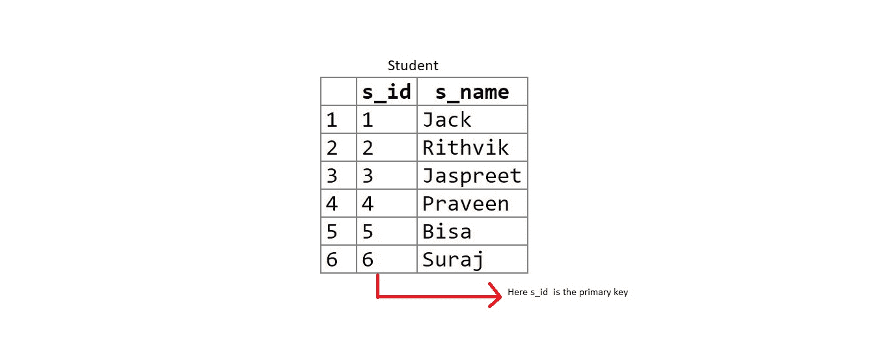
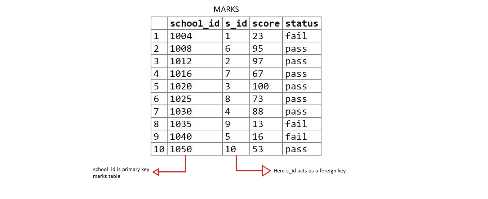
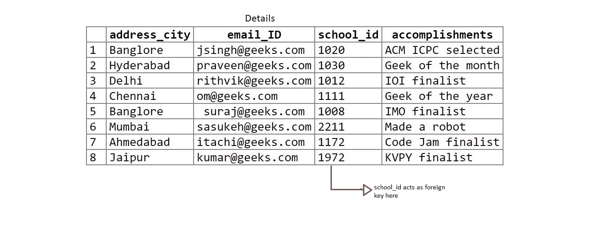
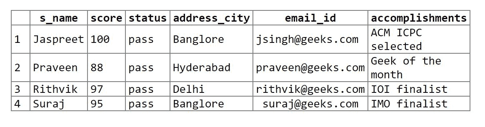

# 在 SQL 中连接三个或更多的表

> 原文:[https://www.geeksforgeeks.org/joining-three-tables-sql/](https://www.geeksforgeeks.org/joining-three-tables-sql/)

有时可能会出现需要从三个或更多表中提取数据的情况。本文讨论了实现这一目标的两种方法。

**示例:**
**创建三个表:**

1.  学生
2.  记号
3.  细节

**注意:**如果不清楚，点击图像，以更大的尺寸查看。

**表 1:学生**

```sql
create table student(s_id int primary key, 
                      s_name varchar(20));

insert into student values(1, 'Jack');
insert into student values(2, 'Rithvik');
insert into student values(3, 'Jaspreet');
insert into student values(4, 'Praveen');
insert into student values(5, 'Bisa');
insert into student values(6, 'Suraj');

```

[](https://media.geeksforgeeks.org/wp-content/uploads/student-table-2.jpg)

**表 2:标记**

```sql
create table marks(school_id int primary key, s_id int, 
                       score int, status varchar(20));

insert into marks values(1004, 1, 23, 'fail');
insert into marks values(1008, 6, 95, 'pass');
insert into marks values(1012, 2, 97, 'pass');
insert into marks values(1016, 7, 67, 'pass'); 
insert into marks values(1020, 3, 100, 'pass');
insert into marks values(1025, 8, 73, 'pass');
insert into marks values(1030, 4, 88, 'pass');
insert into marks values(1035, 9,  13, 'fail');
insert into marks values(1040, 5,  16, 'fail');
insert into marks values(1050, 10, 53, 'pass');

```

[](https://media.geeksforgeeks.org/wp-content/uploads/marks-1.jpg)

**表 3:详情**

```sql
create table details(address_city varchar(20), email_ID varchar(20), 
                      school_id int, accomplishments varchar(50));

insert into details values('Banglore',  'jsingh@geeks.com', 
                                1020, 'ACM ICPC selected');
insert into details values('Hyderabad', 'praveen@geeks.com', 
                                1030, 'Geek of the month');
insert into details values('Delhi',     'rithvik@geeks.com', 
                                    1012, 'IOI finalist');
insert into details values('Chennai',   'om@geeks.com', 
                                 1111, 'Geek of the year');
insert into details values('Banglore', ' suraj@geeks.com',
                                 1008, 'IMO finalist');
insert into details values('Mumbai',    'sasukeh@geeks.com',
                                  2211, 'Made a robot');
insert into details values('Ahmedabad', 'itachi@geeks.com',
                               1172, 'Code Jam finalist');
insert into details values('Jaipur',    'kumar@geeks.com',
                                   1972, 'KVPY finalist');

```

[](https://media.geeksforgeeks.org/wp-content/uploads/details.jpg)

连接三个或更多表的两种方法:
**1。使用 sql 中的**连接**来连接表:**
应用相同的逻辑来连接 2 个表，即**最小**数量的连接语句来连接 **n 个**表为 **(n-1)** 。
**查询:**

```sql
select s_name, score, status, address_city, email_id,
accomplishments from student s inner join marks m on
s.s_id = m.s_id inner join details d on 
d.school_id = m.school_id;

```

**输出:**
[](https://media.geeksforgeeks.org/wp-content/uploads/output1-1.jpg)

**2。使用**亲子**关系:**
这是一个相当有趣的方法。创建列 **X** 作为一个表中的主键和另一个表中的外键(即创建父子关系)。
我们来看看创建的表:
**s_id** 是学生表中的**主键**，是 marks 表中的**外键**。**(学生(家长)–分数(孩子)**。
**school_id** 是标记表中的**主键**和明细表中的**外键**。**(标记(父项)–细节(子项)**。

**查询:**

```sql
select s_name, score, status, address_city, 
email_id, accomplishments from student s, 
marks m, details d where s.s_id = m.s_id and 
m.school_id = d.school_id;

```

**输出:**
[](https://media.geeksforgeeks.org/wp-content/uploads/output1-1.jpg)