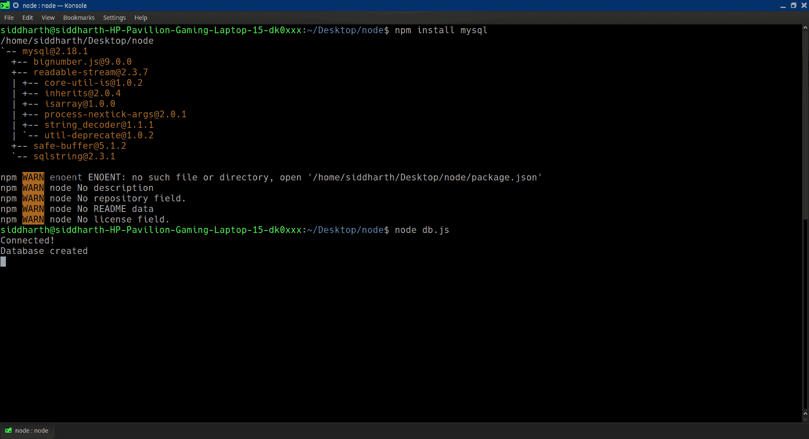
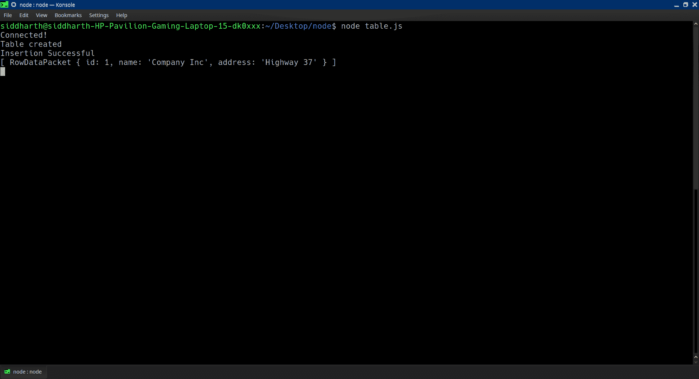

# 在 Node.js 后端侧链接 MySql 数据库

> 原文:[https://www . geesforgeks . org/link-of-MySQL-数据库-in-node-js-后端端/](https://www.geeksforgeeks.org/linking-of-mysql-database-in-node-js-backend-side/)

我们可以将 Node.js 后端的 MySQL 数据库与 **mysql** 模块链接起来。这个模块帮助连接我们的数据库和后端服务器来存储数据。

**先决条件:**

*   系统中正确安装的节点。
*   在系统中正确安装 npm(节点包管理器)。
*   MySQL 服务器安装在您的系统中。

**模块安装:**要下载安装 **mysql** 模块，打开命令终端，执行以下命令:

```sql
npm install mysql
```

**创建连接&数据库:**通过创建一个名为 **gfg 的数据库来创建到数据库的连接。**使用你的 MySQL 数据库**中的用户名和密码。**

**文件名:db.js**

## java 描述语言

```sql
var mysql = require('mysql');

var con = mysql.createConnection({
    host: "localhost",
    user: "yourusername",
    password: "yourpassword"
});

// Created the Connection
/*con.connect(function(err) {
  if (err) throw err;
  console.log("Connected!");
});*/

// Created the Database named as "gfg"
con.connect(function (err) {
    if (err) throw err;
    console.log("Connected!");

    con.query("CREATE DATABASE gfg",
        function (err, result) {
            if (err) throw err;
            console.log("Database created");
        });
});
```

使用以下命令运行 **db.js** 文件:

```sql
node db.js
```



上述命令的输出

**查询数据库:**使用 SQL 语句读取(或写入)MySQL 数据库。这也称为“查询”数据库。上例中创建的连接对象有一个查询数据库的方法。

现在让我们创建一个名为 table.js 的新文件，将表名创建为“geeksforgeeks”。

**文件名:table.js**

## java 描述语言

```sql
var mysql = require('mysql');
var con = mysql.createConnection({
    host: "localhost",
    user: "yourusername",
    password: "yourpassword",
    database: "gfg"
});

con.connect(function (err) {
    if (err) throw err;
    console.log("Connected!");

    // var sql = "CREATE TABLE 
    // geeksforgeeks (name VARCHAR(255),
    // address VARCHAR(255))";

    // var sql = "ALTER TABLE 
    // geeksforgeeks ADD COLUMN id INT 
    // AUTO_INCREMENT PRIMARY KEY";

    var sql1 = "CREATE TABLE geeksforgeeks "
        + "(id INT AUTO_INCREMENT PRIMARY KEY," +
        " name VARCHAR(255), address VARCHAR(255))";

    var sql2 = "INSERT INTO geeksforgeeks (name, "
        + "address) VALUES ('Company Inc', "
        + "'Highway 37')";

    var sql3 = "SELECT * FROM geeksforgeeks "
        + "WHERE address = 'Highway 37'";

    con.query(sql1, function (err, result) {
        if (err) throw err;
        console.log("Table created");
    });

    con.query(sql2, function (err, result) {
        if (err) throw err;
        console.log("Insertion Successful");
    });

    con.query(sql3, function (err, result) {
        if (err) throw err;
        console.log(result);
    });
});
```

使用以下命令运行 **table.js** 文件:

```sql
node table.js
```



我们将创建表，插入记录，并按照要求进行查询。这样，我们就创建了数据库、表，并在插入记录后进行了查询。