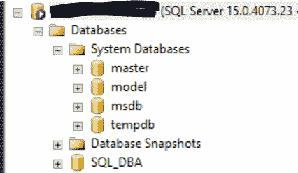
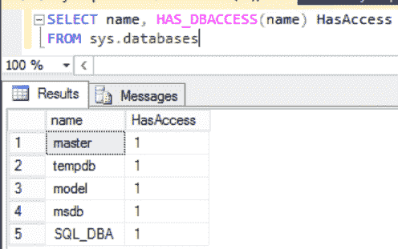
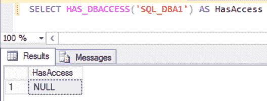

# 在 SQL SERVER 中列出当前用户可用的数据库

> 原文:[https://www . geesforgeks . org/list-SQL server 中当前用户可用的数据库/](https://www.geeksforgeeks.org/list-the-available-databases-for-current-user-in-sql-server/)

**简介:**

数据库性能健康检查的一个先决条件是访问我们要调优的数据库。作为 SQL 数据库管理员，我们还会意外地发现，有时我们会遇到这样一种情况，客户需要我们帮助他们提高数据库的整体性能，但是他们自己现在不再能够访问服务器和数据库。

让我们看一个脚本，它可以列出当前登录用户可以访问的所有数据库–

```sql
SELECT Name, HAS_DBACCESS(Name) AS HasAcces FROM sys.databases
```

上面的查询将给出类似于下面的结果–

<figure class="table">

| 名字 | 有通道 |
| --- | --- |
| 掌握 | one |
| tempdb | one |
| 模型 | one |
| msdn | one |
| 极客 | one |

</figure>

在查询中，我们使用了函数 **HAS_DBACCESS** ，该函数产生关于用户是否有权访问所有数据库的信息。如果用户有权访问数据库，则返回 1；如果用户无权访问数据库，则返回 0；如果数据库名称无效，则返回空值。

**查询以检查我们是否可以访问特定的数据库–**

```sql
SELECT HAS_DBACCESS('databasename') AS HasAccess
```

**示例-1 :**

```sql
SELECT HAS_DBACCESS('geekdb') AS HasAccess
```

<figure class="table">

| 有 Access |
| --- |
| one |

</figure>

作为一个 SQL DBA，我们要时刻记住函数 **HAS_DBACCESS** 的结果。当此函数的结果为 0 时，这也可能意味着数据库处于脱机\可疑模式\单用户模式，或其他阻止我们使用数据库的问题。

**示例-2 :**

检查当前用户是否有权访问以下数据库–



在 SQL Server 管理工作室中运行上述查询–



让我们检查一下当前用户在哪里可以访问“SQL _ DBA1”–

```sql
SELECT HAS_DBACCESS('SQL_DBA1') AS HasAccess
```



结果为空，因为数据库在当前实例中不存在。