# SQL Server 中的魔法表

> 原文:[https://www.geeksforgeeks.org/magic-tables-in-sql-server/](https://www.geeksforgeeks.org/magic-tables-in-sql-server/)

**魔法表**是每当有插入或删除或更新(D.M.L)操作时，由 SQL 服务器创建的临时逻辑表。最近对行执行的操作会自动存储在魔法表中。这些不是物理表，只是临时的内部表。这些魔术表不能直接检索，我们需要使用触发器来访问这些魔术表，以获得删除和插入的行。

**完成以下操作时:**

*   **INSERT–**
    最近插入的行被添加到 INSERT 魔法表中。

*   **DELETE–**
    最近删除的行被添加到 deleted 魔法表中。

*   **UPDATE–**
    更新的行存储在 INSERTED 魔法表中，旧行或前一行存储在 DELETED 魔法表中。

让我们通过使用 MSSQL 作为服务器来看看这是如何工作的:

**创建数据库:**
使用如下 SQL 查询创建数据库 GeeksForGeeks。

```
CREATE DATABASE GeeksForGeeks;
```

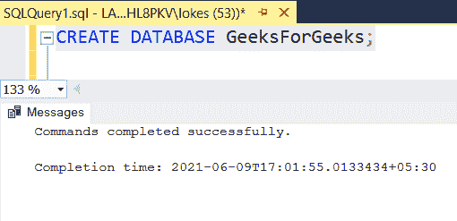

**使用数据库:**
使用数据库学生使用以下 SQL 查询如下。

```
USE GeeksForGeeks;
```

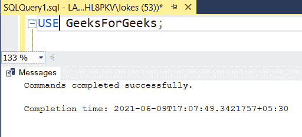

使用 SQL 查询创建学生表，如下所示:

```
CREATE TABLE students
( 
 stu_id varchar(10),
 stu_name varchar(20),
 branch varchar(20)
);
```

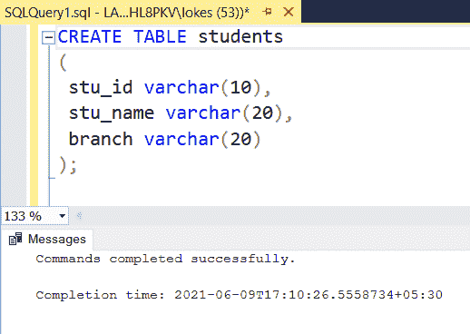

**验证数据库:**
要查看数据库 GeeksForGeeks 中表的描述，请使用以下 SQL 查询，如下所示。

```
EXEC sp_columns students;
```

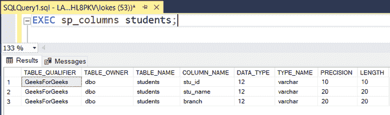

**向表中插入数据:**
使用如下 SQL 查询向学生表中插入行:

```
INSERT INTO students VALUES
('1901401','DEVA','C.S'),
('1901402','HARSH','C.S'),
('1901403','ABHISHEK','C.S'),
('1901404','GARVIT','C.S'),
('1901405','SAMPATH','C.S');
```

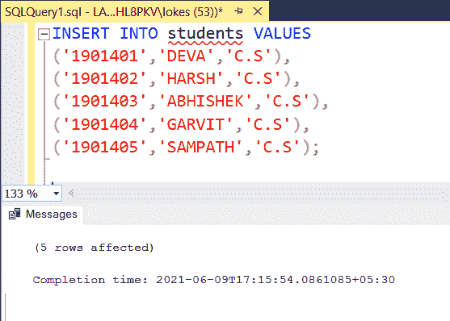

**验证插入的数据:**
使用如下 SQL 查询查看插入行后的表。

```
SELECT * FROM students;
```

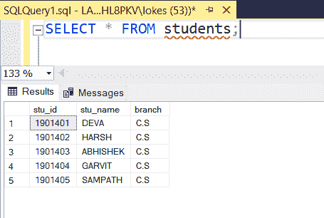

**在插入操作时创建触发器 T1:**

```
CREATE TRIGGER T1 ON students
AFTER INSERT
AS
BEGIN
SELECT * FROM INSERTED
END
```

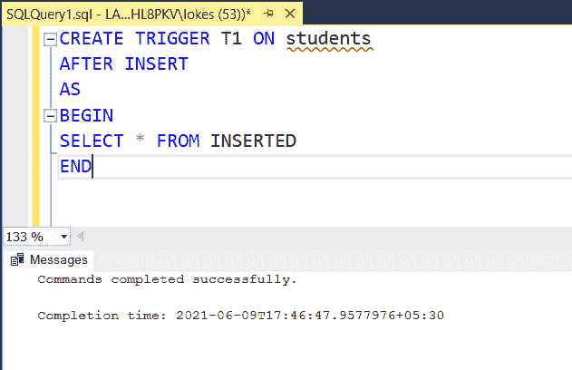

**插入条目检查触发器如何检索插入的魔法表:**

```
INSERT INTO students VALUES
('1901406','PRADEEP','C.S'),
('1901407','DEVESH','C.S');
SELECT* FROM students ;
```

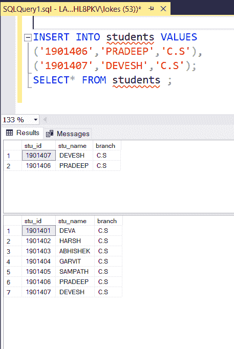

**在删除操作时创建触发 T2:**

```
CREATE TRIGGER T2 ON students
AFTER DELETE
AS
BEGIN
SELECT * FROM DELETED
END
```

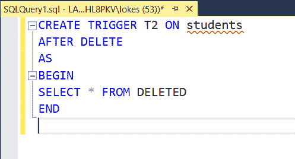

**删除条目，检查触发器如何检索删除的魔法表:**

```
DELETE FROM students
WHERE stu_name = 'PRADEEP';
SELECT* FROM students ;
```

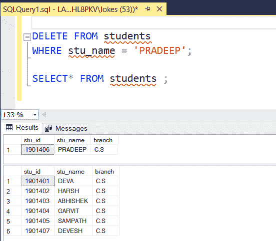

**在更新操作时创建触发 T3:**

```
CREATE TRIGGER T3 ON students
AFTER UPDATE
AS
BEGIN
SELECT * FROM DELETED
SELECT* FROM INSERTED 
END
```

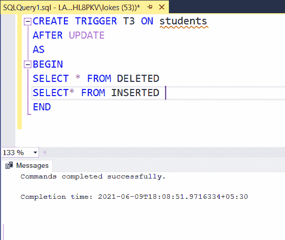

**更新条目，检查触发器如何检索已删除、已插入的魔法表，因为我们在已删除和已更新的条目中发现了一个旧条目，该条目位于已插入的魔法表中:**

```
UPDATE students SET stu_name= 'DEVANSH' 
WHERE stu_id = '1901401'
SELECT* FROM students
```

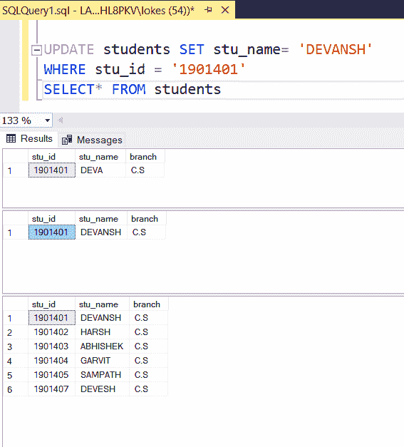