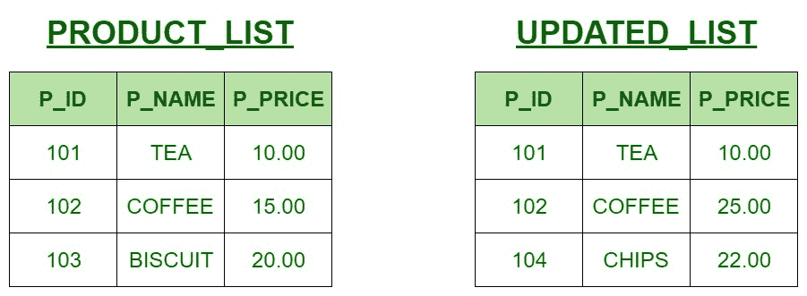
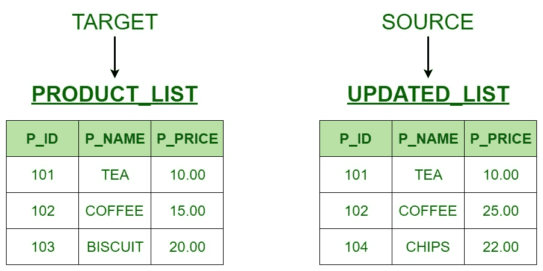

# SQL 中的合并语句解释

> 原文:[https://www . geesforgeks . org/merge-statement-SQL-explained/](https://www.geeksforgeeks.org/merge-statement-sql-explained/)

**先决条件–**[MERGE 语句](https://www.geeksforgeeks.org/sql-merge-statement/)
作为 SQL 中的 MERGE 语句，正如之前在[上一篇文章](https://www.geeksforgeeks.org/sql-merge-statement/)中所讨论的，是三个 [INSERT](https://www.geeksforgeeks.org/sql-insert-statement/) 、 [DELETE](https://www.geeksforgeeks.org/sql-delete-statement/) 和 [UPDATE](https://www.geeksforgeeks.org/sql-update-statement/) 语句的组合。所以如果有一个**源表**和一个**目标表**需要合并，那么借助 MERGE 语句，三个操作(INSERT、UPDATE、DELETE)都可以一次完成。

一个简单的例子将阐明 MERGE 语句的使用。

**例:**
假设有两张表:

*   **PRODUCT_LIST** 是包含当前可用产品详细信息的表格，字段 P_ID、P_NAME 和 P_PRICE 对应于每个产品的 ID、名称和价格。
*   **UPDATED_LIST** 是包含可用产品的新详细信息的表格，字段 P_ID、P_NAME 和 P_PRICE 对应于每个产品的 ID、名称和价格。



任务是根据更新的产品列表更新产品列表中产品的详细信息。

**解法**
现在为了更好地解释这个例子，我们把这个例子分成几个步骤。

**第一步:识别目标和源表**
因此在这个例子中，由于要求它按照更新的列表更新产品列表中的产品，因此产品列表将作为目标，更新的列表将作为源表。



**步骤 2:识别要执行的操作。**
现在可以看到，目标表和源表之间有三个不匹配，分别是:

1.TARGET 的咖啡价格是 15.00 英镑，而 SOURCE 是 25.00 英镑

```sql
      PRODUCT_LIST
102     COFFEE    15.00

      UPDATED_LIST
102     COFFEE    25.00
```

2.源中没有饼干产品，但目标中有

```sql
      PRODUCT_LIST
103     BISCUIT   20.00
```

3.TARGET 中没有 CHIPS 产品，但 SOURCE 中有

```sql
      UPDATED_LIST
104     CHIPS     22.00
```

因此，根据上述差异，需要在 TARGET 中完成三个操作。它们是:

1.更新操作

```sql
102     COFFEE    25.00
```

2.删除操作

```sql
103     BISCUIT   20.00
```

3.插入操作

```sql
104     CHIPS     22.00
```

**第三步:编写 SQL 查询。**

> 注意:MERGE 语句的语法请参考[这篇文章](https://www.geeksforgeeks.org/sql-merge-statement/)。

借助 **MERGE 语句**执行上述操作的 **SQL 查询**为:

## 结构化查询语言

```sql
/* Selecting the Target and the Source */
MERGE PRODUCT_LIST AS TARGET
    USING UPDATE_LIST AS SOURCE

    /* 1\. Performing the UPDATE operation */

    /* If the P_ID is same,
       check for change in P_NAME or P_PRICE */
    ON (TARGET.P_ID = SOURCE.P_ID)
    WHEN MATCHED
         AND TARGET.P_NAME <> SOURCE.P_NAME
         OR TARGET.P_PRICE <> SOURCE.P_PRICE

    /* Update the records in TARGET */
    THEN UPDATE
         SET TARGET.P_NAME = SOURCE.P_NAME,
         TARGET.P_PRICE = SOURCE.P_PRICE

    /* 2\. Performing the INSERT operation */

    /* When no records are matched with TARGET table
       Then insert the records in the target table */
    WHEN NOT MATCHED BY TARGET
    THEN INSERT (P_ID, P_NAME, P_PRICE)         
         VALUES (SOURCE.P_ID, SOURCE.P_NAME, SOURCE.P_PRICE)

    /* 3\. Performing the DELETE operation */

    /* When no records are matched with SOURCE table
       Then delete the records from the target table */
    WHEN NOT MATCHED BY SOURCE
    THEN DELETE

/* END OF MERGE */
```

**输出:**

```sql
  PRODUCT_LIST
P_ID    P_NAME    P_PRICE
101     TEA       10.00 
102     COFFEE    25.00
104     CHIPS     22.00
```

所以，通过这种方式，我们可以在 MERGE 语句的帮助下，在 SQL 中执行所有这三个主要语句。

**注意:** 除了目标和源之外的任何名称都可以在 MERGE 语法中使用。它们只是用来给你一个更好的解释。