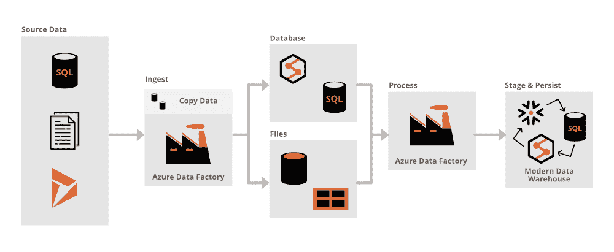

# 微软 Azure–Azure 数据工厂简介

> 原文:[https://www . geesforgeks . org/Microsoft-azure-introduction-to-azure-data-factory/](https://www.geeksforgeeks.org/microsoft-azure-introduction-to-azure-data-factory/)

Azure 数据工厂俗称 ADF，是一个 ETL(Extract-Transform- load)工具，用于将各种格式和大小的各种来源的数据集成在一起，换句话说，它是一个完全托管的、无服务器的数据集成解决方案，用于大规模接收、准备和转换您的所有数据。

随着世界各地的数据日益增加，许多企业和企业正在转向使用基于云的技术，以使其业务可扩展。由于云适应的增加，需要云中可靠的 ETL 工具来进行集成。与其他 ETL 工具相比，Azure 数据工厂因**功能**而脱颖而出，如**易用、**经济高效的**解决方案、** **强大智能的免费代码服务。**

### Azure 数据工厂的架构【T0:

下图描述了使用 Azure 数据工厂的数据工程流程的体系结构

蔚蓝数据工厂

Azure 数据工厂的各种组件如下:

1.  活动
2.  管道
3.  链接服务
4.  资料组
5.  数据流
6.  集成运行时

所有这些组件在运行时协同工作，帮助提取和转换源数据。

在了解什么是管道之前，有必要了解什么是活动。

*   **活动:**管道中的活动定义要对数据执行的操作。例如，复制数据活动可以从 Blob 存储的一个位置读取数据，并将其加载到 Blob 存储的另一个位置
*   **管道:**管道是一起执行任务的活动的逻辑分组。例如，管道可以有一组活动，这些活动从 ADLS 获取数据，并使用 U-SQL 执行一些数据转换，并将数据加载到 SQL 数据库中
*   **链接服务:**链接服务用于通过 Azure 数据工厂连接到其他源。链接服务充当资源连接的连接字符串。例如，将 AWS S3 连接到 Azure 数据工厂
*   **数据集:**数据集只是点或引用数据，我们希望在活动中将其用作输入或输出
*   **数据流:**Azure 数据工厂中的数据流功能将允许用户开发图形数据转换逻辑，该逻辑可以作为活动在 ADF 管道中执行
*   **集成运行时:**集成运行时(IR)是指 ADF 使用的计算基础架构，用于跨不同网络环境提供数据流、数据移动、活动调度和 SSIS 包执行等功能。

### **蔚蓝数据工厂定价:**

*   没有前期成本
*   没有解雇费
*   只为你使用的东西付费

1.  **数据管道:**帮助大规模集成来自云和混合数据源的数据。–定价从每月₹72.046 / 1，000 次活动开始
2.  **SQL Server 集成服务:**有助于轻松地将您现有的内部 SQL Server 集成服务项目移动到云中完全受管理的环境中。sql server integration services 集成运行时节点的定价从₹60.498/小时开始