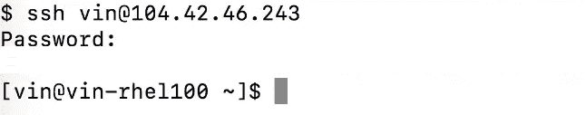
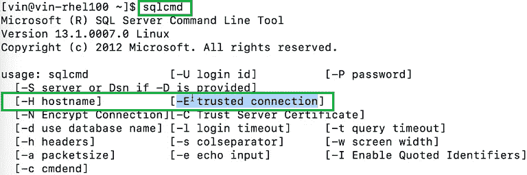
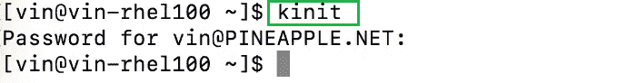
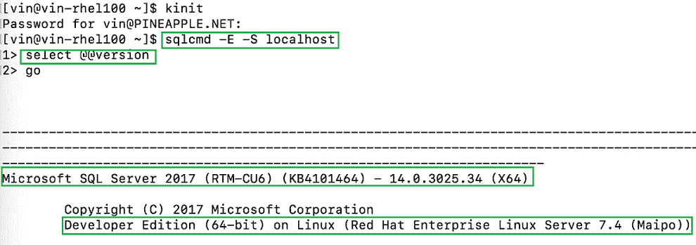
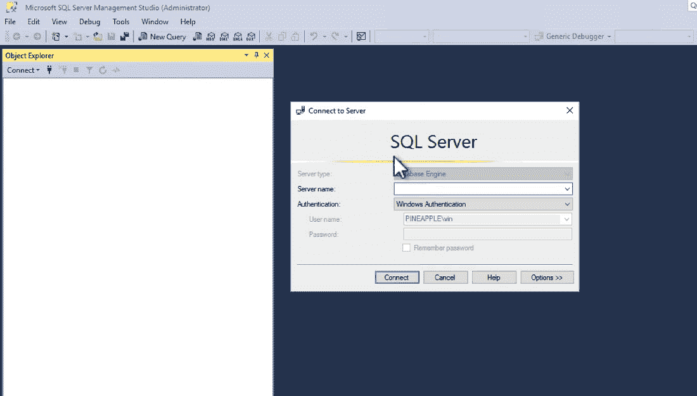
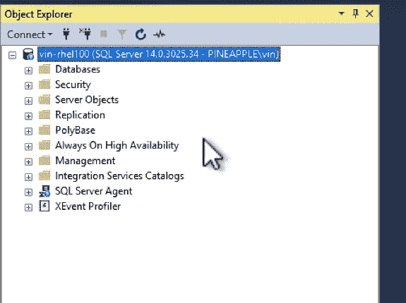

# Linux 机器上的微软 SQL Server 活动目录认证

> 原文:[https://www . geesforgeks . org/Microsoft-SQL-server-active-directory-Linux 上的身份验证-机器/](https://www.geeksforgeeks.org/microsoft-sql-server-active-directory-authentication-on-linux-machine/)

在本文中，我们将研究使用基于 Kerberos 的身份提供程序连接到运行在 Linux 上的 SQL Server 的过程。在本例中，我们将使用活动目录作为 Kerberos 身份提供程序，但这也适用于其他 Kerberos 身份提供程序，如红帽身份管理器或 Centrify。

请按照以下步骤在 Linux 机器上进行微软 SQL Server 活动目录身份验证:

**步骤 1:** 首先我们将 SSH 到一个运行在 *rhel* 上的 SQL 服务器中，我们可以看到这里有一个运行在本地的 SQL 服务器。



**步骤 2:** 现在，我们将运行下面的命令来检查命令行选项是否包括一个 **-E 参数**，该参数允许您使用可信连接或基于 Kerberos 的身份进行连接，以便能够连接到服务器，而不是使用 SQL 登录和密码。

```sql
sqlcmd
```



**步骤 3:** 现在，我们将运行下面的命令，为 Active Directory 用户获取票证授予令牌。在这种特殊情况下，我们登录的用户拥有一个已创建的活动目录标识，并且该特定服务器也是一个加入活动目录域的域。

```sql
kinit
```



**第 4 步:**现在我们已经完成了一个 *kinit* ，现在我们在本地为这个用户准备了一个票证授予令牌，我们可以运行以下命令来连接到本地服务器。

```sql
sqlcmd -E -S localhost
```

你可以看到我们可以在这里连接。我们可以运行如下查询

```sql
select @@version
```

我们可以看到我们在红帽企业版 Linux 上运行。



### 对于窗口:

现在让我们从窗口方面来看看同样的事情。所以在 Windows 端，我们可能想使用这个名为 **SQL server Management Studio 的工具**，从 Windows 机器连接到这个运行在 *rhel* 上的 SQL Server，这是 Windows 端最常用的工具。



所以这里我们可以只使用 Windows 身份验证。我们以我们刚刚在 Linux 端使用的活动目录身份登录，并连接到同一个服务器，您可以看到这是可行的。



就像这样，它只是使用-E 参数从 Windows 连接到 Linux，使用活动目录作为身份提供者来协商两者之间的连接，并向服务器验证该用户。