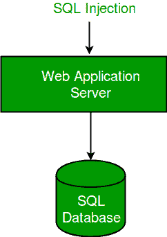

# 使用准备好的语句(参数化查询)缓解 SQL 注入攻击

> 原文:[https://www . geesforgeks . org/缓解-SQL-注入-攻击-使用-准备-语句-参数化-查询/](https://www.geeksforgeeks.org/mitigation-sql-injection-attack-using-prepared-statements-parameterized-queries/)

正如本文[中所解释的](https://www.geeksforgeeks.org/basic-sql-injection-mitigation-example/)，一个 SQL 注入攻击，或者说一个 SQL，是一种利用一个 SQL 语句的潜在漏洞的方法，通过将邪恶的 SQL 语句插入到它的入口字段来执行。它第一次出现是在 1998 年，从那以后，它主要针对零售商和银行账户。当与其他形式的攻击(如 DDOS 攻击、跨站点脚本(XSS)或 DNS 劫持)结合使用时，会导致大规模的结果。
**术语:**

*   **验证:**验证是检查输入是否满足一组标准的过程(例如字符串不包含独立的单引号)。

*   **清理:**清理是修改输入以确保其有效的过程(例如将单引号加倍)。

为了避免 SQL 注入，所有要在动态 SQL 中连接的输入都必须被正确过滤和清理。
**SQL 攻击剖析:**
SQL 攻击有以下两个部分:

*   研究:查看与数据库连接的用户终端应用程序的易受攻击部分。

*   攻击:输入恶意字段，这些字段可以使查询变得对你有利。



**示例 1:**
考虑以下用 Java 编写的**身份验证表单**的代码:

## Java 语言(一种计算机语言，尤用于创建网站)

```sql
String query = "SELECT userName, balance FROM accounts"
    + "WHERE userID=" + request.getParameter("userID") +
  "and password='" + request.getParameter("Password") + "'";

try
{
    Statement statement = connection.createStatement();
    ResultSet rs = statement.executeQuery(query);
    while (rs.next())
    {
        page.addTableRow(rs.getString("userName"),
                        rs.getFloat("balance"));
    }
}
catch (SQLException e)
    {}
```

在正常情况下，用户输入他或她的用户标识和密码，这将生成以下执行语句:

```sql
SELECT userName, balance 
FROM accounts 
WHERE userID=512 and password='thisisyoda'
```

可能的 SQL 注入攻击会利用密码字段生成一个布尔表达式，该表达式在所有情况下的计算结果都为真。想象一下将用户标识和密码字段设置为

```sql
userID = 1' or '1' = '1
password = 1' or '1' = '1
```

然后，SQL 语句变成

```sql
SELECT userName, balance 
FROM accounts 
WHERE userID='1' OR '1'='1' and 
      password='1' OR '1'='1'
```

该查询将返回一个值，因为条件(OR 1=1)始终为真。这样，系统在不知道用户名和密码的情况下对用户进行了身份验证。
该漏洞可以通过使用准备好的语句创建参数化查询来缓解，如下所示:

## Java 语言(一种计算机语言，尤用于创建网站)

```sql
String query = "SELECT userName, balance "+
               "FROM accounts WHERE userID = ?
                and password = ?";

try {
  PreparedStatement statement = connection.prepareStatement(query);
  statement.setInt(1, request.getParameter("userID"));
  ResultSet rs = statement.executeQuery();
  while (rs.next())
  {
    page.addTableRow(rs.getString("userName"),
                     rs.getFloat("balance"));
  }
} catch (SQLException e)
       { ... }
```

如果攻击者试图给 userID 字段一个不是简单整数的值，那么 statement.setInt()将抛出一个 SQLException 错误，而不是允许查询完成。
**示例 2** :
在认证期间考虑另一种类型的攻击:

## Java 语言(一种计算机语言，尤用于创建网站)

```sql
String query = "SELECT userID, userName, passwordHash"+
               " FROM users WHERE userName = '"
               + request.getParameter("user") + "'";
int userID = -1;
HashMap userGroups = new HashMap();
try
{
  Statement statement = connection.createStatement();
  ResultSet rs = statement.executeQuery(query);
  rs.first();
  userID = rs.getInt("userID");

  if (!hashOf(request.getParameter("password")).equals(rs.getString("passwordHash")))
  {
    throw BadLoginException();
  }

  String userGroupQuery = "SELECT group FROM groupMembership"+
                         " WHERE userID = " + userID;

  rs = statement.executeQuery(userGroupQuery);

  while (rs.next())
  {
    userGroup.put(rs.getString("group"), true);
  }
}
catch (SQLException e){}
catch (BadLoginException e){}
```

正常的查询如下。

```sql
SELECT userID, userName, passwordHash 
FROM users 
WHERE userName = 'Anannya'
```

攻击者可能会在用户名字段中插入以下内容。

```sql
Anannya';
INSERT INTO groupMmbership (userID, group) 
VALUES (SELECT userID FROM users
WHERE userName='Anannya', 'Administrator'); --
```

因此，实际查询将变为:

```sql
SELECT userID, userName, passwordHash FROM 
       users WHERE userName = 'Anannya';
INSERT INTO groupMmbership (userID, group) 
VALUES (SELECT userID FROM users 
WHERE userName='Anannya', 'Administrator'); --'
```

这将导致另一条 SQL 语句被追加到实际语句中，导致用户被添加到管理员数据库中。可以通过使用带有参数化查询的准备好的语句来减轻攻击，如下所示。

## Java 语言(一种计算机语言，尤用于创建网站)

```sql
String query = "SELECT userID, userName, passwordHash"+
               " FROM users WHERE userName = ?";

try
{
  PreparedStatement statement =
         connection.prepareStatement(userLoginQuery);
  statement.setString(1, request.getParameter("user"));
  ResultSet rs = statement.executeQuery();
}
```

**示例 3** :
考虑下面讨论的另一个查询漏洞示例:

## Java 语言(一种计算机语言，尤用于创建网站)

```sql
String query = "INSERT INTO users VALUES(" +
        request.getParameter("userName") + ");";
```

一般查询为:

```sql
INSERT INTO users VALUES("Anannya")
```

考虑攻击者是否在用户名字段中输入了以下查询:

```sql
"Anannya); DROP TABLE users;"
```

查询将变为:

```sql
INSERT INTO users VALUES("Anannya"); DROP TABLE users;
```

该查询在执行时会完全删除用户表。这里的一个解决方法还是一个事先准备好的声明。
**在 Java 中使用 Prepared 语句有什么帮助？**
准备好的语句“净化”输入。这意味着它确保用户输入的任何内容在 SQL 中都被视为字符串，而不是 SQL 查询的一部分。它还可能会转义某些字符并检测/删除恶意代码。在 PHP 等其他语言中，filter_input 或 filter_input_array 可用于净化字符串。
本文由 **Anannya Uberoi** 供稿。如果你喜欢 GeeksforGeeks 并想投稿，你也可以使用[write.geeksforgeeks.org](https://write.geeksforgeeks.org)写一篇文章或者把你的文章邮寄到 review-team@geeksforgeeks.org。看到你的文章出现在极客博客主页上，帮助其他极客。
如果发现有不正确的地方，或者想分享更多关于上述话题的信息，请写评论。