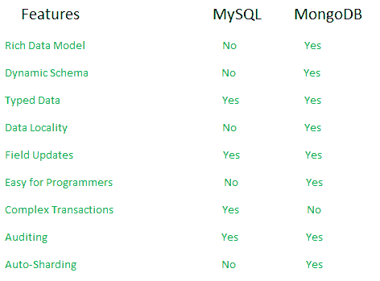
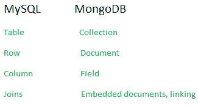

# 蒙戈布 vs MySQL

> 哎哎哎:# t0]https://www . geeksforgeeks . org/monodb-vs-MySQL/

下面讨论 MongoDB 和 MySQL 在各种参数上的差异:

**什么是 MongoDB 和 MySQL？**

| MongoDB | 关系型数据库 |
| --- | --- |
| [MongoDB](https://www.geeksforgeeks.org/mongodb-an-introduction/) 是由 MongoDB，Inc .开发的开源数据库，MongoDB 将数据存储在类似 JSON 的文档中，这些文档的结构可能会有所不同。这是一个受欢迎的 NoSQL 数据库。 | [MySQL](https://www.geeksforgeeks.org/php-mysql-database-introduction/) 是由 Oracle 公司开发、分发和支持的一个流行的开源关系数据库管理系统(RDBMS)。 |

**数据是如何存储的？**

| MongoDB | 关系型数据库 |
| --- | --- |
| 在 MongoDB 中，每个单独的记录都存储为[“文档”](https://www.geeksforgeeks.org/mongodb-getting-started/)。 | 在 MySQL 中，每个单独的记录都作为“行”存储在表中。 |

**记录的等级上限**

| MongoDB | 关系型数据库 |
| --- | --- |
| 属于特定类别或组的文件，如存储在[“集合”](https://www.geeksforgeeks.org/mongodb-getting-started/)中的
。
示例:用户集合。 | “表”用于存储类似类型的行(记录)。 |

**SQL 或 NoSQL**

| MongoDB | 关系型数据库 |
| --- | --- |
| MongoDB 就是所谓的 [NoSQL 数据库](https://en.wikipedia.org/wiki/NoSQL)。这意味着可以定义和遵守传入数据的预定义结构，而且，如果需要，集合中的不同文档可以具有不同的结构。它有一个动态模式。 | MySQL 顾名思义使用 **[【结构化查询语言(SQL)](https://www.geeksforgeeks.org/structured-query-language/)** 进行数据库访问。无法更改架构。只输入给定模式之后的输入。 |

**示例:**在一个表中，如果有**姓名、地址**的列，并且需要在其中一个条目的新列中输入**【年龄】**，则不会将其作为模式中未定义的列。
这可以在 MongoDB 中实现，可以插入任何新字段，而不考虑模式，因此已知具有动态模式。

**显著特征**

| MongoDB | 关系型数据库 |
| --- | --- |
| MongoDB 在设计时考虑了高可用性和可扩展性，包括现成的[复制](https://docs.mongodb.com/manual/replication)和[分片](https://docs.mongodb.com/manual/sharding)。 | MySQL 的概念不允许有效的复制和分片，但是在 MySQL 中，人们可以使用连接来访问相关的数据，从而最大限度地减少重复。 |

Mongodb MySQL 特性比较 gfg

**术语上的差异**
MongoDB 和 MySQL 之间存在基于术语的差异。

术语差异

**数据表示**
数据在两个数据库中的表示和存储方式差异很大。
MongoDB 以类似 JSON 的文档形式存储数据，MySQL 以前面提到的表的行的形式存储数据。
**示例:**展示数据是如何在 MongoDB 和 MySQL 中存储和表示的。

数据表示 MongoDB vs MySQL gfg