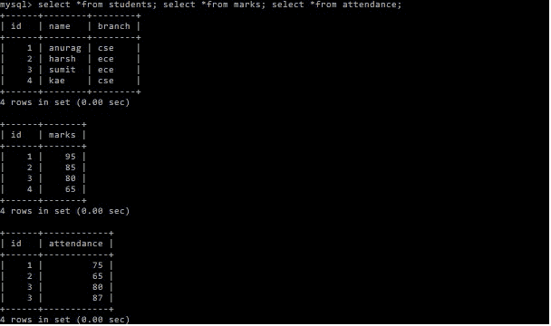

# SQL 中的多重连接

> 原文:[https://www.geeksforgeeks.org/multiple-joins-in-sql/](https://www.geeksforgeeks.org/multiple-joins-in-sql/)

结构化查询语言是一种标准的数据库语言，用于创建、维护和检索关系数据库中的数据，如 MySQL、Oracle 等。在本文中，我们将使用微软的 SQL Server。

**多重连接:**
这里我们要实现多重连接的概念。多个联接可以被描述为包含多次使用的相同或不同类型联接的查询，从而使它们能够组合多个表。在本文中，我们将首先创建一个数据库极客，然后在其中创建三个表，然后在这些表上运行我们的查询。


多重连接的文氏图表示

**1。创建数据库:**

```
CREATE geeks;
```

**输出–**
查询正常，1 行受影响

**2。使用该数据库:**

```
USE geeks;
```

**输出–**
数据库已更改

**3。向数据库添加表:**

```
create table students(id int, name varchar(50),branch varchar(50));
create table marks(id int, marks int);
create table attendance(id int, attendance int);
```

**输出–**
查询正常，0 行受影响
查询正常，0 行受影响
查询正常，0 行受影响

**4。将数据插入表格:**
**学生表格–**

```
--students
insert into students values(1,'anurag','cse');
insert into students values(2,'harsh','ece');
insert into students values(3,'sumit','ece');
insert into students values(4,'kae','cse');
```

**输出–**
查询正常，1 行受影响
查询正常，1 行受影响
查询正常，1 行受影响
查询正常，1 行受影响

**5。标记表:**

```
--marks
insert into marks values(1,95);
insert into marks values(2,85);
insert into marks values(3,80);
insert into marks values(4,65);
```

**输出–**
查询正常，1 行受影响
查询正常，1 行受影响
查询正常，1 行受影响
查询正常，1 行受影响

***6。*** **考勤表:**

```
--attendance
insert into attendance values(1,75);
insert into attendance values(2,65);
insert into attendance values(3,80);
insert into attendance values(4,80);
```

**输出–**
查询正常，1 行受影响
查询正常，1 行受影响
查询正常，1 行受影响
查询正常，1 行受影响

**7。查看表内数据:**

```
select *from students;
```

**输出─**
【学生表】

<figure class="table">

| 【id】 | 【 name 】 | [Branch] |

</figure>

```
select *from marks;
```

**输出–**
标记表-

<figure class="table">T15】95T18T21】85T25】3T30T33】65【T35

| 身份证明（identification） | mark |
| one |
| Two |
| Eighty |
| four |

</figure>

```
select *from attendance;
```

**输出–**
考勤表-

<figure class="table">T15】75T18T21】65T25】3T30T33】87【T37

| 身份证明（identification） | check on work attendance |
| one |
| Two |
| Eighty |
| four |

</figure>

**最终输出截图–**



数据插入后的表格

**8。执行多重连接:**
现在我们将对表执行多重连接。首先，我们将内部连接学生表和分数表，然后我们将连接结果表和出勤率表，只有那些出勤率大于或等于 75 的学生。

**语法–**

```
*JOIN*
*table1.column_name=table2.column_name*
*JOIN*
*table2.column_name=table3.column_na*me
```

**示例查询:**

```
select s.id, name, marks, attendance
from students as s
inner join
marks as m
on s.id=m.id
inner join
attendance as a
on m.id=a.id
where a.attendance>=75;
```

**输出─**

<figure class="table">

| 【id】 | 【 name 】 | 【 Note 】 |

</figure>

**最终输出截图–**


多重连接后的输出

参考:[https://www . geesforgeks . org/SQL-查询找到每个部门工资最高的人/](https://www.geeksforgeeks.org/sql-query-to-find-the-highest-salary-of-each-department/)