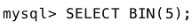
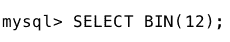

# MySQL | BIN()功能

> 原文:[https://www.geeksforgeeks.org/mysql-bin-function/](https://www.geeksforgeeks.org/mysql-bin-function/)

MySQL 中的 BIN()函数用于将十进制数转换为其二进制等价数。BIN()函数相当于以 CONV(数字，10，2)格式编写的 CONV()函数。在这种格式中，CONV()函数将数字“number”从十进制(十进制)转换为二进制(二进制)。

**语法:**

```
BIN( NUM )

```

**使用的参数** :
**NUM:** 就是你要找的二进制等价的十进制数。

**返回值**:
BIN()函数返回一个字符串值，作为参数传递的十进制数的二进制等价形式。如果数字为空，则返回空值。

**示例:**

1.  Converting 5 to its binary equivalent.
    **Syntax:**
    
    **Output:**

    ```
    '101'
    ```

2.  Converting 12 to its binary equivalent.
    **Syntax:**
    
    **Output:**

    ```
    '1100'
    ```

3.  将 97 转换为它的二进制等价物。
    **语法:**
    
    **输出:**

    ```
    '1100001'
    ```